# Dependency Check

> https://github.com/jeremylong/DependencyCheck

## 简介

Dependency-Check 是一个开源的安全漏洞扫描工具，用于检查应用程序和依赖项中的已知漏洞。它可以扫描各种编程语言的依赖项，如Java、Python、.NET等，并根据公开的漏洞数据库，如NVD、OSV等，检查依赖项的版本是否存在已知的安全漏洞。

Dependency-Check 可以通过命令行或插件集成到各种构建工具中，如Maven、Gradle、Ant等。它会生成报告，显示已检测到的漏洞以及建议的修复措施。这些报告可以帮助开发人员识别和解决与应用程序或依赖项相关的安全问题，从而提高应用程序的安全性。

## cli

`dependency-check.sh`支持的参数：

- --advancedHelp：打印高级帮助信息。
- --enableExperimental：启用实验性的分析器。
- --exclude <pattern>：指定一个排除模式。可以多次指定此选项，并接受 Ant 风格的排除。
- -f,--format <format>：指定报告格式（HTML、XML、CSV、JSON、JUNIT、SARIF、JENKINS 或 ALL）。默认为 HTML。可以指定多个格式参数。
- --failOnCVSS <score>：指定如果检测到 CVSS 分数高于指定级别的漏洞，构建是否应该失败。默认为 11；由于 CVSS 分数为 0-10，因此默认情况下构建永远不会失败。
- -h,--help：打印帮助信息。
- --junitFailOnCVSS <score>：指定在生成 junit 报告时，被认为是失败的 CVSS 分数。默认值为 0。
- -l,--log <file>：写入详细日志信息的文件路径。
- -n,--noupdate：禁用自动更新 NVD-CVE、hosted-suppressions 和 RetireJS 数据。
- -o,--out <path>：写入报告的文件夹路径。默认为当前目录。如果未将格式参数设置为 ALL，则可以将其设置为特定的文件名。
- --prettyPrint：指定 JSON 和 XML 报告格式将被漂亮地打印。
- --project <name>：正在扫描的项目的名称。
- -s,--scan <path>：要扫描的路径 - 可以多次指定此选项。支持 Ant 风格的路径（例如，'path/**/*.jar'）；如果使用 Ant 风格的路径，则强烈建议将参数值用引号引起来。
- --suppression <file>：抑制 XML 文件的文件路径。可以多次指定此选项以使用多个抑制文件。
- -v,--version：打印版本信息。

对webgoat7的组件进行扫描

> https://github.com/mpogr/WebGoat-7.0.1

```sh
./dependency-check.sh -s /tmp/WebGoat-7.0.1/ --project webgoat
```

输出扫描报告，没有扫描到有用的东西。

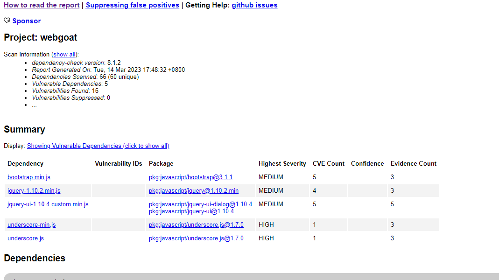


## jenkins

docker启动Jenkins

```
docker run -itd -p 8080:8080 -p 50000:50000 -u root -v /tmp/jenkins:/var/jenkins_home   -v  /tmp/maven:/usr/local/maven jenkins/jenkins:2.344
```

安装插件

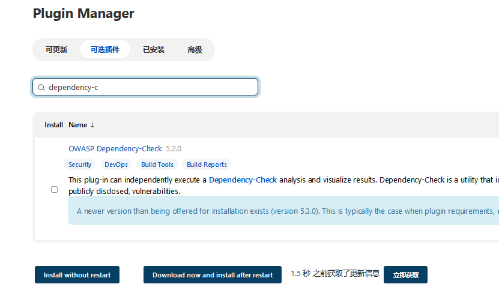

#### 全局工具配置

Jenkins可以通过全局工具配置来安装一个或多个Dependency-Check版本。可以自动安装Dependency-Check，这将从Github下载并提取官方的命令行界面（CLI），或者可以手动安装官方版本，并在配置中引用安装路径。Dependency-Check是一个用于识别应用程序中存在的已知漏洞和依赖项的开源工具。

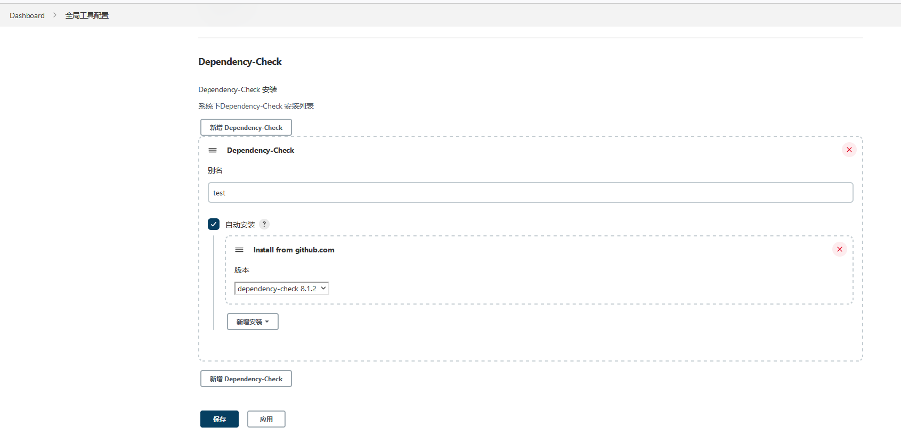

#### Builder

Builder是指使用预定义的Dependency-Check CLI安装之一执行分析的组件。在Jenkins中，特定于配置的部分很少，工作配置中的重要方面是“Arguments”字段，该字段直接发送到定义的CLI安装程序。Builder用于在Jenkins工作流中集成Dependency-Check分析。Builder的配置将传递给Dependency-Check CLI进行分析，并将分析结果传递回Jenkins用于显示和后续处理。

> 对webgoat进行maven编译，生成JAR包

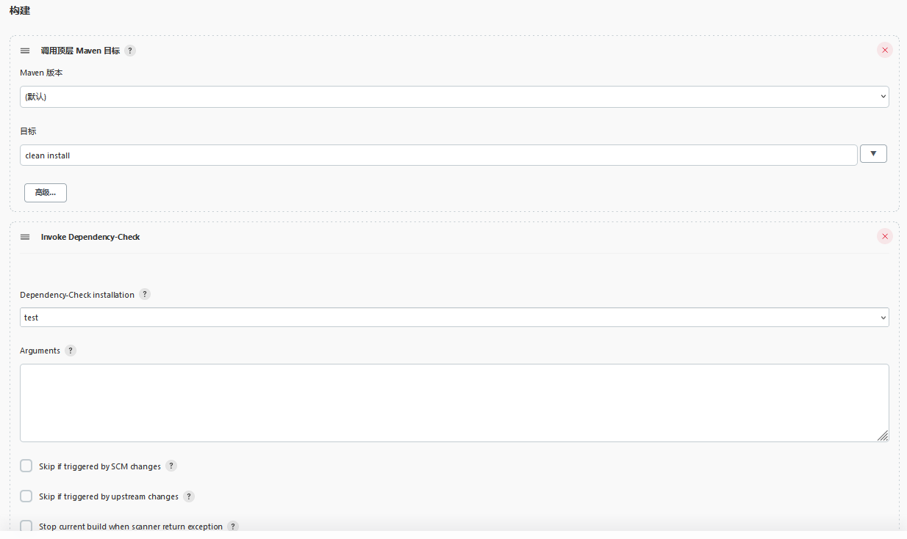

#### Publisher

Publisher是一个独立于工具配置或Builder的组件，负责读取dependency-check-report.xml并生成指标、趋势、发现，并根据可配置的阈值选择性地将构建设为失败或警告状态。在Jenkins工作流程中，Publisher用于生成Dependency-Check的度量和报告，并可根据预定义的阈值将构建标记为失败或警告状态。通过读取dependency-check-report.xml文件，Publisher可以对构建进行分析并提供有关依赖项和已知漏洞的详细信息。

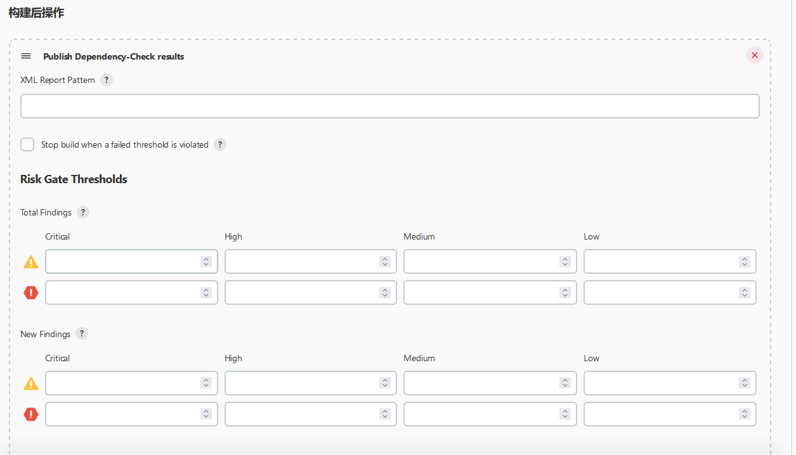

#### 结果

构建结果

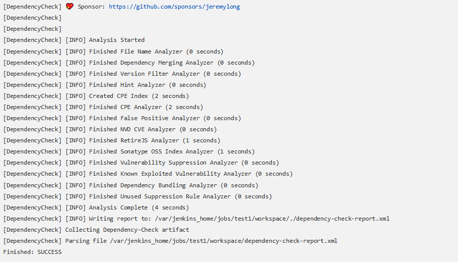

当任务配置了Publisher时，趋势图将显示按严重性分组的结果总数。

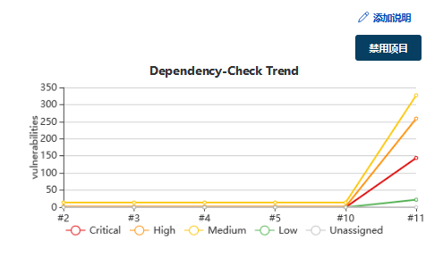

点击Latest Dependency-Check，可以看到具体的组件报告

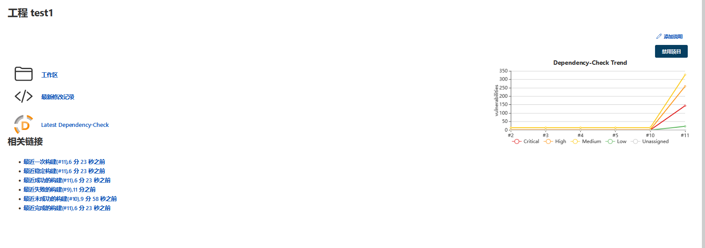

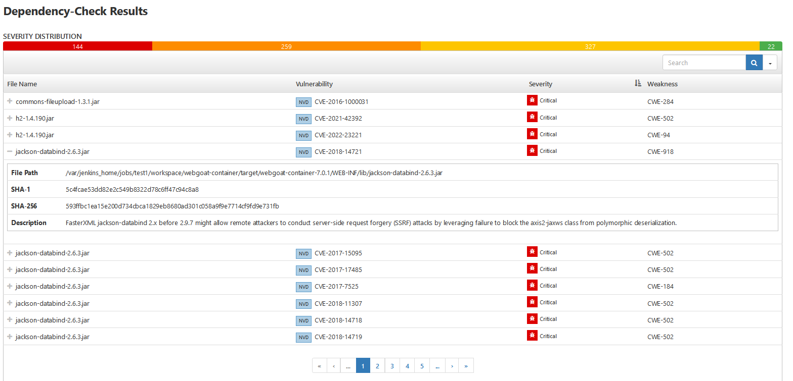


## maven

### mvn

这是 Maven 插件 Dependency-Check 的命令，用于检测应用程序依赖项中已知漏洞并生成报告。

```
mvn org.owasp:dependency-check-maven:check
```

> ```
> mvn org.owasp:dependency-check-maven:aggregate
> ```
>
> 命令执行是全面的漏洞扫描，并生成包含所有依赖项中已知漏洞信息的报告

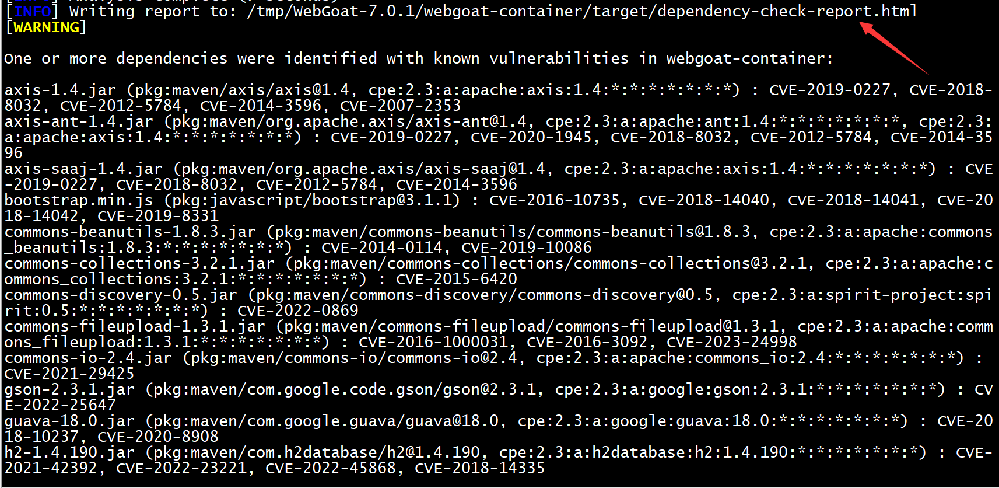

使用maven进行扫描webgoat7可以看到报告里面有JAR包组件漏洞，**比直接CLI扫描更能发现问题。**

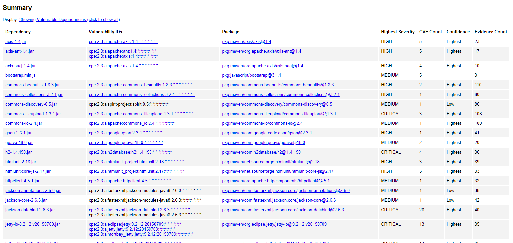


### pom.xml

#### ①检测组件

在目标目录中创建 `dependency-check-report.html`

```xml
<project>
    ...
    <build>
        ...
        <plugins>
            ...
            <plugin>
              <groupId>org.owasp</groupId>
              <artifactId>dependency-check-maven</artifactId>
              <version>8.1.2</version>
              <executions>
                  <execution>
                      <goals>
                          <goal>check</goal>
                      </goals>
                  </execution>
              </executions>
            </plugin>
            ...
        </plugins>
        ...
    </build>
    ...
</project>
```

在IDEA进行`maven verify`，生成报告

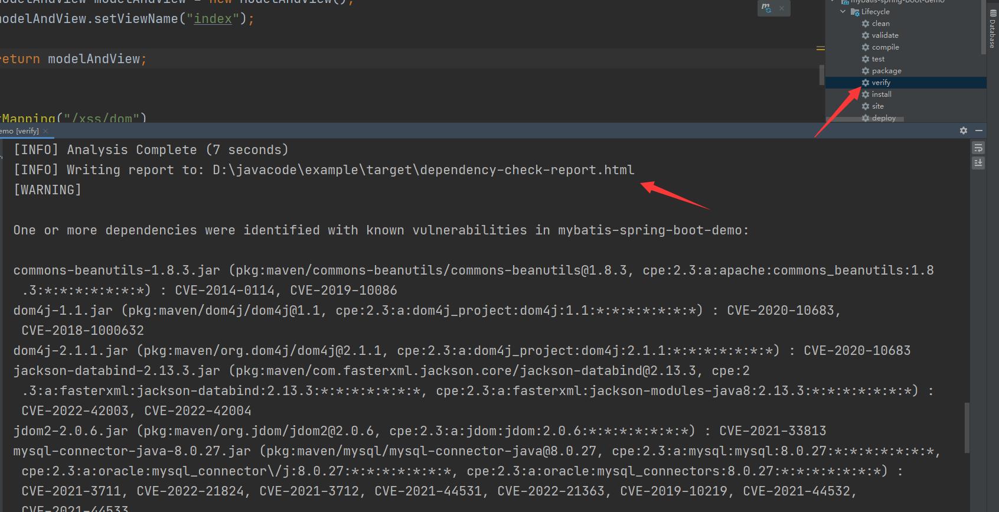

#### ②检测所有依赖项

在站点内创建汇总的依赖性检查报告

```xml
<project>
    ...
    <reporting>
        ...
        <plugins>
            ...
            <plugin>
                <groupId>org.owasp</groupId>
                <artifactId>dependency-check-maven</artifactId>
                <version>8.1.2</version>
                <reportSets>
                    <reportSet>
                        <reports>
                            <report>aggregate</report>
                        </reports>
                    </reportSet>
                </reportSets>
            </plugin>
            ...
        </plugins>
        ...
    </reporting>
    ...
</project>
```

#### ③CVSS评分过滤

创建 `dependency-check-report.html` 并使 CVSS 大于或等于 8 的构建失败

```xml
<project>
    ...
    <build>
        ...
        <plugins>
            ...
            <plugin>
              <groupId>org.owasp</groupId>
              <artifactId>dependency-check-maven</artifactId>
              <version>8.1.2</version>
              <configuration>
                  <failBuildOnCVSS>8</failBuildOnCVSS>
              </configuration>
              <executions>
                  <execution>
                      <goals>
                          <goal>check</goal>
                      </goals>
                  </execution>
              </executions>
            </plugin>
            ...
        </plugins>
        ...
    </build>
    ...
</project>
```

效果如下

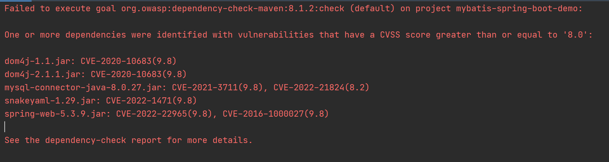

#### ④跳过没有使用到组件

通常情况下，使用 `mvn org.owasp:dependency-check-maven:aggregate`命令来运行 OWASP 的 "dependency-check-maven" 插件，以检查项目依赖项中是否存在已知的安全漏洞，并生成报告。

但是，有时候我们不想包含某些依赖项，比如 provided 范围的依赖，这些依赖项不会被打包到分发包中，因此不需要进行漏洞检查。在这种情况下，可以使用上述命令来创建报告并跳过这些依赖项，以提高效率和减少报告中的噪音。

```xml
<project>
    ...
    <build>
        ...
        <plugins>
            ...
            <plugin>
                <groupId>org.owasp</groupId>
                <artifactId>dependency-check-maven</artifactId>
                <version>8.1.2</version>
                <configuration>
                    <skipProvidedScope>true</skipProvidedScope>
                </configuration>
                <executions>
                    <execution>
                        <goals>
                            <goal>check</goal>
                        </goals>
                    </execution>
                </executions>
            </plugin>
            ...
        </plugins>
        ...
    </build>
    ...
</project>
```


#### ⑤使用内部CVE源

创建 `dependency-check-report.html`报告文件，并使用内部 CVE 内容的镜像。这意味着，`dependency-check-maven`插件将使用本地存储的 CVE 内容，而不是从网络上获取。这通常可以提高扫描的速度，并且可以在没有网络连接的情况下进行扫描。

```xml
<project>
    ...
    <build>
        ...
        <plugins>
            ...
            <plugin>
                <groupId>org.owasp</groupId>
                <artifactId>dependency-check-maven</artifactId>
                <version>8.1.2</version>
                <configuration>
                    <cveUrlModified>http://internal-mirror.mycorp.com/nvdcve-1.1-modified.json.gz</cveUrlModified>
                    <cveUrlBase>http://internal-mirror.mycorp.com/nvdcve-1.1-%d.json.gz</cveUrlBase>
                </configuration>
                <executions>
                    <execution>
                        <goals>
                            <goal>check</goal>
                        </goals>
                    </execution>
                </executions>
            </plugin>
            ...
        </plugins>
        ...
    </build>
    ...
</project>
```

#### ⑥仅更新仓库

从 NIST 更新 NVD 数据的本地缓存，而不分析依赖关系。

```xml
<project>
    ...
    <build>
        ...
        <plugins>
            ...
            <plugin>
                <groupId>org.owasp</groupId>
                <artifactId>dependency-check-maven</artifactId>
                <version>8.1.2</version>
                <executions>
                    <execution>
                        <goals>
                            <goal>update-only</goal>
                        </goals>
                    </execution>
                </executions>
            </plugin>
            ...
        </plugins>
        ...
    </build>
    ...
</project>
```

#### ⑦抑制误报

使用多个抑制文件（例如公司范围的抑制文件和本地项目文件）抑制误报。

```xml
<project>
    ...
    <build>
        ...
        <plugins>
            ...
            <plugin>
                <groupId>org.owasp</groupId>
                <artifactId>dependency-check-maven</artifactId>
                <version>8.1.2</version>
                <configuration>
                    <suppressionFiles>
                        <suppressionFile>http://example.org/suppression.xml</suppressionFile>
                        <suppressionFile>project-suppression.xml</suppressionFile>
                    </suppressionFiles>
                </configuration>
                <executions>
                    <execution>
                        <goals>
                            <goal>check</goal>
                        </goals>
                    </execution>
                </executions>
            </plugin>
            ...
        </plugins>
        ...
    </build>
    ...
</project>
```

