# Dependency Track

## 简介

Dependency-Track是一个智能的组件分析平台，可以帮助组织识别和减少软件供应链中的风险。Dependency-Track采用了一种独特而极具益处的方法，利用了软件材料清单（SBOM）的功能。这种方法提供了传统软件组成分析（SCA）解决方案无法实现的功能。

Dependency-Track监视其组合中每个应用程序的所有版本中的组件使用情况，以便在整个组织范围内主动识别风险。该平台具有API优先设计，并且非常适合在CI/CD环境中使用。

通过使用Dependency-Track，组织可以更好地了解其应用程序中使用的组件，识别其中的漏洞和威胁，以及评估这些组件的风险。此外，Dependency-Track还提供了一些其他功能，例如：

1. 漏洞管理：提供漏洞管理和追踪功能，帮助组织将漏洞及时修复，并跟踪漏洞修复的进度。
2. 管理仪表板：提供管理仪表板，帮助组织快速了解其应用程序的组件情况和安全状态。
3. 安全分析：提供安全分析功能，帮助组织分析其应用程序的安全性，识别可能存在的安全问题，并提供相应的建议和解决方案。

综上所述，Dependency-Track是一种非常有用的组件分析平台，可以帮助组织识别和减少软件供应链中的风险，提高应用程序的安全性和稳定性。

------

Dependency-Track的特点包括：

1. 支持消费和生产CycloneDX软件材料清单（SBOM），支持CycloneDX漏洞利用交换（VEX）。
2. 支持多种组件类型，包括应用程序、库、框架、操作系统、容器、固件、文件、硬件和服务等。
3. 能够跟踪组件在组织组合中的使用情况，快速识别受影响的组件和位置。
4. 能够识别多种风险，包括已知漏洞的组件、过时的组件、修改过的组件、许可证风险等。
5. 集成多个漏洞情报来源，包括国家漏洞数据库（NVD）、GitHub建议、Sonatype OSS Index、Snyk、OSV、Risk Based Security的VulnDB等。
6. 帮助确定优先级，通过支持漏洞利用预测评分系统（EPSS）。
7. 维护一个私人漏洞组件数据库。
8. 支持全局和项目级策略的强大策略引擎，包括安全风险和合规性、许可证风险和合规性、操作风险和合规性等。
9. 支持各种生态系统，包括Cargo（Rust）、Composer（PHP）、Gems（Ruby）、Hex（Erlang/Elixir）、Maven（Java）、NPM（Javascript）、NuGet（.NET）和Pypi（Python）等。
10. 能够识别API和外部服务组件，包括服务提供商、端点URI、数据分类、数据流方向、信任边界遍历、身份验证要求等。
11. 包括一个全面的审计工作流程，用于处理结果。
12. 支持可配置通知，包括Slack、Microsoft Teams、Mattermost、Webhooks、电子邮件和Jira。
13. 支持SPDX许可证标识，并跟踪组件的许可证使用。
14. 提供易于阅读的组件、项目和组合的指标。
15. 原生支持Kenna Security、Fortify SSC、ThreadFix和DefectDojo。
16. 具有API优先设计，便于与其他系统进行集成。API文档以OpenAPI格式提供。
17. 支持OAuth 2.0 + OpenID Connect（OIDC）单一登录（authN/authZ）。
18. 支持内部管理的用户、Active Directory/LDAP和API密钥。
19. 安装和配置简单，只需几分钟即可上手。

## 检测原理

为了有效地管理和跟踪这些组件，Dependency Track需要准备一份软件组件清单，也就是软件构建材料清单（Software Bill of Materials，SBOM）。

SBOM清单是一份详细的清单，包含了软件中使用的所有组件和库的详细信息，包括版本号、许可证、来源、依赖关系等。通过准备这份清单，可以让开发团队更好地了解软件中使用的组件和库，帮助他们更好地进行漏洞管理、版本控制和风险评估等方面的工作。

通过使用SBOM清单，Dependency Track可以将软件中使用的组件和库与已知的漏洞进行比对，并向用户提供相关的漏洞信息、安全建议和修复方案。

**可以通过使用`cyclonedx-maven`插件生成SOMB的信息。**

> https://github.com/CycloneDX/cyclonedx-maven-plugin

## 安装

```sh
# Downloads the latest Docker Compose file
curl -LO https://dependencytrack.org/docker-compose.yml
```

修改`docker-compose.yaml`

```
API_BASE_URL=http://192.168.32.130:8081
```

启动服务

```
docker-compose up -d
```

使用默认账号密码进行登录：`admin/admin`

## CICD

docker启动Jenkins

```
docker run -itd -p 9090:8080 -p 50000:50000 -u root -v /tmp/jenkins:/var/jenkins_home   -v  /tmp/maven:/usr/local/maven jenkins/jenkins:2.344
```

安装`Dependency-Track`插件

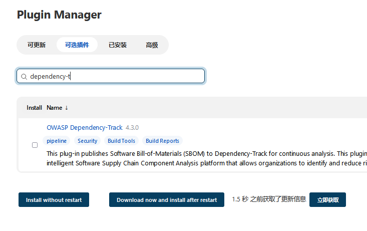

> Dependency-Track Jenkins插件有助于将CycloneDX软件材料清单（SBOM）发布到Dependency-Track平台。
>
> Dependency-Track是一个智能的软件供应链组件分析平台，允许组织识别和减少使用第三方和开源组件所带来的风险。发布SBOM可以异步或同步执行。
>
> 异步发布只是将SBOM上传到Dependency-Track，作业继续进行。同步发布等待Dependency-Track处理上传的SBOM。同步发布的好处是显示交互式作业趋势和每个构建的发现。

在teams创建API key

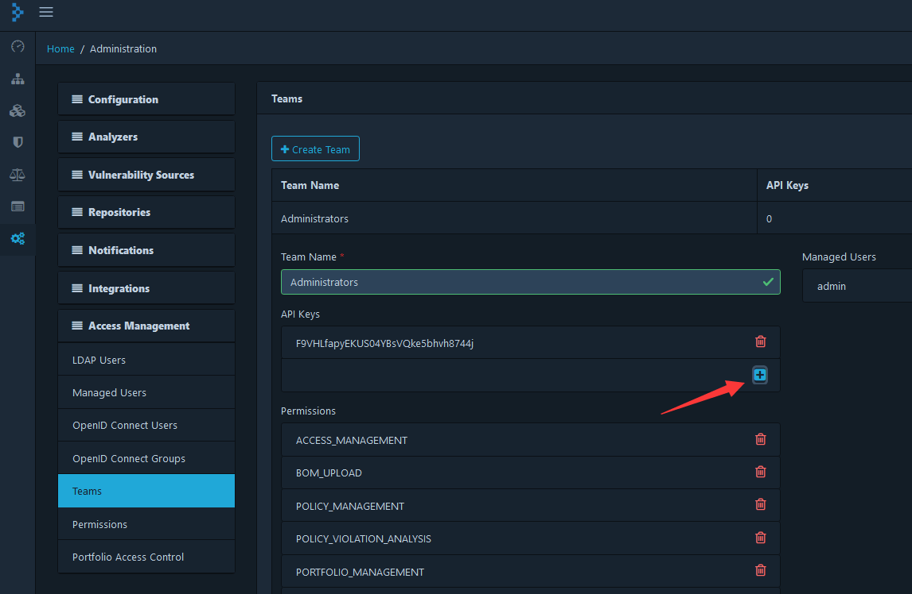

配置API URL和API key

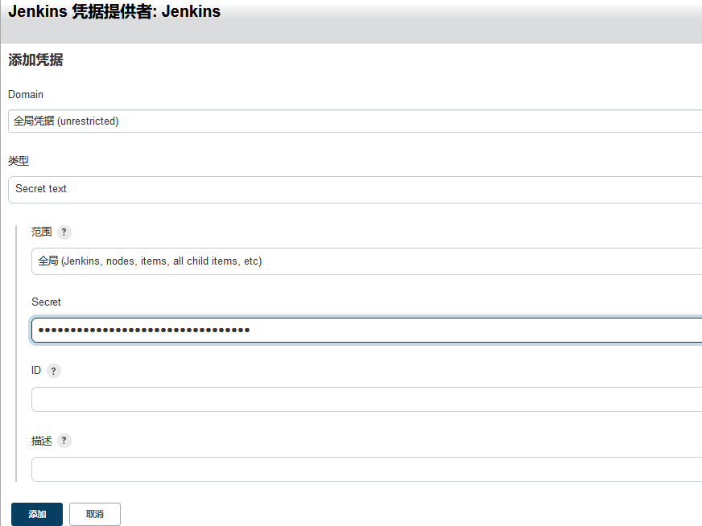

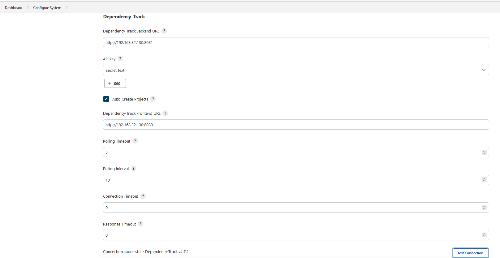

需要在DT平台创建一个test项目

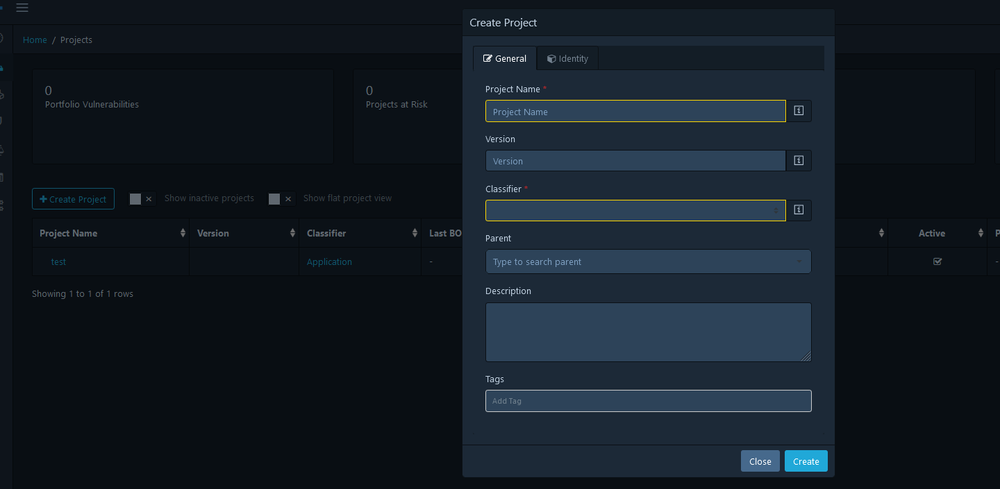

插件选择test项目


在pom.xml添加以下内容，用于生成`bom.xml`

```
<build>
    <plugins>
        <plugin>
            <groupId>org.cyclonedx</groupId>
            <artifactId>cyclonedx-maven-plugin</artifactId>
            <version>2.7.5</version>
            <executions>
                <execution>
                    <phase>compile</phase>
                    <goals>
                        <goal>makeAggregateBom</goal>
                    </goals>
                </execution>
            </executions>
            <configuration>
                <outputFormat>xml</outputFormat>
            </configuration>
        </plugin>
    </plugins>
</build>
```

> 或者Jenkins命令构建时，用`mvn clean compile org.cyclonedx:cyclonedx-maven-plugin:makeAggregateBom`
>
> 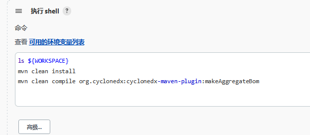

构建项目成功

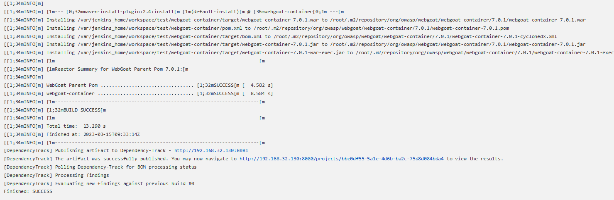

返回上一层，可以看到漏洞总览

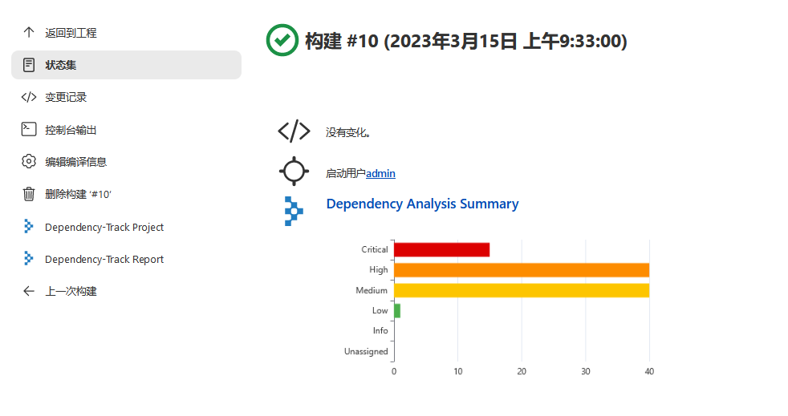

点击Dependency-Track Report，会在Jenkins看到安全漏洞信息。

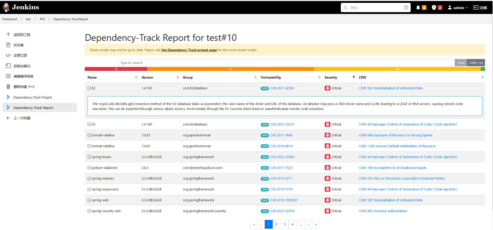

点击Dependency-Track Project会跳转到DT页面

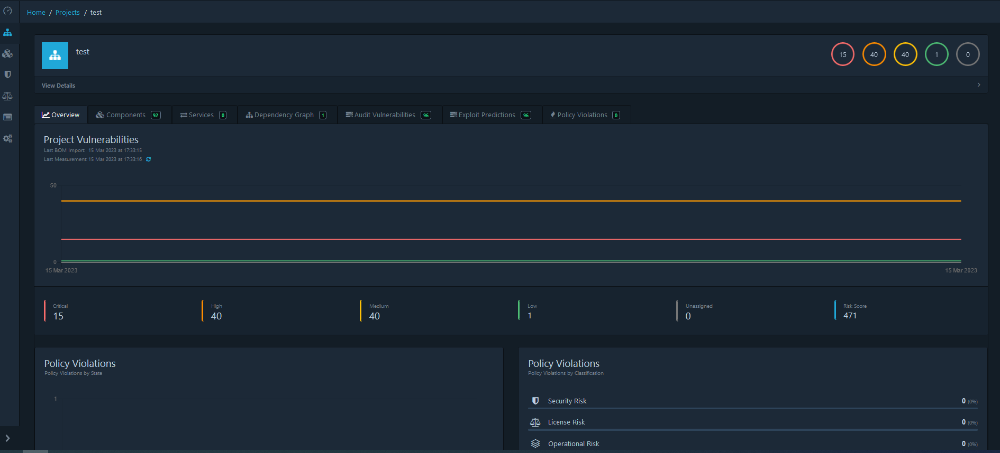

点击 Components可以看到组件漏洞信息

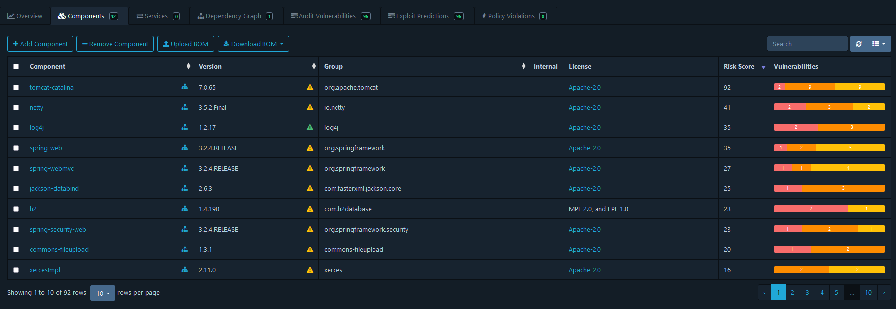

随便点击一个组件进去，可以看到具体的CVE编号

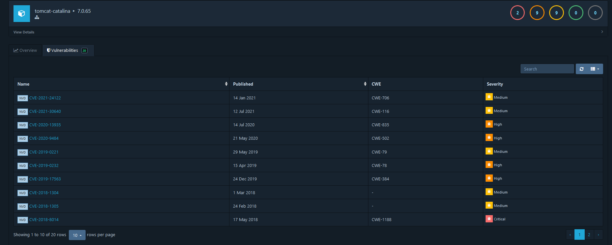

查看漏洞详情描述

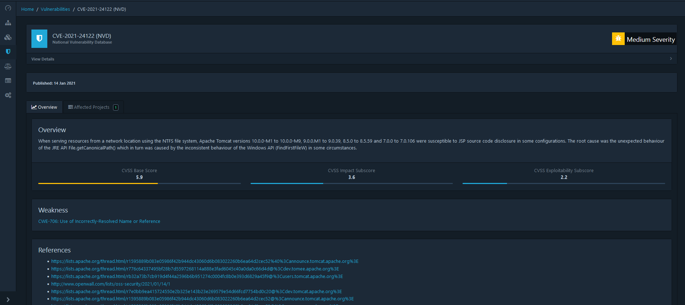

有组件license检测

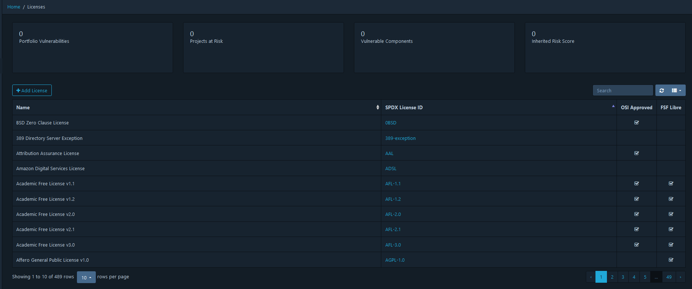

