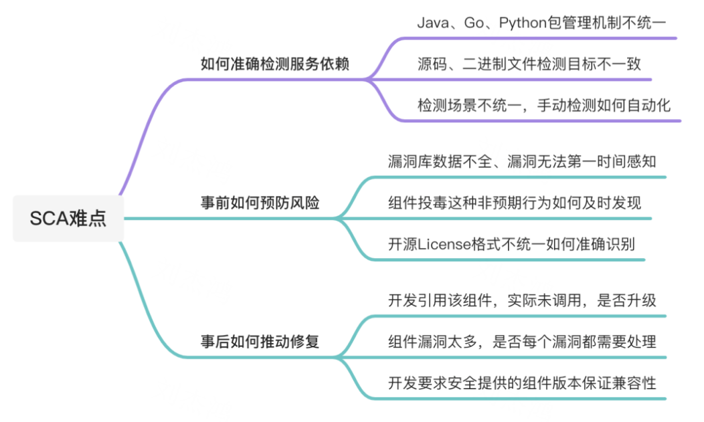
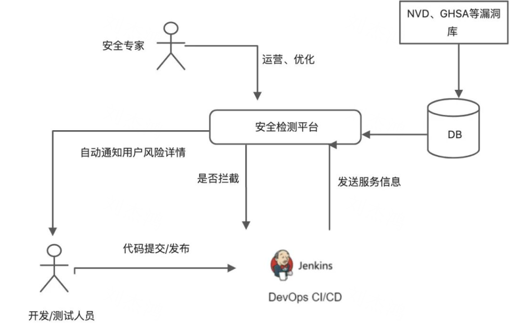
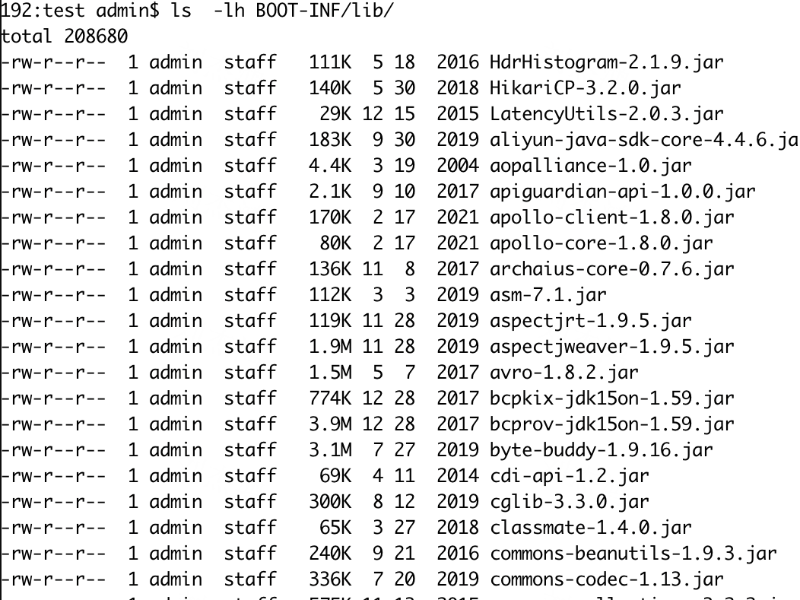
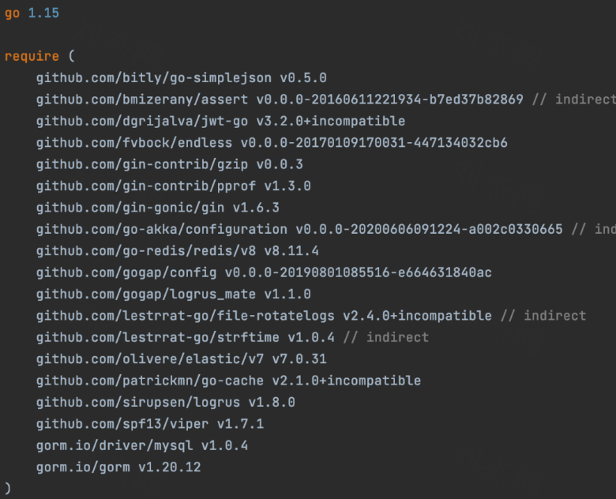
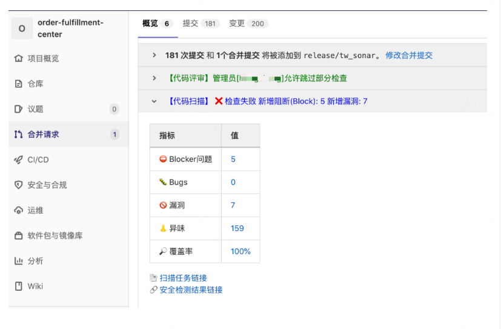

# SCA在得物DevSecOps平台上应用

> SCA（Software Composition Analysis）软件成分分析，通俗的理解就是通过分析软件包含的一些信息和特征来实现对该软件的识别、管理、追踪的技术。

## **一、前言**

现代开发项目中，应用程序中使用的大部分代码都是由开源代码构成的，其余的代码主要是作为"胶水"来组装和调用各种函数。据中国信息通信研究院统计的数据，**2020年中国已经使用开源技术的企业占比为88.2%，比2018年增长6.8%；有计划使用的占9.5%；暂未计划使用开源技术的企业占比为2.1%，**可以看出，中国开源软件应用比例逐年提升。**开源让这些软件更安全吗？**根据通信研究院数据显示，2020年热门开源项目中至少含有一个漏洞占84%，较2019年增长9个百分点；含有高危漏洞的占60%，较2019年增长11个百分点。

下面介绍两个例子

- 最显著的例子就是去年爆发的Log4j2漏洞，Log4j2 是一个开源的基于 Java 的日志记录工具。该日志框架被广泛的应用于各种常见的服务中(spring-boot-starter-log4j2、Apache Struts2、Apache Flink)。从Apache Log4j2 漏洞影响面查询的统计来看，影响多达44029个开源软件，涉及相关版本软件包更是达到了340657个。
- 2020年国内第一起一起关于 GPL 版权纠纷案裁判文书公示。一审判决书显示，GPL3.0 协议是一种民事法律行为，具有合同性质，可认定为授权人与用户间订立的著作权协议，属于我国《合同法》调整的范围。一审判定两侵权被告公司赔偿原告公司经济损失及维权合理费用共计 50 万元，并停止侵权行为。

目前开源软件所面临的除了以上介绍的**漏洞风险，还有开源许可证问题，**避免使用含有问题的组件。这将减少开发过程中的风险。

## **二、SCA**

### 2.1 简介

相信此时的你肯定会疑惑，既然开源软件这么多风险，该如何避免呢？接下来就是本篇文章的主角SCA技术了。SCA（Software Composition Analysis）软件成分分析，通俗的理解就是通过分析软件包含的一些信息和特征来实现对该软件的识别、管理、追踪的技术。SCA可以对任何开发语言对象进行分析，Java、Golang、Python、JavaScript等等，当然也可以对一些二进制、固件等识别。SCA的分析过程：首先对目标源代码或二进制文件解压，并从文件中提取特征(组件名、版本号)，再对特征进行识别和分析，获得该服务使用的相关组件和版本，与已知漏洞库进行关联，找出存在的已知风险。

### **2.2 难点**

上述听起来SCA好像并不复杂，只需要提取关键信息作匹配即可，但是真正的落地过程中会发现遇到如下问题。这些问题导致要做一个成熟的易用的SCA工具并不是想象中那么简单，下图介绍了SCA项目中常见的一些难点。

## 三、落地

### 3.1 架构

如何自动化检测相关组件风险并且安全左移，让开发尽早感知到风险并禁止高危服务上线，是这边的目标。

其中检测架构如下图：

其中得物安全检测平台目前不仅仅做SCA检测、也在做SAST等检测，尽可能的安全左移，更早的发现问题。

### 3.2 实现

目前得物内部主要有Java、Go、Python、JavaScript等语言，目前对以上四种语言已经做到全部支持（包括Java打包后的Jar文件、Go静态语言编译后的二进制文件）。

| 语言       | 文件                                       | 是否支持 |
| ---------- | ------------------------------------------ | -------- |
| Java       | pom.xml、jar                               | 支持     |
| Go         | go.mod、go.sum、binaries built by go       | 支持     |
| Python     | requirements.txt、Pipfile、Pipfile.lock    | 支持     |
| JavaScript | package.json、package-lock.json、yarn.lock | 支持     |

**目前主要采用项目构建及解析包管理文件两种方式**。

- 方式一：项目构建

以Java项目为例，通过与发布平台打通，获得项目编译后的Jar文件，**JAR 文件格式是以 ZIP 文件格式为基础，对Jar文件进行解压**，可在BOOT-INF/lib/目录下获取全部第三方依赖包信息。

- 方式二：包管理文件

解析相应语言的配置文件，以Go为例，通过解析go.mod和go.sum文件，获取相关依赖信息。

对项目依赖的安全分析在服务端进行，基于安全运营同学持续维护的漏洞库，可以快速识别到存在安全缺陷的依赖，当检测到相应依赖存在安全风险的时候，即发相应通知到项目Owner，督促去进行相应改进。

为了让开发者重视安全问题，该检测结果还会同步输出在Gitlab Merge Request处，当Reveiew代码时，将会直接看到安全检测相关结果。

### **3.3 漏洞库**

漏洞库的建设非一朝一夕能完成的，目前漏洞库的建设主要以开源为主，如NVD、GHSA、GLAD、Go VulnDB等，辅以内部人工收集到的一些漏洞信息。这里提一下，NVD官方的漏洞库虽然很全，但里面定义的cpe信息与组件信息不是完全一致，而且许多CVE数据无影响版本、修复版本等数据，这些信息需要结合其他漏洞情报综合判定。

好消息是今年夏天CVE 数据格式将会完成5.0格式的发布(目前CVE格式均为4.0)，这次 CVE 发布添加了几个新数据字段，除了 CVE ID 号、受影响的产品、受影响的版本和公共参考的必需数据之外，将记录包括可选数据，例如严重性评分、研究人员的信用、其他语言、受影响的产品列表、附加参考、社区贡献能力等。这些可选数据将为下游用户和整个漏洞管理社区增强 CVE 记录。详情可参考: https://www.cve.org/Media/News/item/news/2022/01/11/Changes-Coming-to-CVE-Record

| 漏洞库    | 地址                                                |
| --------- | --------------------------------------------------- |
| NVD       | https://nvd.nist.gov/                               |
| GHSA      | https://github.com/advisories/                      |
| GLAD      | https://gitlab.com/gitlab-org/advisories-community/ |
| Go VulnDB | https://github.com/golang/vulndb                    |
| Node      | https://github.com/nodejs/security-wg               |

## **四、思考**

目前SCA检测不仅仅用在安全检测方面，针对应急响应、资产排查等方面也有重要作用。例如常见的Log4j2、Fastjson应急响应。通过该平台可查询引用该组件的服务，快速获取服务负责人、发布时间、组件版本等信息，通知相应负责人升级处理。

目前得物安全内部主要用SCA工具管理开源组件安全，SAST用于检测源代码以发现安全漏洞，这两者已经完美结合起来用于解决软件开发前期常见的安全问题。但是在未来的规划当中，SCA会将尽可能的左移，在开发阶段之前就可以检测到相关安全风险，或者说确保用户在开发阶段引用的组件就是安全的。要确保这一点的话，需要搭建得物内部私服，确保私服上的包都经过安全检测。

总的来讲，SCA 其实并不是一项很先进的技术，OWASP 官方2012年就开源了类似的检测工具DependencyCheck。主要在现代的研发过程中大家越来越使用开源组件，意味着一旦引用的组件出现风险，自己的项目也处于危险之中，供应链安全的问题产生的影响也会越来越大。当然并不是说使用开源软件不好，毕竟可以大幅度提高开发效率，不能因为安全问题而因噎废食。安全的目标就是尽量减少打扰业务，但要保障业务开发的系统更安全、更可靠。

> reference：https://www.modb.pro/db/436541

