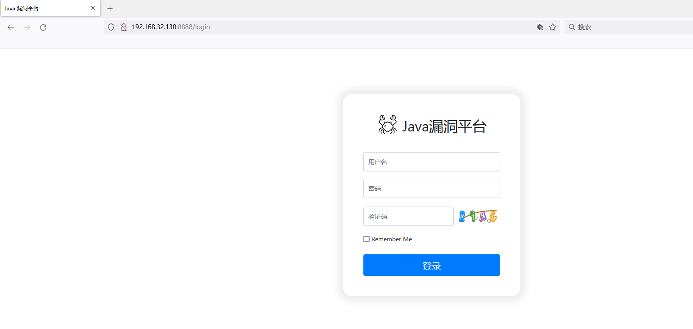
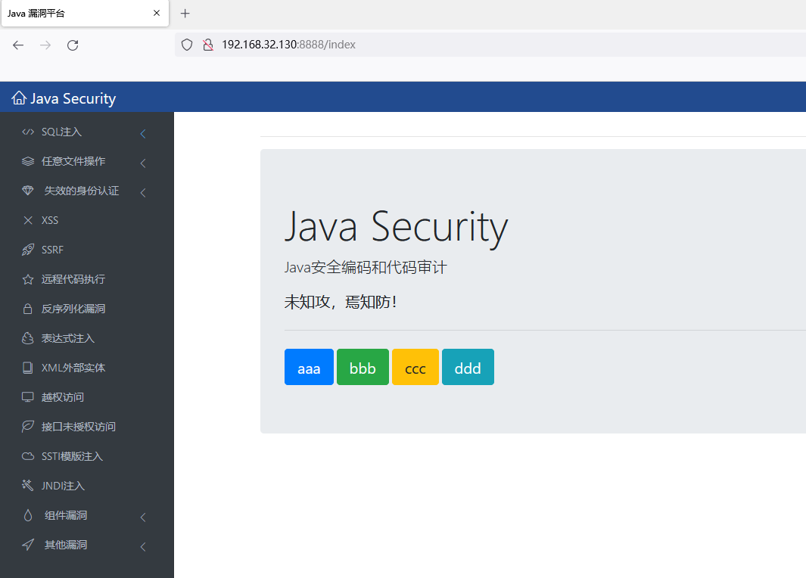
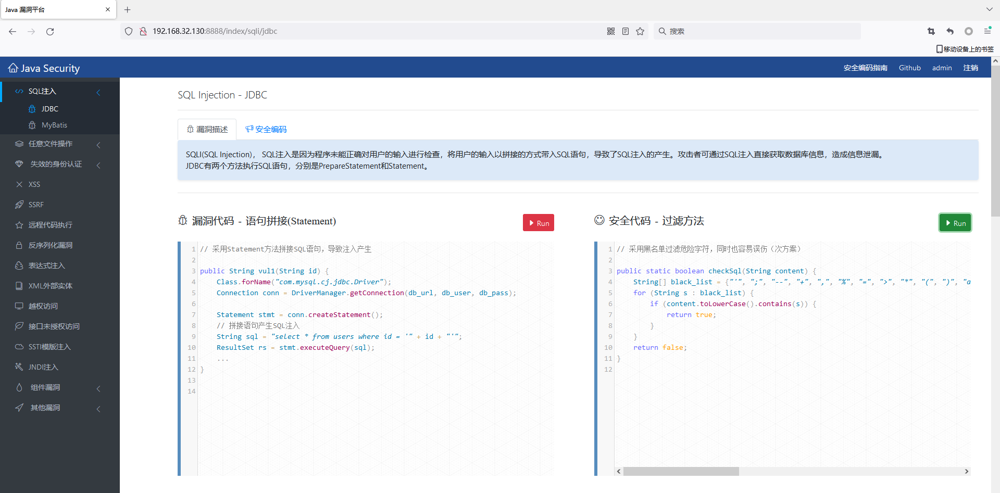

# Hello Java Sec

## 简介

Hello Java Sec是一个java安全编码平台，可以为开发人员攻击具体的漏洞代码、代码运行结果以及修复代码。

## 安装

安装Java8

```
apt install openjdk-8-jdk
```

> 我使用Ubuntu20.04，默认是Java 11，需要切换到Java 8，参考[这里](https://computingforgeeks.com/how-to-set-default-java-version-on-ubuntu-debian/)

启动MySQL

```
docker run  -p 3306:3306 -e MYSQL_ROOT_PASSWORD=123456  -v /opt/mysql/:/var/lib/mysql -d mysql:5.7
```

git仓库下载

```
git clone https://github.com/j3ers3/Hello-Java-Sec.git
```

配置数据库连接：`src/main/resources/application.properties`

```
spring.datasource.url=jdbc:mysql://127.0.0.1:3306/test
spring.datasource.username=root
spring.datasource.password=123456
```

导入`db.sql`数据

```sql
root@l-virtual-machine:/opt/Hello-Java-Sec# mysql -uroot -p123456 -h127.0.0.1 

mysql> create database test;
Query OK, 1 row affected (0.00 sec)

mysql> use test;
Database changed

mysql> source /opt/Hello-Java-Sec/src/main/resources/db.sql
Query OK, 1 row affected (0.00 sec)

Database changed
Query OK, 0 rows affected (0.02 sec)

Query OK, 1 row affected (0.00 sec)

Query OK, 1 row affected (0.00 sec)

Query OK, 0 rows affected (0.00 sec)
```

构建jar包

```
mvn clean package -DskipTests
```


另外一种安装方式

修改数据库连接IP地址为：`172.20.0.200`

修改Dockerfile

```
FROM openjdk:8
RUN apt update -y
RUN apt install -y  maven
COPY . /opt/seccode/
WORKDIR /opt/seccode
RUN mvn clean package -DskipTests

ENTRYPOINT java -jar target/javasec-1.10.jar 
```

新增docker-compose.yaml文件

```
version: '2'
services:
  seccode:
    build:
      context: /opt/Hello-Java-Sec/
      dockerfile: Dockerfile
    image: seccode
    networks:
      extnetwork:
        ipv4_address: 172.20.0.100
    ports:
      - 8888:8888
    environment:
      MYSQL_USER: root
      MYSQL_PASSWORD: 123456

  db:
    image: mysql:5.7
    networks:
      extnetwork:
        ipv4_address: 172.20.0.200
    container_name: db
    volumes:
      - ./data/mysql:/var/lib/mysql
    restart: always
    ports:
      - 3306:3306
    environment:
      MYSQL_ROOT_PASSWORD: 
      MYSQL_DATABASE: jxwaf
      MYSQL_USER: 
      MYSQL_PASSWORD:
    user: root
    privileged: true

networks:
  extnetwork:
    ipam:
      driver: bright
      config:
        - subnet: 172.20.0.0/16
          gateway: 172.20.0.1
```

运行

```
docker-compose build 
docker-compose up
```


## 运行

启动应用，访问8888端口

```
java -jar target/javasec-1.10.jar 
```



输入`admin:admin`进行登录



点击JDBC按钮，可以看到SQL注入的漏洞代码以及对应的过滤方法。



点击漏洞代码的`RUN`键，可以复现相应的漏洞

