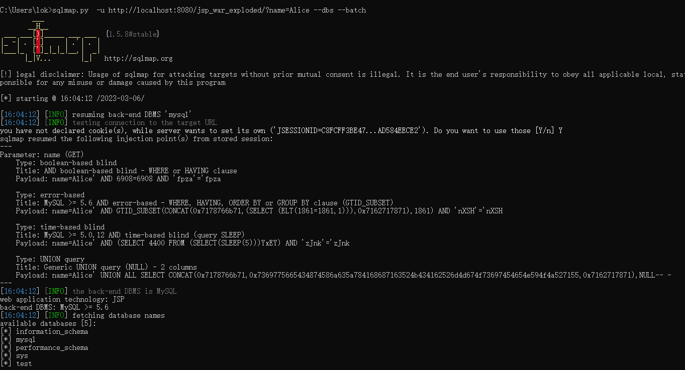
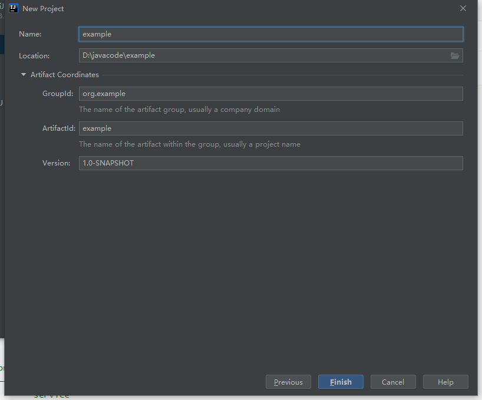

# SQL注入

## jdbc

> 需要将mysql-connector-java-8.0.28.jar放到tomcat的lib目录下面

SQL代码

```sql
CREATE TABLE users (
  id INT PRIMARY KEY,
  name VARCHAR(50) NOT NULL
);

INSERT INTO users (id, name)
VALUES (1, 'Alice'), (2, 'Bob'), (3, 'Charlie');
```

漏洞代码

```jsp
<%@page import="java.sql.*"%>
<%
    String name = request.getParameter("name");
    String query = "SELECT * FROM users WHERE name = '" + name + "'";

    // 设置数据库连接
    String url = "jdbc:mysql://192.168.32.130:3306/test";
    String username = "root";
    String password = "123456";
    Class.forName("com.mysql.jdbc.Driver");
    Connection conn = DriverManager.getConnection(url, username, password);

    // 执行查询
    Statement stmt = conn.createStatement();
    ResultSet rs = stmt.executeQuery(query);

    // 显示查询结果
    out.println("<table>");
    out.println("<tr><th>ID</th><th>Name</th></tr>");
    while (rs.next()) {
        int id = rs.getInt("id");
        String uname = rs.getString("name");
        out.println("<tr><td>" + id + "</td><td>" + uname + "</td></tr>");
    }
    out.println("</table>");

    // 关闭数据库连接
    rs.close();
    stmt.close();
    conn.close();
%>
```



### 修复代码（预编译）

```java
  String query = "SELECT * FROM users WHERE name = ?";

  // 执行查询
  PreparedStatement stmt = conn.prepareStatement(query);
  stmt.setString(1, name);
  ResultSet rs = stmt.executeQuery();
```

预编译语句是一种更安全和更高效的处理方式，它无法处理某些情况，例如like和order by子句中的动态值。

为了解决这些问题，有几种可行的方法：

1. 在使用字符串拼接构建SQL语句时，必须对动态值进行适当的转义和验证，以避免SQL注入攻击。

例如，在使用like子句时，可以这样处理：

```java
String username = request.getParameter("username");
String sql = "SELECT * FROM users WHERE username LIKE ?";
PreparedStatement stmt = conn.prepareStatement(sql);
stmt.setString(1, "%" + username.replace("%", "\\%").replace("_", "\\_") + "%");
ResultSet rs = stmt.executeQuery();
```

2. 对于无法使用预编译的查询，可以在编写代码时尽量将动态值分离出来，使其成为固定的字符串。

例如，在使用order by子句时，可以这样处理：

```java
String sort = req.getParameter("sort");
String sql = "SELECT * FROM users ORDER BY " + validateSort(sort);
PreparedStatement stmt = conn.prepareStatement(sql);
ResultSet rs = stmt.executeQuery();

private String validateSort(String sort) {
  // 对sort参数进行验证和转义，确保只包含允许的字段名和排序方式（ASC或DESC），以避免SQL注入攻击
  if (sort == null) {
    return "id ASC"; // 默认排序方式
  }
  String[] parts = sort.split(" ");
  if (parts.length != 2 || (!"ASC".equals(parts[1]) && !"DESC".equals(parts[1]))) {
    return "id ASC"; // 非法排序参数，使用默认排序方式
  }
  String field = parts[0];
  // 对field进行验证和转义，确保只包含允许的字段名
  if (!"id".equals(field) && !"name".equals(field) && !"age".equals(field)) {
    return "id ASC"; // 非法排序字段，使用默认排序方式
  }
  return field + " " + parts[1];
}
```

## mybatis+springboot

使用MyBatis和Spring Boot的示例代码的典型目录结构

```css
├── src
│   ├── main
│   │   ├── java
│   │   │   └── com
│   │   │       └── example
│   │   │           ├── controller
│   │   │           │   └── UserController.java
│   │   │           ├── mapper
│   │   │           │   └── UserMapper.java
│   │   │           ├── model
│   │   │           │   └── User.java
│   │   │           ├── service
│   │   │           │   └── UserService.java
│   │   │           └── MyApplication.java
│   │   └── resources
│   │       ├── mapper
│   │       │   └── UserMapper.xml
│   │       └── application.properties
│   └── test
│       └── java
│           └── com
│               └── example
│                   └── service
│                       └── UserServiceTest.java
└── pom.xml
```

创建一个maven项目，名字是example。






 

```java
package com.example.controller;

import com.example.mapper.UserMapper;
import com.example.model.User;
import com.example.service.UserService;
import org.springframework.beans.factory.annotation.Autowired;
import org.springframework.http.ResponseEntity;
import org.springframework.web.bind.annotation.*;

import java.util.List;

@RestController
public class UserController {
    @Autowired
    private UserService userService;

    @Autowired
    private UserMapper userMapper;
    // http://127.0.0.1:8080/users/1/
    @GetMapping(value = "/users/{id}", produces = "application/json")
    public ResponseEntity<User> getUser(@PathVariable String id) {
        User user = userService.findById(id);
        return ResponseEntity.ok(user);
    }

    // http://127.0.0.1:8080/users/ids/?ids=1,2,3
    @GetMapping("/users/ids")
    public List<User> findUsersByIds(@RequestParam String ids) {
        List<User> users = userMapper.findUsersByIds(ids);
        return users;
    }
    // http://127.0.0.1:8080/users/name?name=A
    @GetMapping("/users/name")
    public List<User> findUsersByNameLike(@RequestParam String name) {
        List<User> users = userMapper.findUsersByNameLike(name);
        return users;
    }
    // http://127.0.0.1:8080/users/sort?orderByColumn=name&orderByDirection=asc
    @GetMapping("/users/sort")
    public List<User> findUsersOrderBy(@RequestParam String orderByColumn, @RequestParam String orderByDirection) {
        List<User> users = userMapper.findUsersOrderBy(orderByColumn, orderByDirection);
        return users;
    }
    // http://127.0.0.1:8080/users/names?names=Alice&names=Bob
    @GetMapping("/users/names")
    public List<User> findUsersByNames(@RequestParam List<String> names) {
        List<User> users = userMapper.findUsersByNames(names);
        return users;
    }
    
}
```





```java
package com.example.mapper;

import com.example.model.User;
import org.apache.ibatis.annotations.Mapper;
import org.apache.ibatis.annotations.Param;

import java.util.List;

@Mapper
public interface UserMapper {
    User findById(@Param("id") String id);

    List<User> findUsersByIds(@Param("ids") String ids);

    List<User> findUsersByNameLike(@Param("name") String name);

    List<User> findUsersOrderBy(@Param("orderByColumn") String orderByColumn, @Param("orderByDirection") String orderByDirection);

    List<User> findUsersByNames(@Param("names") List<String> names);
}
```





```java
package com.example.model;

public class User {
    private Long id;
    private String name;
    private Integer age;

    public User() {
        // empty constructor required by some frameworks
    }

    public User(Long id, String name, Integer age) {
        this.id = id;
        this.name = name;
        this.age = age;
    }

    public Long getId() {
        return id;
    }

    public void setId(Long id) {
        this.id = id;
    }

    public String getName() {
        return name;
    }

    public void setName(String name) {
        this.name = name;
    }

    public Integer getAge() {
        return age;
    }

    public void setAge(Integer age) {
        this.age = age;
    }
}
```





```java
package com.example.service;

import com.example.mapper.UserMapper;
import com.example.model.User;
import org.springframework.beans.factory.annotation.Autowired;
import org.springframework.stereotype.Service;

@Service
public class UserService {
    @Autowired
    private UserMapper userMapper;

    public User findById(String id) {
        return userMapper.findById(id);
    }

}
```





```java
package com.example;

import org.mybatis.spring.annotation.MapperScan;
import org.springframework.boot.SpringApplication;
import org.springframework.boot.autoconfigure.SpringBootApplication;

@SpringBootApplication
@MapperScan("com.example.mapper")
public class MyApplication {
    public static void main(String[] args) {
        SpringApplication.run(MyApplication.class, args);
    }
}
```






```java
<?xml version="1.0" encoding="UTF-8" ?>
<!DOCTYPE mapper PUBLIC "-//mybatis.org//DTD Mapper 3.0//EN"
        "http://mybatis.org/dtd/mybatis-3-mapper.dtd">

<mapper namespace="com.example.mapper.UserMapper">

    <select id="findById" resultType="User">
        SELECT * FROM users WHERE id = '${id}'
    </select>

    <select id="findUsersByIds" resultType="User">
        SELECT * FROM users
        WHERE id IN (${ids})
    </select>

    <select id="findUsersByNameLike" resultType="User">
        SELECT * FROM users
        WHERE name LIKE '%${name}%'
    </select>

    <select id="findUsersOrderBy" resultType="User">
        SELECT * FROM users
        ORDER BY ${orderByColumn} ${orderByDirection}
    </select>

    <select id="findUsersByNames" resultType="User">
        SELECT * FROM users
        WHERE name IN
        <foreach item="name" collection="names" open="(" separator="," close=")">
            '${name}'
        </foreach>

    </select>

</mapper>
```





```python
spring.datasource.driver-class-name=com.mysql.cj.jdbc.Driver
spring.datasource.url=jdbc:mysql://192.168.32.130:3306/test?characterEncoding=utf8&useSSL=true
spring.datasource.username=root
spring.datasource.password=123456

mybatis.type-aliases-package=com.example.model
mybatis.mapper-locations=classpath:mapper/*.xml
```





### 修复代码





在 MyBatis 中，你可以使用占位符（?）来表示参数，这样就可以将参数值与 SQL 语句分离。在 mapper XML 文件中，你可以使用 `<select>`、`<insert>` 或 `<update>` 标签来定义 SQL 语句，然后使用 `#{}` 占位符来引用参数。例如：

```xml
<select id="getUserById" parameterType="Long" resultType="User">
    SELECT * FROM users WHERE id = #{id}
</select>
```





当你使用参数化查询时，MyBatis 会自动将 SQL 语句转换为预编译语句，从而避免 SQL 注入攻击。预编译语句将会在 SQL 执行之前进行编译和解析，因此恶意注入的代码将无法被执行。

在 mapper XML 文件中，你可以使用 `#{}` 占位符来引用参数。例如：

```xml
<select id="findUsersByNames" resultType="User">
    SELECT * FROM users
    WHERE name IN
    <foreach item="name" collection="names" open="(" separator="," close=")">
        #{name}
    </foreach>

</select>
```





避免在 SQL 语句中拼接参数值，因为这样容易受到 SQL 注入攻击。如果你需要在 SQL 语句中拼接字符串或其他类型的值，请使用 MyBatis 内置的**字符串函数或者使用占位符**来引用参数。

```xml
<select id="getUserByName" parameterType="String" resultType="User">
    SELECT * FROM users WHERE name LIKE CONCAT('%', #{name}, '%')
</select>
```





在 mapper XML 文件中，你可以使用 `<select>`、`<insert>` 或 `<update>` 标签来定义 SQL 语句，然后使用 `#{}` 占位符来引用参数。例如：

```xml
<select id="findUsers" parameterType="map" resultType="User">
    SELECT * FROM users
    WHERE name LIKE #{name}
    ORDER BY #{orderByColumn} #{orderByDirection}
</select>
```






在这个例子中，`findUsers` 方法将会接收一个 `Map` 类型的参数，并返回匹配的 `User` 对象列表。`#{orderByColumn}` 和 `#{orderByDirection}` 占位符将会将参数值安全地插入到 SQL 语句中，并避免了 SQL 注入攻击。

为了避免 SQL 注入攻击，你应该限制 ORDER BY 子句中的列名只能为预定义的值。你可以在代码中定义一个白名单，只允许一些特定的列名。例如：

```java
package com.example.service;

import com.example.mapper.UserMapper;
import com.example.model.User;
import org.springframework.beans.factory.annotation.Autowired;
import org.springframework.stereotype.Service;

import java.util.Arrays;
import java.util.List;

@Service
public class UserService {
    @Autowired
    private UserMapper userMapper;

    private static final List<String> ALLOWED_COLUMNS = Arrays.asList("id", "name", "age");
    private static final List<String> ALLOWED_DIRECTIONS = Arrays.asList("asc", "desc");


    public UserService(UserMapper userMapper) {
        this.userMapper = userMapper;
    }

    public List<User> findUsersOrderBy(String orderByColumn, String orderByDirection) {
        if (!ALLOWED_COLUMNS.contains(orderByColumn)) {
            throw new IllegalArgumentException("Invalid column name: " + orderByColumn);
        }
        if (!ALLOWED_DIRECTIONS.contains(orderByDirection)) {
            throw new IllegalArgumentException("Invalid direction: " + orderByDirection);
        }
        return userMapper.findUsersOrderBy(orderByColumn, orderByDirection, ALLOWED_COLUMNS, ALLOWED_DIRECTIONS);
    }


}
```

```Java
package com.example.mapper;

import com.example.model.User;
import org.apache.ibatis.annotations.Mapper;
import org.apache.ibatis.annotations.Param;

import java.util.List;

@Mapper
public interface UserMapper {

    List<User> findUsersOrderBy(
            @Param("orderByColumn") String orderByColumn,
            @Param("orderByDirection") String orderByDirection,
            @Param("allowedColumns") List<String> allowedColumns,
            @Param("allowedDirections") List<String> allowedDirections);

}
```

```xml
<select id="findUsersOrderBy" resultType="User">
    SELECT * FROM users
    <if test="allowedColumns.contains(orderByColumn) and allowedDirections.contains(orderByDirection)">
        ORDER BY ${orderByColumn} ${orderByDirection}
    </if>
</select>
```

```java
    @GetMapping("/users/sort")
    public List<User> findUsersOrderBy(
            @RequestParam String orderByColumn,
            @RequestParam(defaultValue = "ASC") String orderByDirection) {
        return userService.findUsersOrderBy(orderByColumn, orderByDirection);
    }
```



