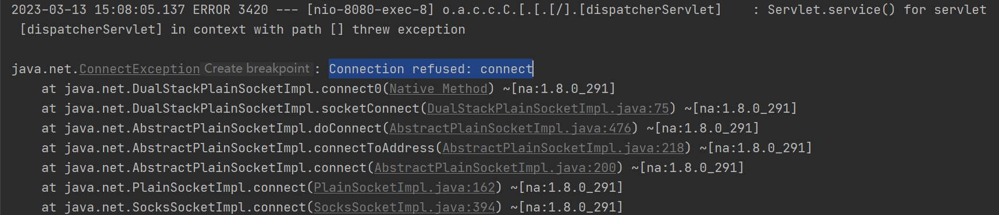
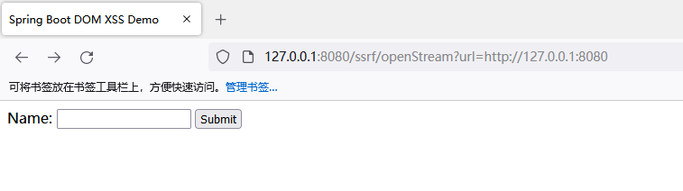
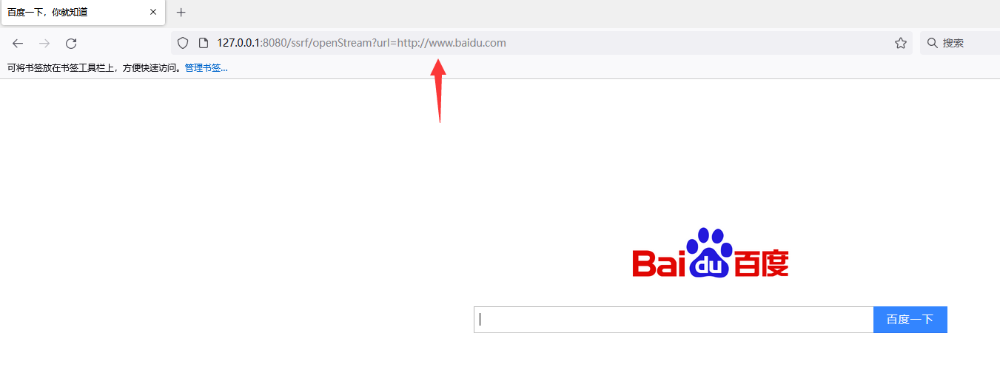

# SSRF


## openStream



```java
package com.example.controller;

import org.springframework.web.bind.annotation.GetMapping;
import org.springframework.web.bind.annotation.RequestParam;
import org.springframework.web.bind.annotation.RestController;

import java.io.BufferedReader;
import java.io.InputStream;
import java.io.InputStreamReader;
import java.net.URL;

@RestController

public class SsrfController {
    @GetMapping("/ssrf/openStream")
    public String example(@RequestParam String url) throws Exception {
        URL urlObj = new URL(url);
        InputStream is = urlObj.openStream();
        BufferedReader reader = new BufferedReader(new InputStreamReader(is));
        StringBuilder response = new StringBuilder();
        String line;
        while ((line = reader.readLine()) != null) {
            response.append(line);
        }
        reader.close();
        return response.toString();
    }
}
```



输入没有开放的端口会报错，`http://127.0.0.1:8080/ssrf/openStream?url=http://127.0.0.1:9999`



可以跳转和查看端口





我们可以使用Spring的`RestTemplate`类来进行HTTP请求，而不是直接使用`openStream()`方法。`RestTemplate`类可以帮助我们更方便地进行HTTP请求，并提供了更多的安全性选项。


## openConnection



```java
package com.example.controller;
import org.springframework.web.bind.annotation.GetMapping;
import org.springframework.web.bind.annotation.RequestParam;
import org.springframework.web.bind.annotation.RestController;

import java.io.BufferedReader;
import java.io.InputStreamReader;
import java.net.HttpURLConnection;
import java.net.URL;

@RestController
public class SsrfController {
    @GetMapping("/ssrf/openConnection")
    public String example(@RequestParam String url) throws Exception {
        URL urlObj = new URL(url);
        HttpURLConnection connection = (HttpURLConnection) urlObj.openConnection();
        connection.setRequestMethod("GET");
        connection.setRequestProperty("User-Agent", "Mozilla/5.0");
        int responseCode = connection.getResponseCode();
        BufferedReader reader = new BufferedReader(new InputStreamReader(connection.getInputStream()));
        StringBuilder response = new StringBuilder();
        String line;
        while ((line = reader.readLine()) != null) {
            response.append(line);
        }
        reader.close();
        return response.toString();
    }
}
```




## 修复代码



```java
package com.example.controller;

import org.springframework.http.ResponseEntity;
import org.springframework.web.bind.annotation.GetMapping;
import org.springframework.web.bind.annotation.RequestParam;
import org.springframework.web.bind.annotation.RestController;
import org.springframework.web.client.RestTemplate;

import java.net.URL;
import java.util.Arrays;

@RestController

public class SsrfController {
    @GetMapping("/ssrf/openStream")
    public String example(@RequestParam String url) throws Exception {
        String[] allowedHosts = {"example.com", "example.net"};
        URL urlObj = new URL(url);
        if (!Arrays.asList(allowedHosts).contains(urlObj.getHost())) {
            throw new Exception("Host not allowed.");
        }
        if (!urlObj.getProtocol().equals("http") && !urlObj.getProtocol().equals("https")) {
            throw new Exception("Protocol not allowed.");
        }
        RestTemplate restTemplate = new RestTemplate();
        ResponseEntity<String> responseEntity = restTemplate.getForEntity(url, String.class);
        String response = responseEntity.getBody();
        return response;
    }
}
```

