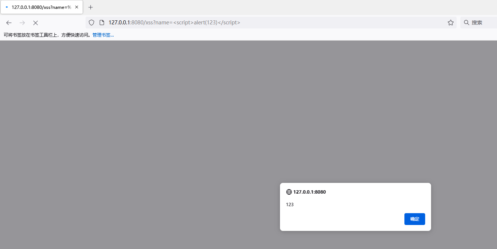
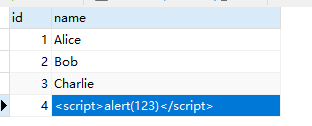
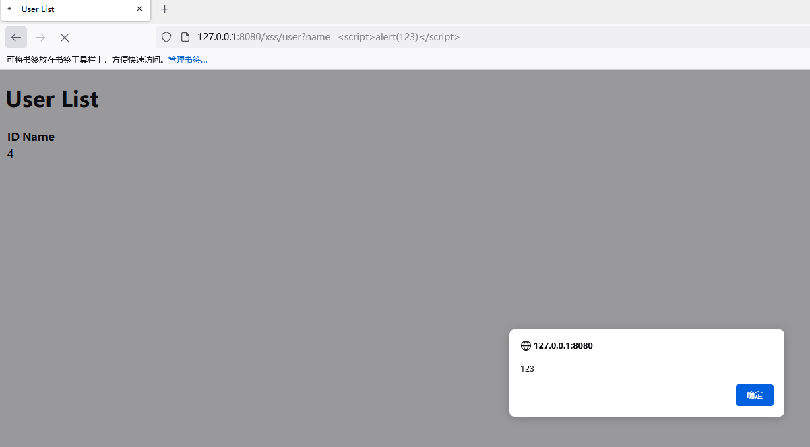
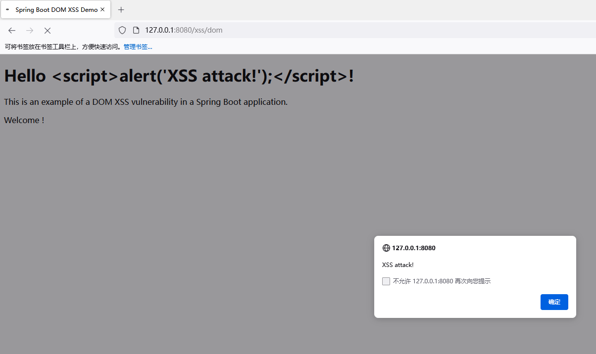
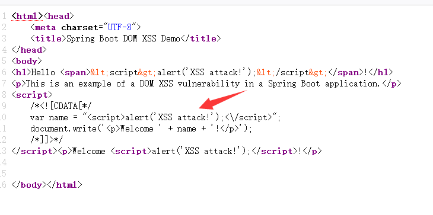
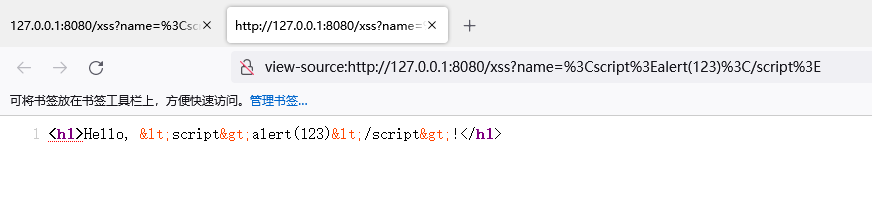

# XSS

## 反射型XSS

下面是一个简单的 Spring Boot Web 应用，其中包含了一个含有 XSS 漏洞的请求处理器。

在这个应用中，我们通过 GET 请求方式访问 `/xss` 接口，输入参数会被直接输出到 HTML 页面中。如果输入参数中包含了恶意脚本，那么这些脚本就会被执行，从而导致 XSS 攻击。

```java
package com.example.controller;

import org.springframework.web.bind.annotation.GetMapping;
import org.springframework.web.bind.annotation.RequestParam;
import org.springframework.web.bind.annotation.RestController;

@RestController
public class XssController {
    @GetMapping("/xss")
    public String XssTest(@RequestParam String name) {
        return "<h1>Hello, " + name + "!</h1>";
    }
}
```

触发漏洞结果



## 存储型XSS

数据库插入一条XSS记录





 

Thymeleaf 是一款常用的模板引擎，它可以将 HTML 页面与 Java 代码进行结合，实现动态渲染 HTML 页面的功能。在 Spring Boot 项目中使用 Thymeleaf，需要在项目的 `pom.xml` 文件中添加以下依赖：

```xml
<dependency>
    <groupId>org.springframework.boot</groupId>
    <artifactId>spring-boot-starter-thymeleaf</artifactId>
</dependency>
```

该依赖会自动引入 Thymeleaf 模板引擎及其依赖的其他库，因此不需要额外添加其他依赖。在添加了该依赖后，Spring Boot 会自动配置 Thymeleaf 模板引擎，无需手动进行配置。




 

Spring Boot配置Thymeleaf的三个属性：

- `spring.thymeleaf.cache=false`：设置Thymeleaf的缓存是否开启，此处为关闭缓存；
- `spring.thymeleaf.prefix=classpath:/templates/`：设置Thymeleaf模板所在的目录，此处为`/templates`；
- `spring.thymeleaf.suffix=.html`：设置Thymeleaf模板的后缀名，此处为`.html`。

```java
spring.thymeleaf.cache=false
spring.thymeleaf.prefix=classpath:/templates/
spring.thymeleaf.suffix=.html
```




 

```java
package com.example.controller;

import com.example.model.User;
import com.example.service.UserService;
import org.springframework.beans.factory.annotation.Autowired;
import org.springframework.web.bind.annotation.GetMapping;
import org.springframework.web.bind.annotation.RequestParam;
import org.springframework.web.bind.annotation.RestController;
import org.springframework.web.servlet.ModelAndView;

import java.util.List;

@RestController
public class XssController {

    @Autowired
    private UserService userService;

    @GetMapping("/xss/user")
    public ModelAndView listUsers(@RequestParam String name) {
        List<User> users = userService.findUsersByName(name);
        System.out.println(users);
        ModelAndView modelAndView = new ModelAndView();
        modelAndView.addObject("users", users);
        modelAndView.setViewName("userList");
        return modelAndView;
    }
}
```




 

`th:utext`会将变量的值直接输出到HTML中，而不是对其进行转义处理。

```html
<!DOCTYPE html>
<html xmlns:th="http://www.thymeleaf.org">
<head>
    <meta charset="UTF-8"/>
    <title>User List</title>
</head>
<body>
<h1>User List</h1>
<table>
    <thead>
    <tr>
        <th>ID</th>
        <th>Name</th>
    </tr>
    </thead>
    <tbody>
    <!-- 使用 Thymeleaf 的 each 循环遍历用户列表，并生成 HTML 行 -->
    <tr th:each="user : ${users}">
        <td th:utext="${user.id}"></td>
        <td th:utext="${user.name}"></td>
    </tr>
    </tbody>
</table>
</body>
</html>
```




 

```java
public class UserService {
    public List<User> findUsersByName(String name) {
        return userMapper.findUsersByName(name);
    }
}
```




 

```java
public interface UserMapper {
    List<User> findUsersByName(String name);
}
```



 

```xml
    <select id="findUsersByName" resultType="User">
        SELECT * FROM users where name = #{name}
    </select>
```







## dom xss



 

```java
package com.example.controller;

import com.example.model.User;
import com.example.service.UserService;
import org.springframework.beans.factory.annotation.Autowired;
import org.springframework.ui.Model;
import org.springframework.web.bind.annotation.GetMapping;
import org.springframework.web.bind.annotation.PostMapping;
import org.springframework.web.bind.annotation.RequestParam;
import org.springframework.web.bind.annotation.RestController;
import org.springframework.web.servlet.ModelAndView;

import java.util.List;

@RestController
public class XssController {

    @GetMapping("/xss/index")
    public ModelAndView index() {
        ModelAndView modelAndView = new ModelAndView();
        modelAndView.setViewName("index");

        return modelAndView;
    }

    @PostMapping("/xss/dom")
    public ModelAndView xss(@RequestParam("name") String name) {
        ModelAndView modelAndView = new ModelAndView();
        modelAndView.addObject("name", name);
        modelAndView.setViewName("xss");
        return modelAndView;
    }
}
```



 

```html
<!DOCTYPE html>
<html xmlns:th="http://www.thymeleaf.org">
<head>
    <meta charset="UTF-8">
    <title>Spring Boot DOM XSS Demo</title>
</head>
<body>
<form method="post" action="/xss/dom">
    <label for="name">Name:</label>
    <input type="text" id="name" name="name">
    <button type="submit">Submit</button>
</form>
</body>
</html>

```



 

```html
<!DOCTYPE html>
<html xmlns:th="http://www.thymeleaf.org">
<head>
    <meta charset="UTF-8">
    <title>Spring Boot DOM XSS Demo</title>
</head>
<body>
<h1>Hello <span th:text="${name}"></span>!</h1>
<p>This is an example of a DOM XSS vulnerability in a Spring Boot application.</p>
<script th:inline="javascript">
    /*<![CDATA[*/
    var name = /*[[${name}]]*/ 'default';
    document.write('<p>Welcome ' + name + '!</p>');
    /*]]>*/
</script>
</body>
</html>
```







查看页面源代码，可以看到插入到JS里面



## 修复代码

### HtmlUtils类

使用Spring框架提供的HtmlUtils类对用户输入进行转义

```java
package com.example.controller;

import org.springframework.web.bind.annotation.GetMapping;
import org.springframework.web.bind.annotation.RequestParam;
import org.springframework.web.bind.annotation.RestController;
import org.springframework.web.util.HtmlUtils;

@RestController
public class XssController {
    @GetMapping("/xss")
    public String XssTest(@RequestParam String name) {
        String escapedName = HtmlUtils.htmlEscape(name);
        return "<h1>Hello, " + escapedName + "!</h1>";
    }
}
```

查看页面源代码，可以看到已经转义



### escapeHtml4类

```java
import static org.unbescape.html.HtmlEscape.escapeHtml4;

@RestController
public class XssController {
    @GetMapping("/xss")
    public String XssTest(@RequestParam String name) {
        String escapedName = escapeHtml4(name);
        return "<h1>Hello, " + escapedName + "!</h1>";
    }
}
```

### HTML编码

```java
public class XssController {

    public static String escapeHtml(String str) {
        if (str == null) {
            return null;
        }
        StringBuilder sb = new StringBuilder();
        for (char c : str.toCharArray()) {
            switch (c) {
                case '<':
                    sb.append("&lt;");
                    break;
                case '>':
                    sb.append("&gt;");
                    break;
                case '"':
                    sb.append("&quot;");
                    break;
                case '\'':
                    sb.append("&#x27;");
                    break;
                case '&':
                    sb.append("&amp;");
                    break;
                default:
                    sb.append(c);
            }
        }
        return sb.toString();
    }


    @GetMapping("/xss")
    public String XssTest(@RequestParam String name) {
        return "<h1>Hello, " + escapeHtml(name) + "!</h1>";
    }
}
```

### thymeleaf模板过滤

```html
<!DOCTYPE html>
<html xmlns:th="http://www.thymeleaf.org">
<head>
    <meta charset="UTF-8">
    <title>User List</title>
</head>
<body>
<h1>User List</h1>
<table>
    <tr>
        <th>ID</th>
        <th>Name</th>
    </tr>
    <tr th:each="user : ${users}">
        <td th:text="${user.id}"></td>
        <td th:text="${user.name}"></td>
    </tr>
</table>
</body>
</html>
```

