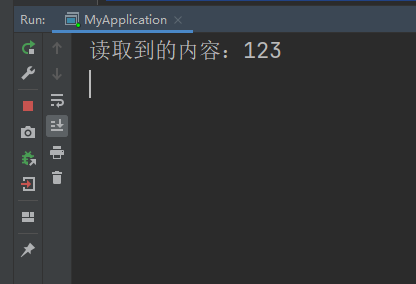
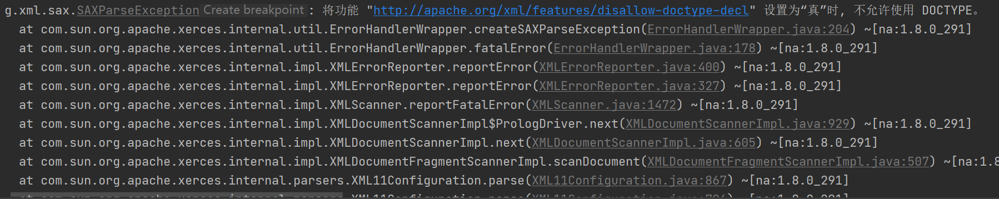
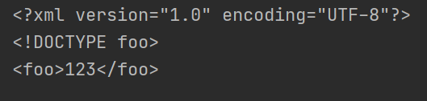
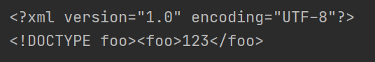
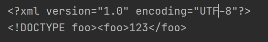
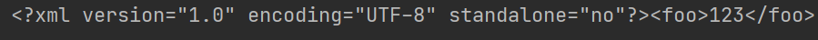
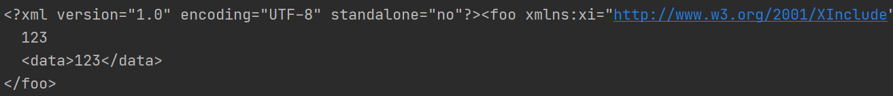

# XXE

## SAX

> Java SAX（Simple API for XML）库是一种处理XML（eXtensible Markup Language）文档的标准Java API。SAX库是一种事件驱动的XML解析器，它使用基于事件的回调机制来解析XML文档。在解析过程中，SAX解析器会将XML文档中的每个元素解析成一个事件，并在解析到每个事件时触发相应的回调方法。
>
> 下面是SAX库的一些详细说明：
>
> 1. SAX库是基于Java的标准API，因此它可以与任何Java程序一起使用。
> 2. SAX库提供了一个处理XML文档的API，可以让开发者从XML文档中获取数据并进行处理。
> 3. SAX库是一种轻量级的解析器，它不需要将整个XML文档读入内存，因此可以处理非常大的XML文档。
> 4. SAX库使用事件驱动的回调机制，这意味着开发者可以在解析XML文档时指定一些回调方法，以便在解析到特定事件时触发这些回调方法。
> 5. SAX库提供了一组默认的回调方法，但也可以通过继承默认处理程序类并覆盖其方法来自定义回调方法。
> 6. SAX库可以解析XML文档的所有部分，包括元素、属性、注释和处理指令等。
> 7. SAX库还提供了一些辅助类和方法，用于简化XML解析过程和处理解析后的数据。

#### SAXParserFactory

这个代码可以回显 "XXE" 字符串，但并不能回显解释内容。在 `parseXml` 方法中，首先创建了一个 `SAXParserFactory` 实例，然后使用该工厂创建了一个 `SAXParser` 对象。接着，该方法通过 `parser.parse` 方法解析传递进来的 `xmlData` 字符串，解析过程中不会输出任何内容。



```java
package com.example.controller;

import org.springframework.web.bind.annotation.PostMapping;
import org.springframework.web.bind.annotation.RequestBody;
import org.springframework.web.bind.annotation.RestController;
import org.xml.sax.helpers.DefaultHandler;

import org.xml.sax.InputSource;
import javax.xml.parsers.SAXParserFactory;
import javax.xml.parsers.SAXParser;
import java.io.StringReader;

@RestController
public class XxeController {

    @PostMapping("/parseXml")
    public String parseXml(@RequestBody String xmlData) throws Exception {
        SAXParserFactory factory = SAXParserFactory.newInstance();
        SAXParser parser = factory.newSAXParser();
        parser.parse(new InputSource(new StringReader(xmlData)), new DefaultHandler());
        return "XXE";
    }
}
```



要让这段代码回显内容，可以在`DefaultHandler`的回调方法中添加处理逻辑。在处理XML时，`DefaultHandler`提供了一些回调方法，我们可以在这些方法中处理我们感兴趣的内容。例如，我们可以重写`DefaultHandler`的`characters`方法，当读取到XML文档中的字符数据时，就将其输出到控制台或者返回给调用方。

以下是修改后的代码示例，当读取到XML文档中的字符数据时，会将其输出到控制台：



```java
package com.example.controller;


import org.xml.sax.SAXException;
import org.xml.sax.helpers.DefaultHandler;

public class MyHandler extends DefaultHandler {
    private StringBuilder builder = new StringBuilder();

    @Override
    public void characters(char[] ch, int start, int length) throws SAXException {
        builder.append(ch, start, length);
        System.out.println("读取到的内容：" + builder.toString());
    }
}
```





```java
package com.example.controller;

import org.springframework.web.bind.annotation.PostMapping;
import org.springframework.web.bind.annotation.RequestBody;
import org.springframework.web.bind.annotation.RestController;

import org.xml.sax.InputSource;
import javax.xml.parsers.SAXParserFactory;
import javax.xml.parsers.SAXParser;
import java.io.StringReader;

@RestController
public class XxeController {

    @PostMapping("/parseXml")
    public String parseXml(@RequestBody String xmlData) throws Exception {
        SAXParserFactory factory = SAXParserFactory.newInstance();
        SAXParser parser = factory.newSAXParser();
        MyHandler handler = new MyHandler();
        parser.parse(new InputSource(new StringReader(xmlData)), handler);
        return "XXE";
    }
}
```





```
POST /parseXml HTTP/1.1
Host: 127.0.0.1:8080
User-Agent: Mozilla/5.0 (Windows NT 10.0; Win64; x64; rv:109.0) Gecko/20100101 Firefox/110.0
Accept: text/html,application/xhtml+xml,application/xml;q=0.9,image/avif,image/webp,*/*;q=0.8
Accept-Language: zh-CN,zh;q=0.8,zh-TW;q=0.7,zh-HK;q=0.5,en-US;q=0.3,en;q=0.2
DNT: 1
Connection: close
Upgrade-Insecure-Requests: 1
Content-Length: 125

<?xml version="1.0"?>
<!DOCTYPE foo [
<!ELEMENT foo ANY >
<!ENTITY xxe SYSTEM "file:///C:/1.log" >]>
<foo>&xxe;</foo>
```





**修复代码**

```java
        SAXParserFactory factory = SAXParserFactory.newInstance();
        factory.setFeature("http://apache.org/xml/features/disallow-doctype-decl", true);
        factory.setFeature("http://xml.org/sax/features/external-general-entities", false);
        factory.setFeature("http://xml.org/sax/features/external-parameter-entities", false);
```

如果攻击会提示不允许使用`DOCTYPE`



#### XMLReaderFactory

从Java SE 9开始，`XMLReaderFactory.createXMLReader()`方法已被标记为弃用，推荐使用`SAXParser`来创建`XMLReader`对象。因此，在Java SE 9及更高版本中，您将无法使用`XMLReaderFactory.createXMLReader()`方法来创建XMLReader对象。

在Java SE 8及更早版本中，`XMLReaderFactory.createXMLReader()`方法是可用的，但存在XXE漏洞，因此不建议使用它来解析未知来源的XML文件。如果您仍然需要使用这个方法，请确保您使用的是最新的Java SE 8版本，并仅在解析已知安全的XML文件时使用它。

```java
package com.example.controller;

import org.springframework.web.bind.annotation.PostMapping;
import org.springframework.web.bind.annotation.RequestBody;
import org.springframework.web.bind.annotation.RestController;

import org.xml.sax.InputSource;
import org.xml.sax.XMLReader;
import org.xml.sax.helpers.XMLReaderFactory;
import java.io.StringReader;

@RestController
public class XxeController {
    @PostMapping("/parseXml")
    public String parseXml(@RequestBody String xmlData) throws Exception {
        XMLReader xmlReader = XMLReaderFactory.createXMLReader();
        xmlReader.parse(new InputSource(new StringReader(xmlData)));
        return "XXE";
    }
}
```

**修复代码**

```java
        xmlReader.setFeature("http://apache.org/xml/features/disallow-doctype-decl", true);
        xmlReader.setFeature("http://xml.org/sax/features/external-general-entities", false);
        xmlReader.setFeature("http://xml.org/sax/features/external-parameter-entities", false);
```


## jdom2

> Java JDOM2库是一个基于Java的XML解析和操作库，它提供了一种更加面向对象和易于使用的API来处理XML文档。相对于SAX库和DOM库，JDOM2库在易用性和可读性方面都有很大优势，同时也提供了一些高级特性，如命名空间支持、XPath查询、XML Schema验证等。
>
> 下面是JDOM2库的一些详细说明：
>
> 1. JDOM2库是基于Java的标准API，因此可以与任何Java程序一起使用。
> 2. JDOM2库提供了一种面向对象的API，开发者可以通过创建XML元素和属性对象来构建XML文档。
> 3. JDOM2库提供了一些高级特性，如命名空间支持、XPath查询、XML Schema验证等。
> 4. JDOM2库可以将XML文档加载到内存中，并以树形结构表示。开发者可以使用节点对象来遍历和修改XML文档。
> 5. JDOM2库支持将XML文档序列化为字符串、文件或流，并提供了一些选项来控制输出格式。
> 6. JDOM2库支持解析和生成所有类型的XML文档，包括DTD、XML Schema等。
> 7. JDOM2库还提供了一些辅助类和方法，用于简化XML解析过程和处理解析后的数据。

该方法使用了JDOM2的SAXBuilder来解析这个XML字符串，并将其转换为JDOM2的Document对象。然后，它对这个Document对象进行操作，例如读取或修改XML元素。

由于这个方法使用了SAXBuilder，它存在XXE漏洞。攻击者可以在XML数据中包含外部实体，从而读取敏感文件或进行其他恶意操作。



```java
package com.example.controller;

import org.jdom2.Document;
import org.jdom2.input.sax.XMLReaders;
import org.jdom2.output.Format;
import org.jdom2.output.XMLOutputter;
import org.springframework.web.bind.annotation.PostMapping;
import org.springframework.web.bind.annotation.RequestBody;
import org.springframework.web.bind.annotation.RestController;

import java.io.StringReader;
import org.jdom2.input.SAXBuilder;


@RestController
public class XxeController {

    @PostMapping("/parseXml")
    public String parseXml(@RequestBody String xmlData) throws Exception {
        SAXBuilder saxBuilder = new SAXBuilder(XMLReaders.NONVALIDATING);
        Document document = saxBuilder.build(new StringReader(xmlData));
        // 对文档进行操作
        XMLOutputter outputter = new XMLOutputter(Format.getPrettyFormat());
        String xmlString = outputter.outputString(document);
        System.out.println(xmlString);
        return "XXE";
    }
}
```





**修复代码**

```java
saxBuilder.setFeature("http://apache.org/xml/features/disallow-doctype-decl", true);
saxBuilder.setFeature("http://xml.org/sax/features/external-general-entities", false);
saxBuilder.setFeature("http://xml.org/sax/features/external-parameter-entities", false);
```


## dom4j

> Java DOM4J库是一个基于Java的XML解析和操作库，它提供了一种高性能、灵活、易于使用的API来处理XML文档。相对于SAX库和DOM库，DOM4J库在易用性和性能方面都有很大优势，同时也提供了一些高级特性，如XPath查询、XML Schema验证等。
>
> 下面是DOM4J库的一些详细说明：
>
> 1. DOM4J库是基于Java的标准API，因此可以与任何Java程序一起使用。
> 2. DOM4J库提供了一种高性能的API，开发者可以通过创建XML元素和属性对象来构建XML文档。
> 3. DOM4J库提供了一些高级特性，如XPath查询、XML Schema验证等。
> 4. DOM4J库可以将XML文档加载到内存中，并以树形结构表示。开发者可以使用节点对象来遍历和修改XML文档。
> 5. DOM4J库支持将XML文档序列化为字符串、文件或流，并提供了一些选项来控制输出格式。
> 6. DOM4J库支持解析和生成所有类型的XML文档，包括DTD、XML Schema等。
> 7. 

### SAXReader

该方法使用了SAXReader来解析这个XML字符串，并将其转换为Dom4j的Document对象。然后，它将Document对象转换为格式化的XML字符串，并使用`System.out.println()`方法将其输出到控制台上。

由于这个方法使用了SAXReader，它存在XXE漏洞。攻击者可以在XML数据中包含外部实体，从而读取敏感文件或进行其他恶意操作。



```java
package com.example.controller;
import org.dom4j.Document;
import org.dom4j.io.SAXReader;
import org.springframework.web.bind.annotation.PostMapping;
import org.springframework.web.bind.annotation.RequestBody;
import org.springframework.web.bind.annotation.RestController;
import java.io.StringReader;

@RestController
public class XxeController {

    @PostMapping("/parseXml")
    public String parseXml(@RequestBody String xmlData) throws Exception {
        SAXReader reader = new SAXReader();
        Document document = reader.read(new StringReader(xmlData));

        String xmlString = document.asXML();
        System.out.println(xmlString);

        return "XXE";
    }
}
```





**修复代码**

```java
reader.setFeature("http://apache.org/xml/features/disallow-doctype-decl", true);
reader.setFeature("http://xml.org/sax/features/external-general-entities", false);
reader.setFeature("http://xml.org/sax/features/external-parameter-entities", false);
```

### DocumentHelper



```java
package com.example.controller;

import org.dom4j.Document;
import org.dom4j.DocumentHelper;
import org.springframework.web.bind.annotation.PostMapping;
import org.springframework.web.bind.annotation.RequestBody;
import org.springframework.web.bind.annotation.RestController;


@RestController
public class XxeController {

    @PostMapping("/parseXml")
    public String parseXml(@RequestBody String xmlData) throws Exception {
        Document document = DocumentHelper.parseText(xmlData);
        // 对文档进行操作
        String xmlString = document.asXML();
        System.out.println(xmlString);
        return "XXE";
    }
}
```





> 修复该漏洞只需升级dom4j到2.1.1及以上，该版本及以上禁用了ENTITY；不带ENTITY的PoC不能利用，所以禁用ENTITY即可完成修复。

## digester3

> Java Digester3库是一个基于Java的XML解析和操作库，它提供了一种基于规则的XML解析和对象创建机制。相对于其他XML解析库，Digester3库可以更加方便地将XML文档转换为Java对象，同时也提供了一些高级特性，如XPath查询、XML Schema验证等。
>
> 下面是Digester3库的一些详细说明：
>
> 1. Digester3库是基于Java的标准API，因此可以与任何Java程序一起使用。
> 2. Digester3库提供了一种基于规则的XML解析和对象创建机制，开发者可以定义一组规则来指导XML解析过程。
> 3. Digester3库支持将XML文档转换为Java对象，通过将XML元素映射到Java对象的属性来实现。
> 4. Digester3库提供了一些高级特性，如XPath查询、XML Schema验证等。
> 5. Digester3库可以将XML文档加载到内存中，并使用Digester对象解析XML文档。
> 6. Digester3库支持解析和生成所有类型的XML文档，包括DTD、XML Schema等。
> 7. Digester3库还提供了一些辅助类和方法，用于简化XML解析过程和处理解析后的数据。



```java
package com.example.controller;
import org.apache.commons.digester.Digester;
import org.springframework.web.bind.annotation.PostMapping;
import org.springframework.web.bind.annotation.RequestBody;
import org.springframework.web.bind.annotation.RestController;

import java.io.StringReader;

@RestController
public class XxeController {

    @PostMapping("/parseXml")
    public String parseXml(@RequestBody String xmlData) throws Exception {
        Digester digester = new Digester();
        digester.parse(new StringReader(xmlData));  // parse xml
        return "XXE";
    }
}
```



**修复代码**

```
digester.setFeature("http://apache.org/xml/features/disallow-doctype-decl", true);
digester.setFeature("http://xml.org/sax/features/external-general-entities", false);
digester.setFeature("http://xml.org/sax/features/external-parameter-entities", false);
```


## javax.xml

> javax.xml是Java语言中提供的一个用于处理XML（eXtensible Markup Language）的标准API集合。该API集合包含了各种处理XML文档的类和接口，包括DOM、SAX、StAX等三种常用的XML解析器，以及JAXB、JAXP等一些用于XML绑定、转换和验证的工具。下面是javax.xml的一些详细说明：
>
> 1. javax.xml是Java语言中的标准API，因此可以与任何Java程序一起使用。
> 2. javax.xml提供了各种处理XML文档的类和接口，包括DOM、SAX、StAX等三种常用的XML解析器。
> 3. javax.xml还提供了一些用于XML绑定、转换和验证的工具，如JAXB、JAXP等。
> 4. javax.xml中的DOM API允许开发者将XML文档加载到内存中，并以树形结构表示。开发者可以使用节点对象来遍历和修改XML文档。
> 5. javax.xml中的SAX API是一种事件驱动的XML解析器，它使用基于事件的回调机制来解析XML文档。
> 6. javax.xml中的StAX API是一种流式的XML解析器，它允许开发者逐个地处理XML文档中的事件，而不需要将整个文档读入内存。
> 7. javax.xml中的JAXB API允许开发者将XML文档转换为Java对象，并将Java对象序列化为XML文档。
> 8. javax.xml中的JAXP API提供了一些通用的XML处理工具，如XPath查询、XML Schema验证等。
>
> 总之，javax.xml是Java语言中的一个用于处理XML的标准API集合，它提供了各种处理XML文档的类和接口，包括DOM、SAX、StAX等三种常用的XML解析器，以及JAXB、JAXP等一些用于XML绑定、转换和验证的工具。开发者可以根据自己的需要选择适合的API来处理XML文档。



```java
package com.example.controller;
import org.springframework.web.bind.annotation.PostMapping;
import org.springframework.web.bind.annotation.RequestBody;
import org.springframework.web.bind.annotation.RestController;
import org.w3c.dom.Document;
import org.xml.sax.InputSource;

import javax.xml.parsers.DocumentBuilder;
import javax.xml.parsers.DocumentBuilderFactory;
import javax.xml.transform.Transformer;
import javax.xml.transform.TransformerFactory;
import javax.xml.transform.dom.DOMSource;
import javax.xml.transform.stream.StreamResult;
import java.io.StringReader;
import java.io.StringWriter;

@RestController
public class XxeController {

    @PostMapping("/parseXml")
    public String parseXml(@RequestBody String xmlData) throws Exception {
        DocumentBuilderFactory factory = DocumentBuilderFactory.newInstance();
        DocumentBuilder builder = factory.newDocumentBuilder();
        Document document = builder.parse(new InputSource(new StringReader(xmlData)));
        String xmlString = getStringFromDocument(document);
        System.out.println(xmlString);
        return "XXE";
    }

    private static String getStringFromDocument(Document document) throws Exception {
        TransformerFactory transformerFactory = TransformerFactory.newInstance();
        Transformer transformer = transformerFactory.newTransformer();
        StringWriter writer = new StringWriter();
        transformer.transform(new DOMSource(document), new StreamResult(writer));
        return writer.getBuffer().toString();
    }
}    
```





**修复代码**

```java
factory.setFeature("http://apache.org/xml/features/disallow-doctype-decl", true);
factory.setFeature("http://xml.org/sax/features/external-general-entities", false);
factory.setFeature("http://xml.org/sax/features/external-parameter-entities", false);
```

------

> XInclude漏洞是一种基于XXE漏洞的攻击，攻击者可以在XML数据中包含XInclude指令，从而注入外部实体和其他恶意代码。XInclude是一种XML规范，用于在XML文档中包含和引用其他XML文档。当XML解析器支持XInclude时，它会在解析XML数据时加载外部实体，从而导致安全问题。



```java
package com.example.controller;
import org.springframework.web.bind.annotation.PostMapping;
import org.springframework.web.bind.annotation.RequestBody;
import org.springframework.web.bind.annotation.RestController;
import org.w3c.dom.Document;
import org.xml.sax.InputSource;

import javax.xml.parsers.DocumentBuilder;
import javax.xml.parsers.DocumentBuilderFactory;
import javax.xml.transform.Transformer;
import javax.xml.transform.TransformerFactory;
import javax.xml.transform.dom.DOMSource;
import javax.xml.transform.stream.StreamResult;
import java.io.StringReader;
import java.io.StringWriter;

@RestController
public class XxeController {

    @PostMapping("/parseXml")
    public String parseXml(@RequestBody String xmlData) throws Exception {
        DocumentBuilderFactory factory = DocumentBuilderFactory.newInstance();
        factory.setXIncludeAware(true); //支持XInclude
        factory.setNamespaceAware(true);
        factory.setExpandEntityReferences(true);
        DocumentBuilder builder = factory.newDocumentBuilder();
        Document document = builder.parse(new InputSource(new StringReader(xmlData)));
        String xmlString = getStringFromDocument(document);
        System.out.println(xmlString);
        return "XXE";
    }

    private static String getStringFromDocument(Document document) throws Exception {
        TransformerFactory transformerFactory = TransformerFactory.newInstance();
        Transformer transformer = transformerFactory.newTransformer();
        StringWriter writer = new StringWriter();
        transformer.transform(new DOMSource(document), new StreamResult(writer));
        return writer.getBuffer().toString();
    }
}
```





```xml
<?xml version="1.0"?>
<!DOCTYPE foo [
<!ELEMENT foo ANY >
<!ENTITY xxe SYSTEM "file:///C:/1.log" >]>
<foo xmlns:xi="http://www.w3.org/2001/XInclude">
  <xi:include href="file:///C:/1.log" parse="text"/>
  <data>&xxe;</data>
</foo>
```





