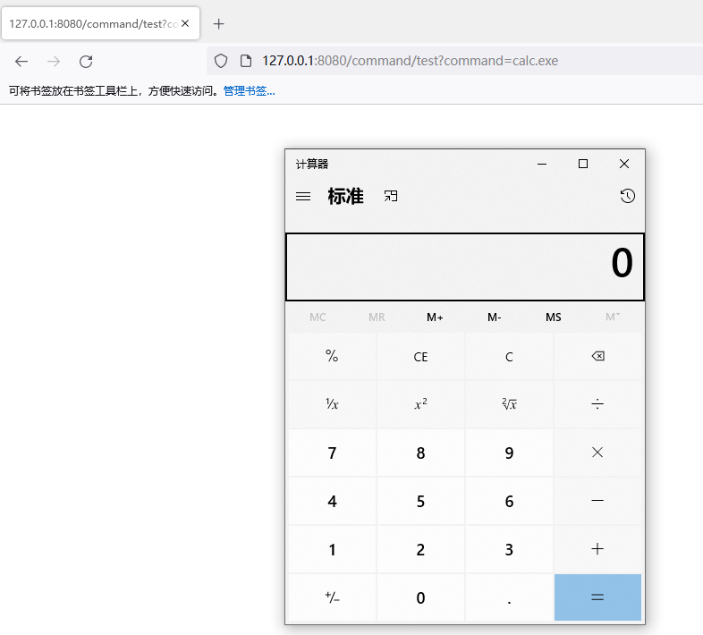

# 命令执行

## Runtime



```java
package com.example.controller;

import org.springframework.web.bind.annotation.GetMapping;
import org.springframework.web.bind.annotation.RequestParam;
import org.springframework.web.bind.annotation.RestController;

import java.io.BufferedReader;
import java.io.IOException;
import java.io.InputStreamReader;
@RestController
public class CommandController {
    @GetMapping("/command/test")
    public String executeCommand(@RequestParam String  command) throws IOException {
        String output = "";
        Process process = Runtime.getRuntime().exec(command);
        BufferedReader reader = new BufferedReader(new InputStreamReader(process.getInputStream()));
        String line;
        while ((line = reader.readLine()) != null) {
            output += line + "\n";
        }
        return output;
    }
}
```





## ProcessBuilder



```java
package com.example.controller;

import org.springframework.web.bind.annotation.GetMapping;
import org.springframework.web.bind.annotation.RequestParam;
import org.springframework.web.bind.annotation.RestController;

import java.io.BufferedReader;
import java.io.IOException;
import java.io.InputStreamReader;
@RestController
public class CommandController {
    @GetMapping("/command/test")
    public String executeCommand(@RequestParam String command) throws IOException {
        String output = "";
        ProcessBuilder builder = new ProcessBuilder(command.split(" "));
        Process process = builder.start();
        BufferedReader reader = new BufferedReader(new InputStreamReader(process.getInputStream()));
        String line;
        while ((line = reader.readLine()) != null) {
            output += line + "\n";
        }
        return output;
    }
}
```




## 漏洞修复

1. 如果使用 `Runtime.exec()` 执行命令，请改用 `ProcessBuilder`。这样可以避免在构造命令字符串时遇到潜在的注入问题，例如：

   ```java
   ProcessBuilder builder = new ProcessBuilder();
   builder.command("ls", "-l");
   Process process = builder.start();
   ```

2. 在使用外部参数构造命令时，请务必对其进行输入验证和过滤。这可以确保只允许在需要时执行特定的命令和参数。例如，如果只需要列出某个目录的内容，则可以对目录进行验证并拒绝任何输入的参数。

3. 在使用用户提供的参数时，请务必对其进行转义和编码。这可以防止用户输入恶意代码并在执行命令时注入命令字符串。例如，可以使用 `StringEscapeUtils.escapeJava()` 方法来转义 Java 字符串中的特殊字符。

4. 尽可能地使用库中提供的高级 API，以避免直接使用操作系统命令。例如，使用 Spring 的 `ProcessLauncher` 接口来执行命令，或使用 Apache Commons Exec 库来执行外部进程。