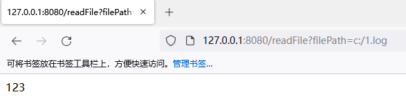
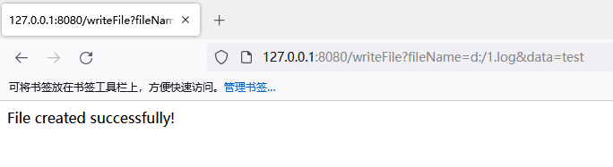

# 文件操作

## 文件上传



```java
package com.example.controller;

import org.springframework.web.bind.annotation.GetMapping;
import org.springframework.web.bind.annotation.PostMapping;
import org.springframework.web.bind.annotation.RequestParam;
import org.springframework.web.bind.annotation.RestController;
import org.springframework.web.multipart.MultipartFile;
import org.springframework.web.servlet.ModelAndView;

import java.io.IOException;
import java.nio.file.Files;
import java.nio.file.Path;
import java.nio.file.Paths;

@RestController
public class FileController {

    @GetMapping("/upload")
    public ModelAndView  showUploadForm() {

        ModelAndView modelAndView = new ModelAndView();
        modelAndView.setViewName("upload");

        return modelAndView;
    }

    @PostMapping("/upload")
    public String handleFileUpload(@RequestParam("file") MultipartFile file) {
        try {
            // 将上传的文件保存到本地文件系统
            byte[] bytes = file.getBytes();
            Path path = Paths.get(file.getOriginalFilename());
            Files.write(path, bytes);
        } catch (IOException e) {
            e.printStackTrace();
        }
        return "redirect:/success";
    }
    
}
```





```html
<!DOCTYPE html>
<html>
<head>
    <meta charset="UTF-8">
    <title>文件上传</title>
</head>
<body>
<h1>文件上传</h1>
<form method="POST" enctype="multipart/form-data" action="/upload">
    <input type="file" name="file">
    <br/><br/>
    <button type="submit">上传</button>
</form>
</body>
</html>
```



修复代码

```java
@Controller
public class FileUploadController {
 
    private static final List<String> ALLOWED_EXTENSIONS = Arrays.asList(".jpg", ".jpeg", ".png");

    @PostMapping("/upload")
    public String handleFileUpload(@RequestParam("file") MultipartFile file) {
        try {
            // 验证上传的文件是否为图片类型
            String fileName = file.getOriginalFilename();
            String extension = fileName.substring(fileName.lastIndexOf(".")).toLowerCase();
            if (!ALLOWED_EXTENSIONS.contains(extension)) {
                throw new RuntimeException("Invalid file type.");
            }

            // 验证上传的文件是否为合法的图片文件
            BufferedImage image = ImageIO.read(file.getInputStream());
            if (image == null) {
                throw new RuntimeException("Invalid image file.");
            }

            // 限制上传文件的大小和数量
            if (file.getSize() > 10 * 1024 * 1024) { // 10MB
                throw new RuntimeException("File size exceeds the limit.");
            }

            // 将上传的文件保存到指定位置
            String uploadDir = "/uploads";
            String realPath = request.getServletContext().getRealPath(uploadDir);
            if (realPath == null) {
                throw new RuntimeException("Failed to retrieve upload directory.");
            }
            Path path = Paths.get(realPath, fileName);
            Files.write(path, file.getBytes());

        } catch (IOException e) {
            throw new RuntimeException("Failed to upload file: " + e.getMessage());
        }
        return "redirect:/success";
    }
}
```

在上面的代码中，我们采取了以下措施：

1. 我们定义了一个`ALLOWED_EXTENSIONS`列表，用于存储允许上传的图片文件类型后缀名。当上传的文件类型不在此列表中时，会抛出异常并拒绝上传。
2. 我们在上传前通过`BufferedImage`读取上传的图片文件，并对其进行验证。如果文件不是合法的图片文件，将抛出异常并拒绝上传。
3. 我们对上传的文件大小进行了限制，当上传的文件超过10MB时，将抛出异常并拒绝上传。
4. 我们将上传的文件保存到应用程序的指定位置（此处为`/uploads`目录），而不是保存在Web根目录下。这有助于避免攻击者通过构造特定的URL访问并执行上传的文件。
5. 我们还在捕获异常时提供了更具体的错误信息，以便于排查问题。


## 文件读取


```java
package com.example.controller;

import org.springframework.web.bind.annotation.GetMapping;
import org.springframework.web.bind.annotation.RequestParam;
import org.springframework.web.bind.annotation.RestController;

import java.io.BufferedReader;
import java.io.File;
import java.io.FileReader;
import java.io.IOException;

@RestController
public class FileController {

    @GetMapping("/readFile")
    public String readFile(@RequestParam String filePath) throws IOException {
        File file = new File(filePath);
        BufferedReader reader = new BufferedReader(new FileReader(file));
        String line = null;
        StringBuilder stringBuilder = new StringBuilder();
        while ((line = reader.readLine()) != null) {
            stringBuilder.append(line);
        }
        reader.close();
        return stringBuilder.toString();
    }
}
```




修复代码

```java
@RestController
public class FileController {

    private static final String UPLOADS_FOLDER = "/uploads/";
    
    @GetMapping("/readFile")
    public String readFile(@RequestParam String filePath) throws IOException {
        File file = new File(ResourceUtils.getFile(filePath).getAbsolutePath());
        String canonicalPath = file.getCanonicalPath();
        if (!canonicalPath.startsWith(ResourceUtils.getFile(UPLOADS_FOLDER).getCanonicalPath())) {
            return "Access denied";
        }
        if (!file.exists() || !file.isFile()) {
            return "File not found";
        }
        if (!file.canRead()) {
            return "Cannot read file";
        }
        BufferedReader reader = new BufferedReader(new FileReader(file));
        String line = null;
        StringBuilder stringBuilder = new StringBuilder();
        while ((line = reader.readLine()) != null) {
            stringBuilder.append(line);
        }
        reader.close();
        return stringBuilder.toString();
    }
}
```

先将传递的文件路径转化为绝对路径，然后获取限定文件夹的绝对路径，再判断传递的文件路径是否在限定的目录下。如果文件路径不在限定的目录下，则拒绝访问。


## 文件写入


```java
package com.example.controller;

import org.springframework.web.bind.annotation.GetMapping;
import org.springframework.web.bind.annotation.RequestParam;
import org.springframework.web.bind.annotation.RestController;

import java.io.File;
import java.io.FileWriter;
import java.io.IOException;

@RestController
public class FileController {

    private static final String UPLOADS_FOLDER = "/uploads/";

    @GetMapping("/writeFile")
    public String writeFile(@RequestParam String fileName, @RequestParam String data) throws IOException {
        File file = new File(fileName);
        FileWriter fileWriter = new FileWriter(file);
        fileWriter.write(data);
        fileWriter.flush();
        fileWriter.close();
        return "File created successfully!";
    }
}
```




修复代码

```java
package com.example.controller;

import org.springframework.web.bind.annotation.GetMapping;
import org.springframework.web.bind.annotation.RequestParam;
import org.springframework.web.bind.annotation.RestController;

import java.io.File;
import java.io.FileOutputStream;
import java.io.IOException;

@RestController
public class FileController {

    private static final String UPLOADS_FOLDER = "upload/";

    @GetMapping("/writeFile")
    public String writeFile(@RequestParam String fileName, @RequestParam String data) throws IOException {
        // 检查文件名是否包含目录遍历字符
        if (fileName.contains("../")) {
            return "Invalid file name";
        }

        // 检查文件名是否合法
        if (!fileName.matches("^[a-zA-Z0-9_]*$")) {
            return "Invalid file name";
        }

        // 确定文件路径
        String filePath = UPLOADS_FOLDER + fileName;

        // 创建文件对象
        File file = new File(filePath);

        // 检查目录是否存在
        if (!file.getParentFile().exists()) {
            // 创建目录
            file.getParentFile().mkdirs();
        }

        // 写入文件
        try (FileOutputStream fos = new FileOutputStream(file)) {
            fos.write(data.getBytes());
        }

        return "File created successfully!";
    }
}
```


## 文件下载


```java
@RestController
public class FileController {

    private static final String UPLOADS_FOLDER = "upload/";

    @GetMapping("/download")
    public void downloadFile(@RequestParam String fileName, HttpServletResponse response) throws IOException {
        // 确定文件路径
        String filePath = UPLOADS_FOLDER + fileName;

        // 创建文件对象
        File file = new File(filePath);

        // 检查文件是否存在
        if (!file.exists()) {
            response.sendError(HttpServletResponse.SC_NOT_FOUND);
            return;
        }

        // 设置响应头信息
        response.setContentType("application/octet-stream");
        response.setHeader("Content-Disposition", "attachment;filename=" + fileName);

        // 读取文件并输出到响应流
        try (InputStream is = new FileInputStream(file);
             OutputStream os = response.getOutputStream()) {
            byte[] buffer = new byte[1024];
            int length;
            while ((length = is.read(buffer)) != -1) {
                os.write(buffer, 0, length);
            }
            os.flush();
        }
    }
}
```

payload

```
../upload/test.txt
```

修复代码

```java
package com.example.controller;

import org.springframework.web.bind.annotation.GetMapping;
import org.springframework.web.bind.annotation.RequestParam;
import org.springframework.web.bind.annotation.RestController;

import javax.servlet.http.HttpServletResponse;
import java.io.*;

@RestController
public class FileController {

    private static final String UPLOADS_FOLDER = "upload/";

    @GetMapping("/download")
    public void downloadFile(@RequestParam String fileName, HttpServletResponse response) throws IOException {

        // 检查文件名是否合法
        if (!fileName.matches("^[a-zA-Z0-9_]*$")) {
            response.sendError(HttpServletResponse.SC_BAD_REQUEST);
            return;
        }

        // 确定文件路径
        String filePath = UPLOADS_FOLDER + fileName;
        // 创建文件对象
        File file = new File(filePath);

        // 检查文件是否存在
        if (!file.exists()) {
            response.sendError(HttpServletResponse.SC_NOT_FOUND);
            return;
        }

        // 检查文件是否在指定目录下
        if (!file.getAbsolutePath().startsWith(new File(UPLOADS_FOLDER).getAbsolutePath())) {
            response.sendError(HttpServletResponse.SC_FORBIDDEN);
            return;
        }
        // 设置响应头信息
        response.setContentType("application/octet-stream");
        response.setHeader("Content-Disposition", "attachment;filename=" + fileName);

        // 读取文件并输出到响应流
        try (InputStream is = new FileInputStream(file);
             OutputStream os = response.getOutputStream()) {
            byte[] buffer = new byte[1024];
            int length;
            while ((length = is.read(buffer)) != -1) {
                os.write(buffer, 0, length);
            }
            os.flush();
        }
    }
}
```


## 文件删除


```java
package com.example.controller;

import org.springframework.web.bind.annotation.GetMapping;
import org.springframework.web.bind.annotation.RequestParam;
import org.springframework.web.bind.annotation.RestController;

import javax.servlet.http.HttpServletResponse;
import java.io.*;

@RestController
public class FileController {

    private static final String UPLOADS_FOLDER = "upload/";

    @GetMapping("/delete")
    public void deleteFile(@RequestParam String fileName, HttpServletResponse response) throws IOException {
        // 确定文件路径
        String filePath = UPLOADS_FOLDER + fileName;

        // 创建文件对象
        File file = new File(filePath);

        // 检查文件是否存在
        if (!file.exists()) {
            response.sendError(HttpServletResponse.SC_NOT_FOUND);
            return;
        }

        // 删除文件
        if (!file.delete()) {
            response.sendError(HttpServletResponse.SC_INTERNAL_SERVER_ERROR);
            return;
        }

        // 返回删除成功的响应
        response.setStatus(HttpServletResponse.SC_OK);
    }
}
```


修复代码

```java
package com.example.controller;

import org.springframework.web.bind.annotation.GetMapping;
import org.springframework.web.bind.annotation.RequestParam;
import org.springframework.web.bind.annotation.RestController;

import javax.servlet.http.HttpServletResponse;
import java.io.*;

@RestController
public class FileController {

    private static final String UPLOADS_FOLDER = "upload/";

    @GetMapping("/delete")
    public void deleteFile(@RequestParam String fileName, HttpServletResponse response) throws IOException {
        // 检查文件名是否合法
        if (!fileName.matches("^[a-zA-Z0-9_]*$")) {
            response.sendError(HttpServletResponse.SC_BAD_REQUEST);
            return;
        }

        // 确定文件路径
        String filePath = UPLOADS_FOLDER + fileName;

        // 创建文件对象
        File file = new File(filePath);

        // 检查文件是否存在
        if (!file.exists()) {
            response.sendError(HttpServletResponse.SC_NOT_FOUND);
            return;
        }

        // 检查文件是否在指定目录下
        if (!file.getAbsolutePath().startsWith(new File(UPLOADS_FOLDER).getAbsolutePath())) {
            response.sendError(HttpServletResponse.SC_FORBIDDEN);
            return;
        }

        // 删除文件
        if (!file.delete()) {
            response.sendError(HttpServletResponse.SC_INTERNAL_SERVER_ERROR);
            return;
        }

        // 返回删除成功的响应
        response.setStatus(HttpServletResponse.SC_OK);
    }
}
```

