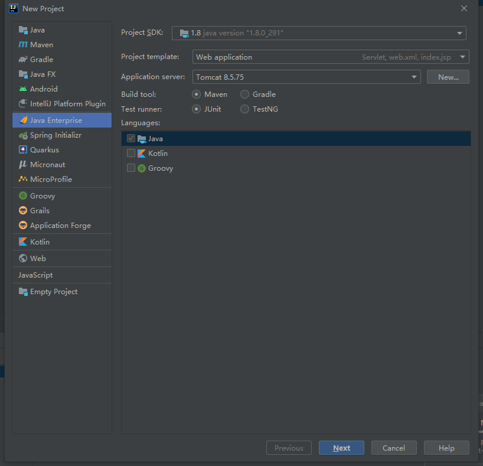
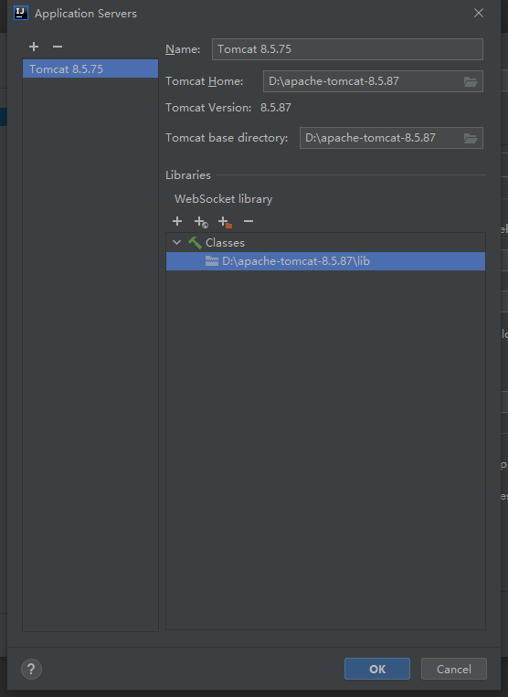

# 配置IDEA

## JSP



配置lib目录



## mybatis+springboot

使用MyBatis和Spring Boot的示例代码的典型目录结构

```css
├── src
│   ├── main
│   │   ├── java
│   │   │   └── com
│   │   │       └── example
│   │   │           ├── controller
│   │   │           │   └── UserController.java
│   │   │           ├── mapper
│   │   │           │   └── UserMapper.java
│   │   │           ├── model
│   │   │           │   └── User.java
│   │   │           ├── service
│   │   │           │   └── UserService.java
│   │   │           └── MyApplication.java
│   │   └── resources
│   │       ├── mapper
│   │       │   └── UserMapper.xml
│   │       └── application.properties
│   └── test
│       └── java
│           └── com
│               └── example
│                   └── service
│                       └── UserServiceTest.java
└── pom.xml
```

创建一个maven项目，名字是example。


首先，您需要在pom.xml中添加以下依赖项：

```
<?xml version="1.0" encoding="UTF-8"?>
<project xmlns="http://maven.apache.org/POM/4.0.0"
         xmlns:xsi="http://www.w3.org/2001/XMLSchema-instance"
         xsi:schemaLocation="http://maven.apache.org/POM/4.0.0 http://maven.apache.org/xsd/maven-4.0.0.xsd">

    <modelVersion>4.0.0</modelVersion>

    <groupId>com.example</groupId>
    <artifactId>mybatis-spring-boot-demo</artifactId>
    <version>1.0.0</version>

    <parent>
        <groupId>org.springframework.boot</groupId>
        <artifactId>spring-boot-starter-parent</artifactId>
        <version>2.6.3</version>
        <relativePath/> <!-- lookup parent from repository -->
    </parent>

    <properties>
        <java.version>11</java.version>
        <mybatis.version>3.5.8</mybatis.version>
        <mysql.connector.version>8.0.27</mysql.connector.version>
    </properties>

    <dependencies>
        <!-- Spring Boot dependencies -->
        <dependency>
            <groupId>org.springframework.boot</groupId>
            <artifactId>spring-boot-starter-web</artifactId>
        </dependency>

        <!-- MyBatis dependencies -->
        <dependency>
            <groupId>org.mybatis.spring.boot</groupId>
            <artifactId>mybatis-spring-boot-starter</artifactId>
            <version>2.3.0</version>
        </dependency>
        <dependency>
            <groupId>mysql</groupId>
            <artifactId>mysql-connector-java</artifactId>
            <version>${mysql.connector.version}</version>
        </dependency>
        <dependency>
            <groupId>org.mybatis.spring.boot</groupId>
            <artifactId>mybatis-spring-boot-starter</artifactId>
            <version>2.1.4</version>
        </dependency>

        <dependency>
            <groupId>org.mybatis</groupId>
            <artifactId>mybatis</artifactId>
            <version>3.5.6</version>
        </dependency>
        <dependency>
            <groupId>org.mybatis</groupId>
            <artifactId>mybatis-spring</artifactId>
            <version>2.0.6</version>
        </dependency>

    </dependencies>

    <build>
        <plugins>
            <plugin>
                <groupId>org.springframework.boot</groupId>
                <artifactId>spring-boot-maven-plugin</artifactId>
            </plugin>
            <plugin>
                <groupId>org.apache.maven.plugins</groupId>
                <artifactId>maven-compiler-plugin</artifactId>
                <version>3.8.1</version>
                <configuration>
                    <source>1.8</source>
                    <target>1.8</target>
                </configuration>
            </plugin>

        </plugins>
    </build>

</project>
```

MyApplication.java

```
package com.example;

import org.mybatis.spring.annotation.MapperScan;
import org.springframework.boot.SpringApplication;
import org.springframework.boot.autoconfigure.SpringBootApplication;

@SpringBootApplication
@MapperScan("com.example.mapper")
public class MyApplication {
    public static void main(String[] args) {
        SpringApplication.run(MyApplication.class, args);
    }
}
```

application.properties

```
spring.datasource.driver-class-name=com.mysql.cj.jdbc.Driver
spring.datasource.url=jdbc:mysql://192.168.32.130:3306/test?characterEncoding=utf8&useSSL=true
spring.datasource.username=root
spring.datasource.password=123456

mybatis.type-aliases-package=com.example.model
mybatis.mapper-locations=classpath:mapper/*.xml
```

UserController.java

```
package com.example.controller;

import com.example.model.User;
import com.example.service.UserService;
import org.springframework.beans.factory.annotation.Autowired;
import org.springframework.http.ResponseEntity;
import org.springframework.web.bind.annotation.*;

@RestController
public class UserController {
    @Autowired
    private UserService userService;

    @GetMapping(value = "/users/{id}", produces = "application/json")
    public ResponseEntity<User> getUser(@PathVariable String id) {
        User user = userService.findById(id);
        return ResponseEntity.ok(user);
    }
}
```

User.java

```
package com.example.model;

public class User {
    private Long id;
    private String name;
    private Integer age;

    public User() {
        // empty constructor required by some frameworks
    }

    public User(Long id, String name, Integer age) {
        this.id = id;
        this.name = name;
        this.age = age;
    }

    public Long getId() {
        return id;
    }

    public void setId(Long id) {
        this.id = id;
    }

    public String getName() {
        return name;
    }

    public void setName(String name) {
        this.name = name;
    }

    public Integer getAge() {
        return age;
    }

    public void setAge(Integer age) {
        this.age = age;
    }
}
```

UserService.java

```
package com.example.service;

import com.example.mapper.UserMapper;
import com.example.model.User;
import org.springframework.beans.factory.annotation.Autowired;
import org.springframework.stereotype.Service;

@Service
public class UserService {
    @Autowired
    private UserMapper userMapper;

    public User findById(String id) {
        return userMapper.findById(id);
    }
}
```

UserMapper.java

```java
package com.example.mapper;

import com.example.model.User;
import org.apache.ibatis.annotations.Mapper;
import org.apache.ibatis.annotations.Param;
import org.apache.ibatis.annotations.Select;

@Mapper
public interface UserMapper {
    @Select("SELECT * FROM users WHERE id = '${id}'")
    User findById(@Param("id") String id);
}
```

------

或者写成xml文件（src/main/resources/mapper/UserMapper.xml）

```xml
<?xml version="1.0" encoding="UTF-8" ?>
<!DOCTYPE mapper PUBLIC "-//mybatis.org//DTD Mapper 3.0//EN"
        "http://mybatis.org/dtd/mybatis-3-mapper.dtd">

<mapper namespace="com.example.mapper.UserMapper">

    <select id="findById" resultType="User">
        SELECT * FROM users WHERE id = #{id}
    </select>

</mapper>
```

去掉原来的select语句

```java
@Mapper
public interface UserMapper {
    User findById(@Param("id") Long id);
}
```

------

修复代码：将`$`修改为`#`

------

order by修复

```
<select id="findUsers" parameterType="map" resultType="User">
  SELECT * FROM users
  <if test="orderBy != null">
    ORDER BY ${orderBy}
  </if>
</select>
```

in 修复

```java
public class ListToStringTypeHandler extends BaseTypeHandler<List<?>> {
    @Override
    public void setNonNullParameter(PreparedStatement ps, int i, List<?> parameter, JdbcType jdbcType)
            throws SQLException {
        ps.setString(i, StringUtils.join(parameter, ","));
    }

    @Override
    public List<?> getNullableResult(ResultSet rs, String columnName) throws SQLException {
        return null;
    }

    @Override
    public List<?> getNullableResult(ResultSet rs, int columnIndex) throws SQLException {
        return null;
    }

    @Override
    public List<?> getNullableResult(CallableStatement cs, int columnIndex) throws SQLException {
        return null;
    }
}
```

```xml
<select id="findUsersByIds" parameterType="java.util.List" resultType="User">
  SELECT * FROM users
  WHERE id IN (#{ids, typeHandler=com.example.type.ListToStringTypeHandler})
</select>
```

------

```
<select id="findUsersByIds" parameterType="java.util.List" resultType="User">
  SELECT * FROM users WHERE id IN
  <foreach collection="list" item="id" open="(" separator="," close=")">
    #{id}
  </foreach>
</select>
```

```
@Autowired
private UserMapper userMapper;

public List<User> findUsersByIds(List<Long> ids) {
  return userMapper.findUsersByIds(ids);
}
```

like修复

```xml
<select id="findUsersByName" parameterType="String" resultType="User">
  SELECT * FROM users
  WHERE name LIKE CONCAT('%', #{name}, '%')
</select>
```

