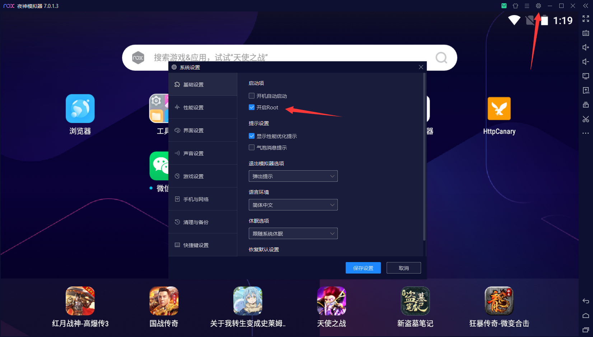
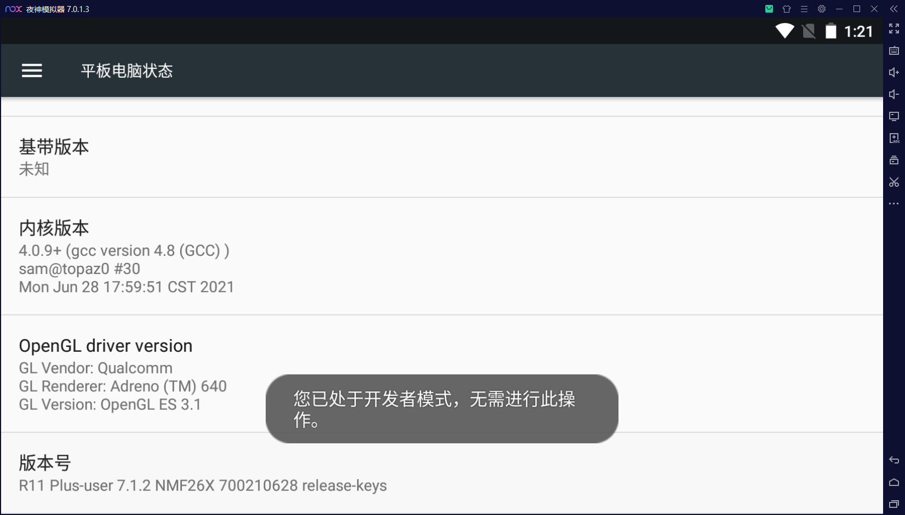
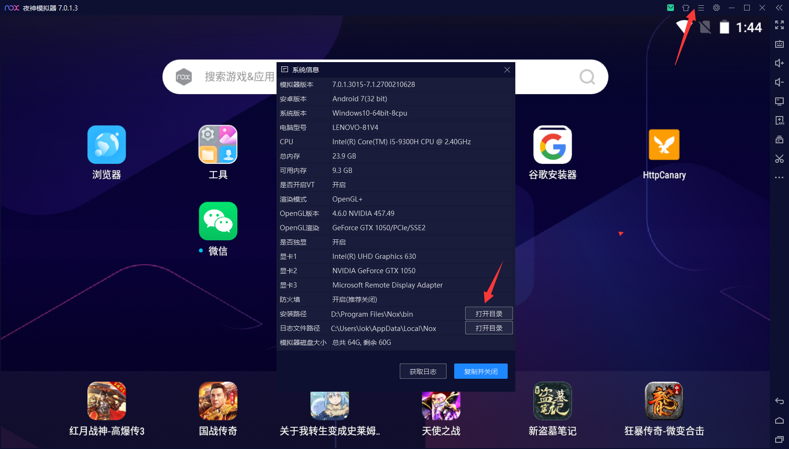
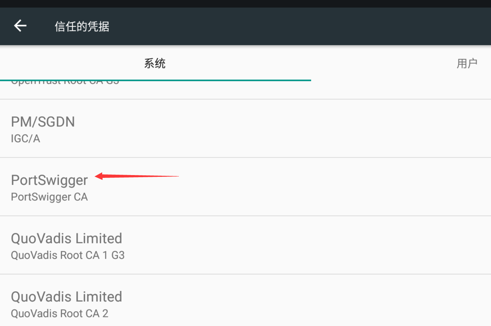
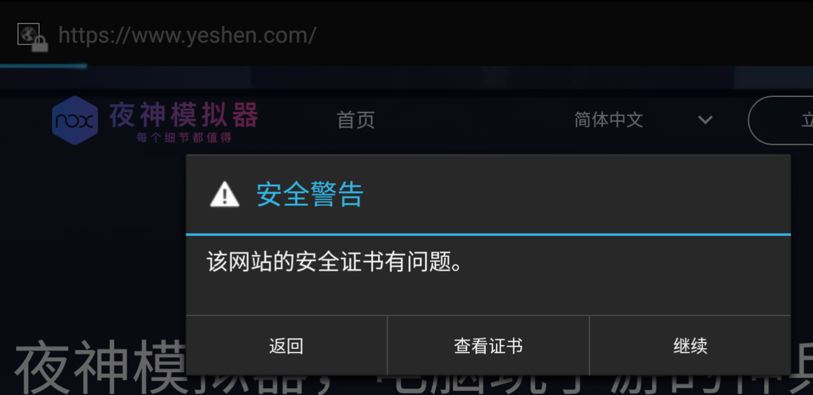
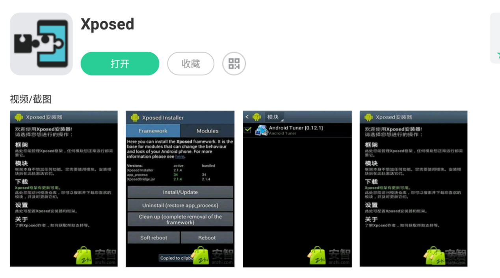
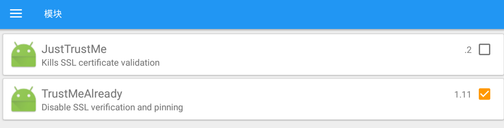
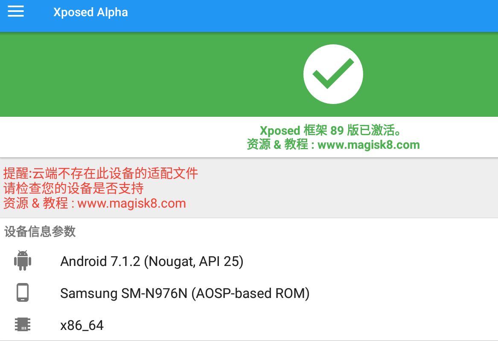

# 安卓7版本抓包

## 前言

由于高版本的安卓和微信不再信任系统的证书，所以无法进行抓包。

## 证书生成

浏览器挂上burp代理，访问http://burp/下载burp证书。

Linux系统执行命令：

```sh
# openssl x509 -inform DER -in cacert.der -out PortSwiggerCA.pem
```

会输出一个hash串，然后用hash重命名证书。

```sh
# openssl x509 -inform PEM -subject_hash_old -in PortSwiggerCA.pem|head -1
9a5ba575
```

生成`.0`证书文件

```sh
# mv PortSwiggerCA.pem 9a5ba575.0
```


## 模拟器配置

配置为夜神模拟器安卓7并开启root权限。



打开设置，找到**关于平板电脑**功能。鼠标**连续点击5下版本号**。



打开夜神模拟器安装目录下的`D:\Program Files\Nox\bin文件夹`



使用`nox_adb`.exe，执行`nox_adb.exe devices`命令查看当前连接shell可以看到已经连接成功。

```powershell
PS D:\Program Files\Nox\bin> .\nox_adb.exe devices
List of devices attached
127.0.0.1:62001 device
```

## **证书安装**

输入`nox_adb root` 将adb以root身份运行。

```
PS D:\Program Files\Nox\bin> .\nox_adb root
```

再输入`nox_adb remount`重新挂载system分区。

```
PS D:\Program Files\Nox\bin> .\nox_adb remount
remount succeeded
```

使用`nox_adb push`将证书push到系统内。

```powershell
PS D:\Program Files\Nox\bin> ./nox_adb push  d:\9a5ba575.0 /system/etc/security/cacerts
[100%] /system/etc/security/cacerts/9a5ba575.0
```

将证书权限修改为644。

```
PS D:\Program Files\Nox\bin> .\adb shell chmod 644 /system/etc/security/cacerts/9a5ba575.0
```

现在我们就能够在系统证书里看到我们的证书了。



浏览器打开网页会提示，证书无效，这时候虽然可以抓包，但是要点击信任。**但是在APP就没有办法抓包**。




官方商店可以下载Xposed



使用TrustMeAlready插件

> https://github.com/ViRb3/TrustMeAlready/releases

```
#安装
PS D:\Program Files\Nox\bin> ./adb.exe install D:\TrustMeAlready-v1.11-release.apk
```



> 不使用JustTrustMe，报错net::err_failed

直接访问浏览器就可以发现抓包正常。


## x64的xposed

以上的xpose只支持32位，即使官方商店有xposed，也会提示你无法安装。于是我们需要进行**离线安装**。

下载地址：

> https://yunpan.360.cn/surl_ykyqdH7TIRG
>
> https://wwn.lanzoub.com/b07syd1ze，密码：aevx

下载完成后，将`x86_64位安卓7模拟器框架文件`文件夹里面的`xposed`复制到模拟器的`download`目录。

接着安装`Xposed 派大星.apk`。

然后执行脚本，并且重启模拟器

```sh
PS D:\Program Files\Nox\bin> ./adb shell

d2q:/sdcard/Download/xposed # ls
script.sh  system

d2q:/sdcard/Download/xposed # sh script.sh
******************************
Xposed framework installer zip
******************************
- Mounting /system and /vendor read-write
- Checking environment
  Xposed version: 89
- Placing files
- Done

d2q:/sdcard/Download/xposed # reboot
```

其余步骤跟上面一样。




> **[注意]：在32位中可以安装微信，但是无法安装钉钉。对钉钉的轻应用抓包需要使用64位的模拟器**

