# 安卓9版本抓包

## 安装Magisk

> 资源下载地址：
>
> https://pan.baidu.com/s/1ND1-16KU9HpQtZju7gK5Mw  密码：ovl0
> https://yunpan.360.cn/surl_yEe2hUuTvSJ 密码：7e88
>
> https://cloud.189.cn/t/MnIF7rQbIVbe 密码：6c6a

### 准备

夜神模拟器选择Android 9版本进行打开。
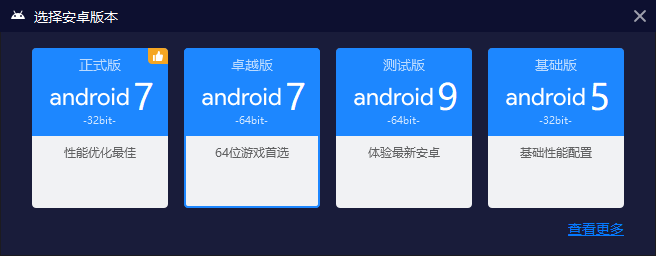

启动root

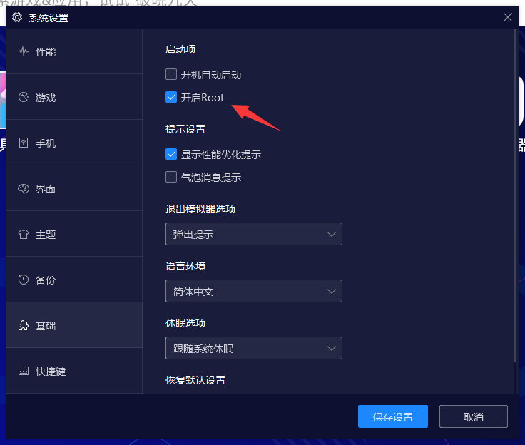


### 安装

在**安卓9模拟器_magisk**目录找到`Magisk_v25.2.apk`和`Magisk Terminal Emulator_17.7.apk`，直接将这两个APK拖进模拟器里面。

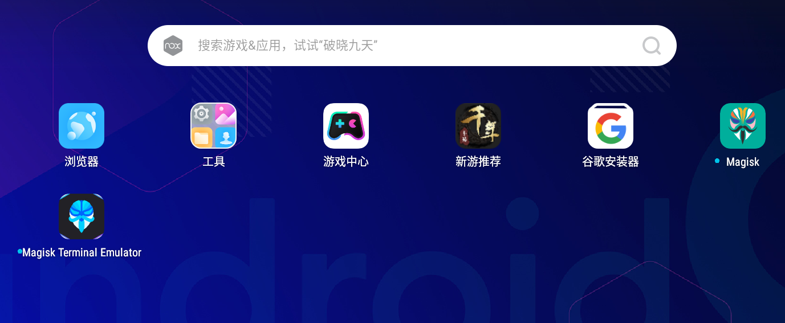

打开**Magisk Terminal Emulator**

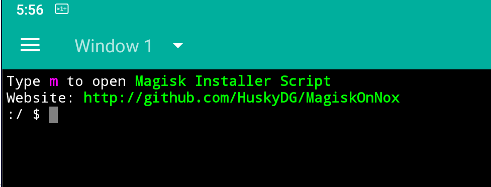

键入<**m**><回车>、<**Y**><回车>，提示超级用户授权点击允许

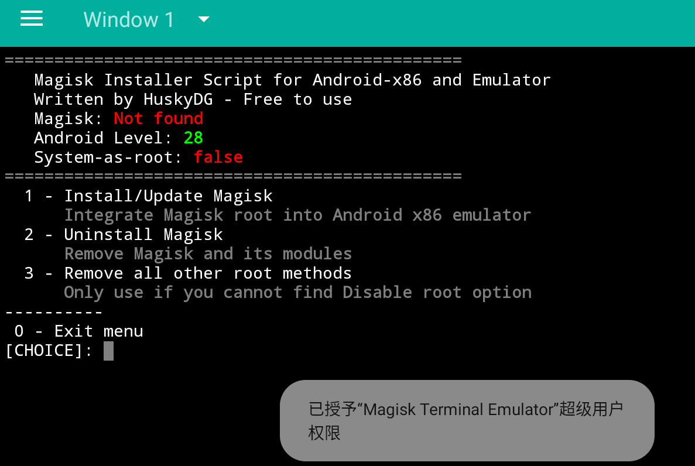

键入<**1**><回车>、<**a**><回车>、<**1**><回车>，出现 Done代表安装完成。

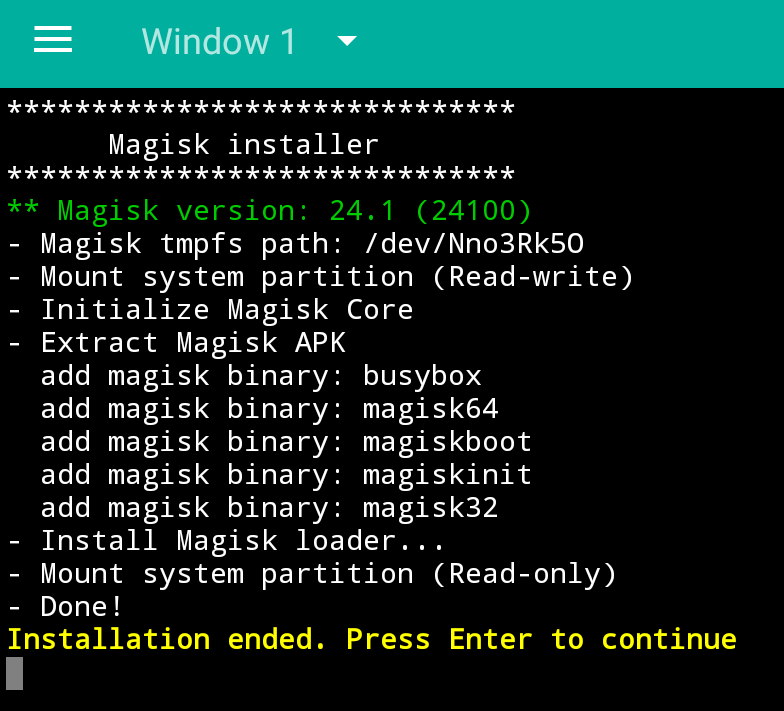


取消root，并且重启模拟器。

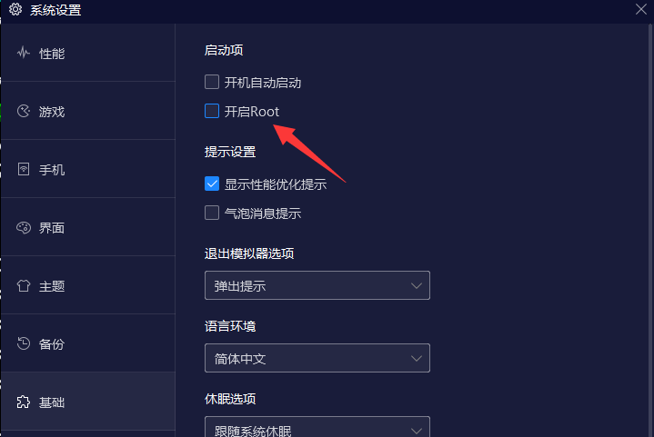

访问**magisk** APP。

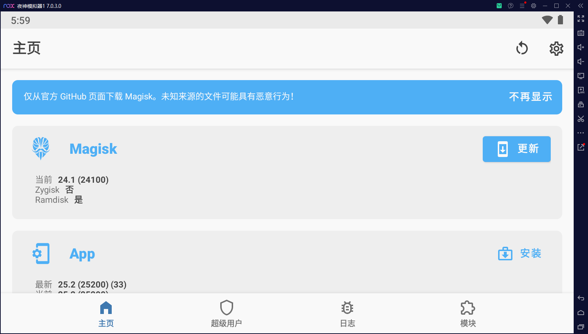

点击右上角设置，启动zygisk选项，然后重启模拟器（模拟器右上角按X重启）

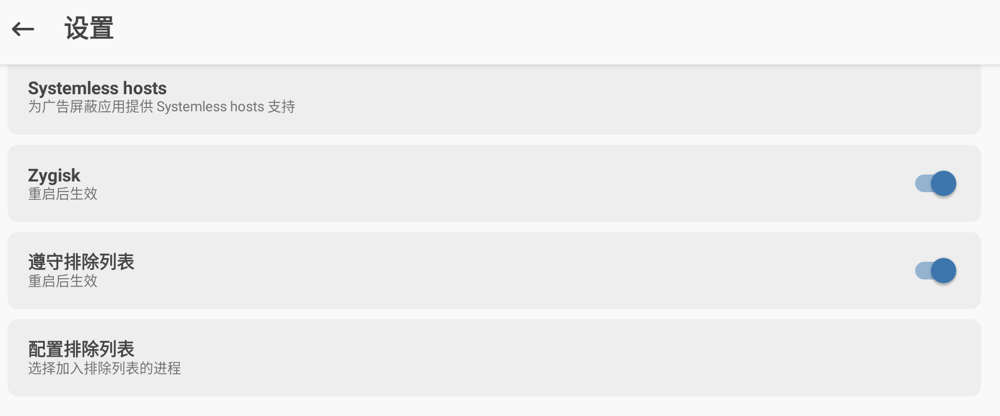

重新访问APP就可以看到zygisk启动了。

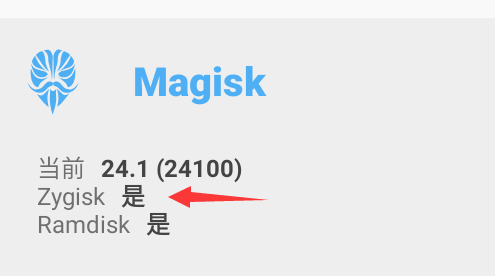

将`LSPosed-v1.8.5-6649-zygisk-release.zip`模块复制到模拟器的目录

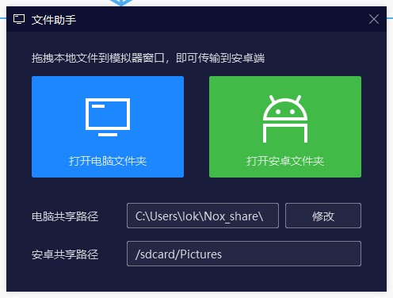

安装lsposed模块

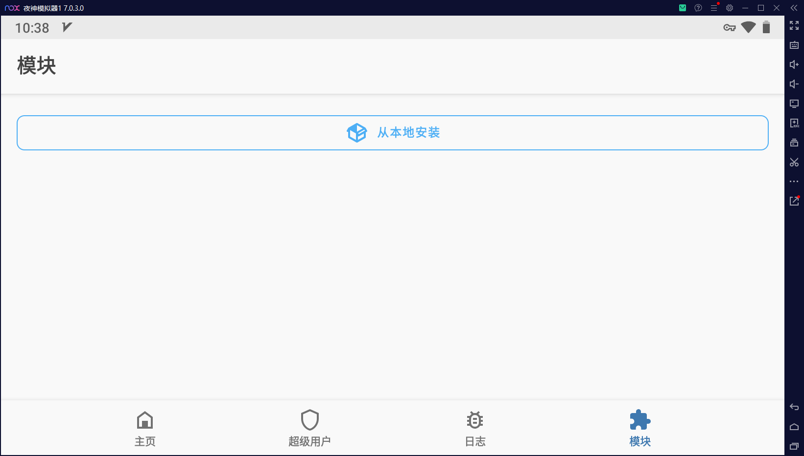

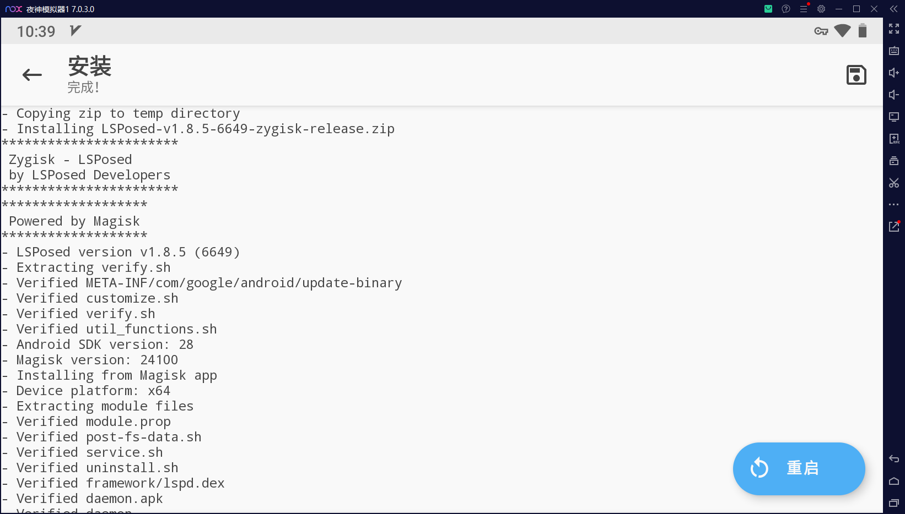

但是重启之后，在桌面没有看到有lsposed APP，需要拖进模拟器安装`LSPosed manager1.8.5.apk`

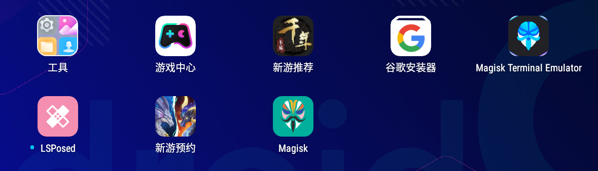

安装`TrustMeAlready`

```
PS D:\Program Files\Nox\bin> ./adb install D:\TrustMeAlready-v1.11-release.apk
Success
```

在lsposed勾选**TrustMeAlready模块**，其中justtrustme模块不生效

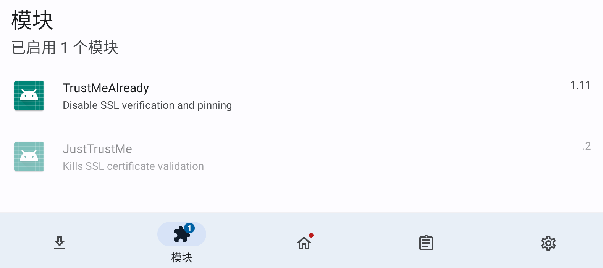

勾选微信，然后重启模拟器

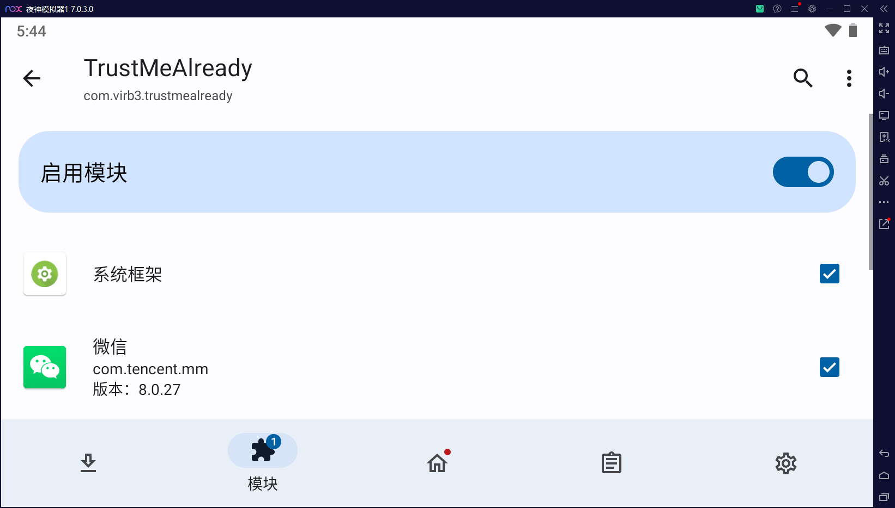

导入证书这些跟安卓7一样步骤。

**最后就可以对微信小程序和钉钉的轻应用进行抓包。**


> 参考链接：
>
> https://www.magisk8.com/ldmagisk.html
>
> https://www.bilibili.com/video/BV1Ud4y1T7U4/?vd_source=3b0b2659a1086173ac43bf4d9774bb97