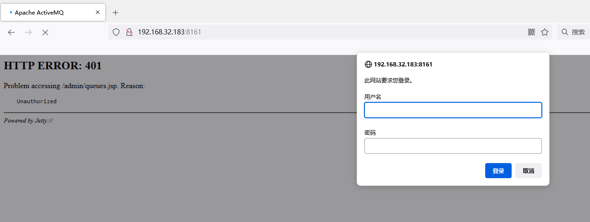

# ActiveMQ未授权访问漏洞

## Vulnerability Description

Apache ActiveMQ is an open source message middleware developed by the Apache Software Foundation, which supports Java Message Service, clustering, Spring Framework, etc. The default username and password of the Apache ActiveMQ management console are admin and admin, respectively. Users can access the server directly without authorization using the default credentials, resulting in sensitive information leakage and further attacks.

## Environment Setup

Download: http://archive.apache.org/dist/activemq/apache-activemq/5.5.0/apache-activemq-5.5.0-bin.tar.gz

```
[root@localhost bin]# ./activemq start
INFO: Using default configuration
(you can configure options in one of these file: /etc/default/activemq /root/.activemqrc)

INFO: Invoke the following command to create a configuration file
./activemq setup [ /etc/default/activemq | /root/.activemqrc ]

INFO: Using java '/usr/bin/java'
INFO: Starting - inspect logfiles specified in logging.properties and log4j.properties to get details
INFO: pidfile created : '/tmp/apache-activemq-5.5.0/data/activemq.pid' (pid '2173')

```

## Vulnerability Reproduction

Directly access: http://192.168.32.183:8161/admin/queues.jsp


## Solution

Edit `${ACTIVEMQ_HOME}/conf/jetty.xml` to enable authentication and change the authenticate attribute to true:

```
pythonCopy code
<property name="authenticate" value="true" />
```

Edit the file `conf/jetty-realm.properties` to change the default username and password for Apache ActiveMQ, as follows:


重启服务就可以进行鉴权

