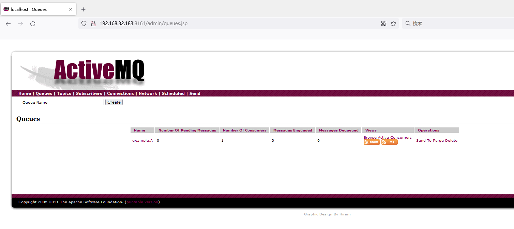
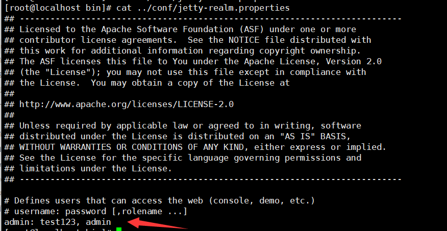

# ActiveMQ未授权访问漏洞

## 漏洞描述

Apache ActiveMQ是美国阿帕奇（Apache）软件基金会所研发的一套开源的消息中间件，它支持Java消息服务、集群、Spring Framework等。
Apache ActiveMQ管理控制台的默认管理用户名和密码分别为admin和admin，用户可以未经授权使用默认凭据直接访问服务器，导致敏感信息泄露，并进一步进行攻击。

## 环境搭建

下载：http://archive.apache.org/dist/activemq/apache-activemq/5.5.0/apache-activemq-5.5.0-bin.tar.gz

```
[root@localhost bin]# ./activemq start
INFO: Using default configuration
(you can configure options in one of these file: /etc/default/activemq /root/.activemqrc)

INFO: Invoke the following command to create a configuration file
./activemq setup [ /etc/default/activemq | /root/.activemqrc ]

INFO: Using java '/usr/bin/java'
INFO: Starting - inspect logfiles specified in logging.properties and log4j.properties to get details
INFO: pidfile created : '/tmp/apache-activemq-5.5.0/data/activemq.pid' (pid '2173')

```

## 漏洞复现

直接访问：http://192.168.32.183:8161/admin/queues.jsp



## 修复方案

编辑 `${ACTIVEMQ_HOME}/conf/jetty.xml`开启身份验证，将authenticate属性改为true：

```
<property name="authenticate" value="true" />
```

编辑文件`conf/jetty-realm.properties`来更改[Apache](https://so.csdn.net/so/search?q=Apache&spm=1001.2101.3001.7020) ActiveMQ的默认管理用户名和密码，格式如下：



重启服务就可以进行鉴权

