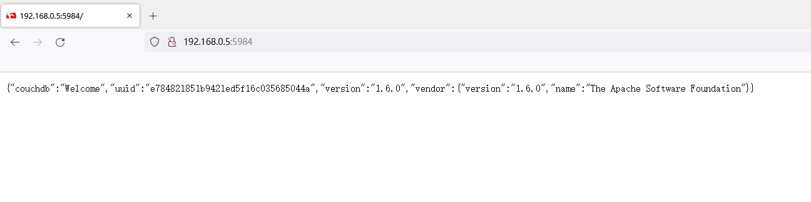
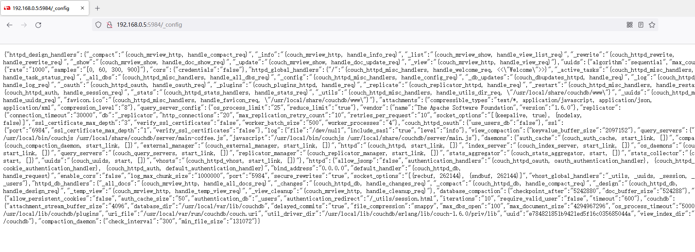

# CouchDB未授权访问漏洞

## 漏洞描述

CouchDB因配置不当可以未授权访问，被攻击者恶意利用。

攻击者无需认证访问到内部数据，可能导致敏感信息泄露，黑客也可以恶意清空所有数据。

## 漏洞搭建

> https://github.com/vulhub/vulhub/blob/master/couchdb/CVE-2017-12636/README.zh-cn.md

使用docker-compose启动。

```bash
cd couchdb/CVE-2017-12636/
docker-compose up -d
```


## 漏洞利用

访问5984端口，就可以看到版本信息。



访问`/_config`接口，可以看到couchDB配置信息。



