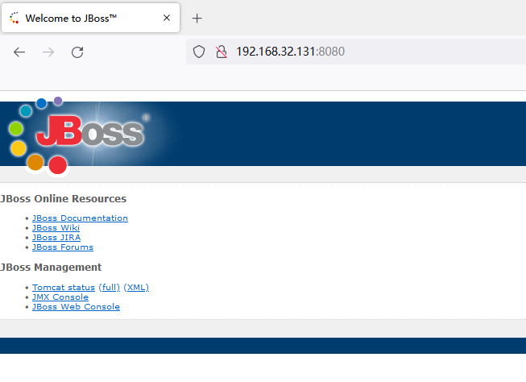
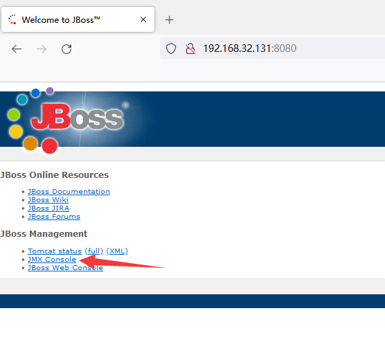
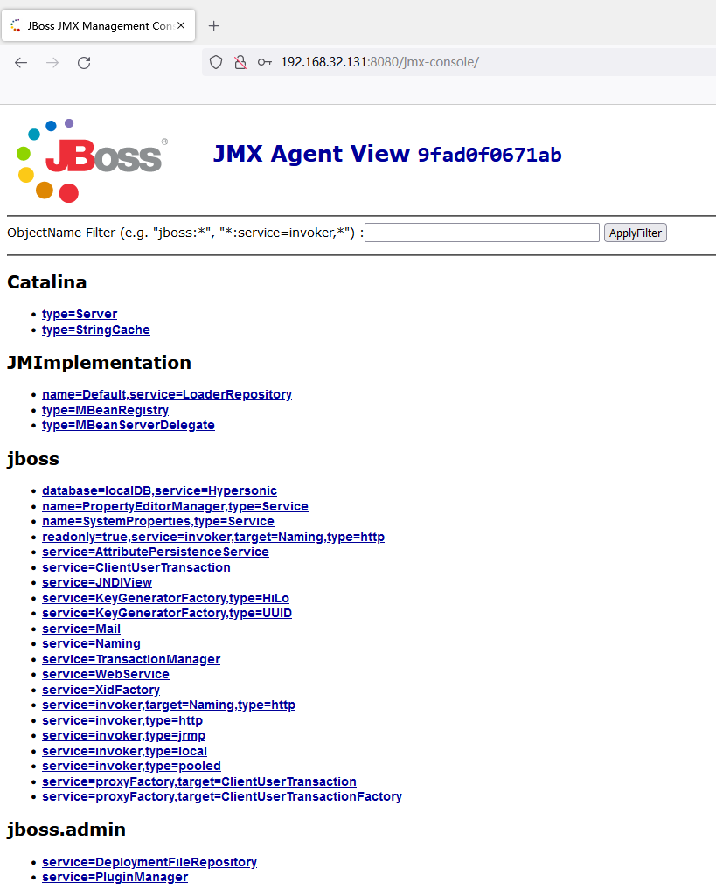
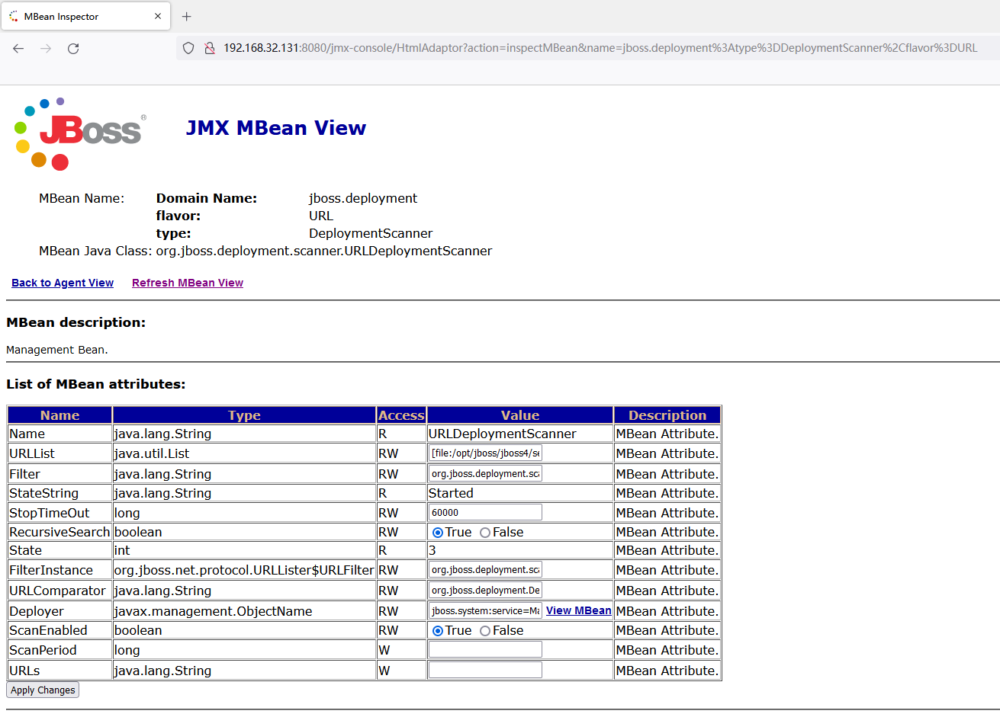
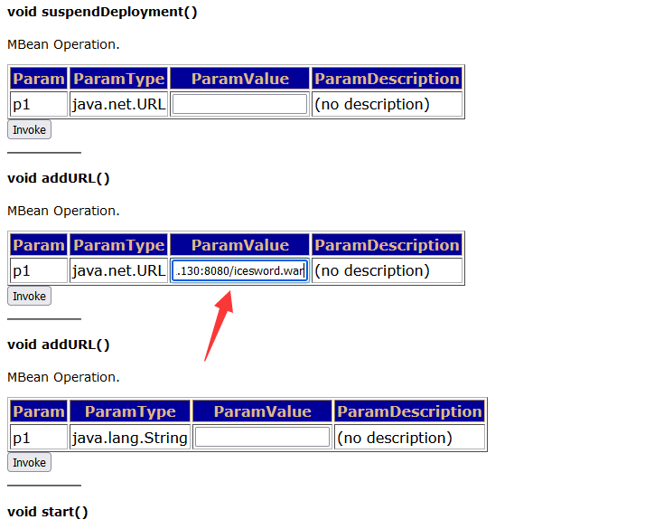
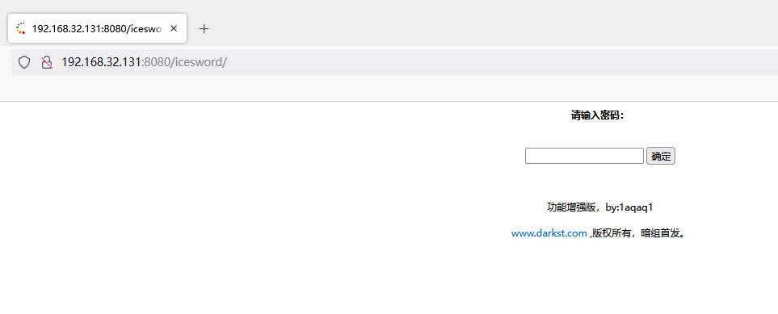

# JBoss未授权访问漏洞

## 漏洞描述

JBoss 是一个管理 EJB 的容器和服务器，支持 EJB 1.1、EJB 2.0 和 EJB3 的规范。但 JBoss 核心服务不包括支持 [servlet](https://so.csdn.net/so/search?q=servlet&spm=1001.2101.3001.7020)/JSP 的 WEB 容器，一般与 Tomcat 或 Jetty 绑定使用。JBoss 默认在 8080 端口监听。

在低版本的 JBoss 中，默认可以访问 JBoss Web 控制台(http://IP:8080/jmx-console)，无需用户名和密码。通过 JBoss 未授权访问管理控制台的漏洞，可以进行后台服务管理，可以通过脚本命令执行系统命令，如反弹 shell、wget 写 Webshell 文件。


## 环境搭建

这里用CVE-2017-7504的漏洞环境，启动环境

```
[root@localhost CVE-2017-7504]# docker-compose up
```

浏览器访问**8080**端口



## 漏洞复现

发现jboss默认页面,点击进入控制页



假设是未授权访问的话，点击`JMX-Console`不会提示输入用户名、密码，而这个地方用的是别的漏洞的环境，用户名密码都是admin、admin，所以就假装是不用输入用户名密码的



往下找jboss.deployment进入应用部署页面



进入应用部署页面后，下滑找到`void addURL()`，这里`ParamValue`部分填写远程服务器上的木马的地址。



访问`iceword`路径，就可以看到webshell



