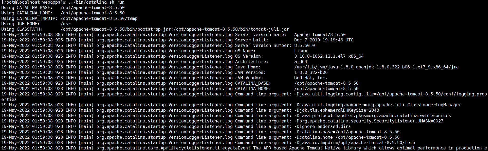
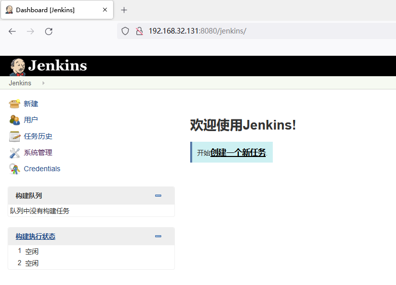
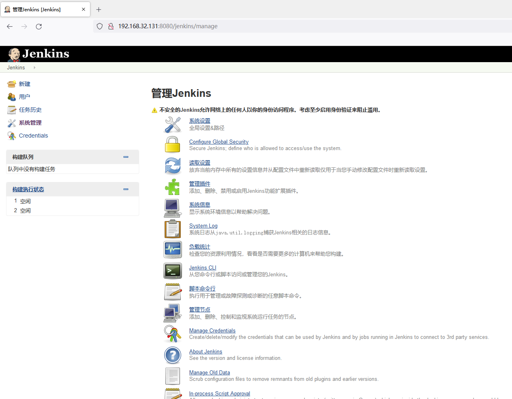
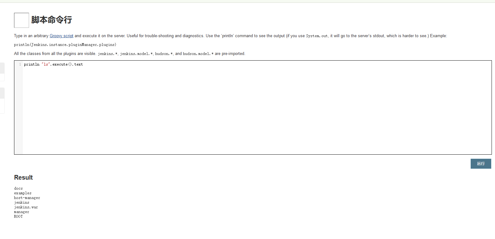

# Jenkins未授权访问漏洞

## 漏洞描述

部署**Jenkins 1.62版本**，将全局授权策略打开，目前新版本的Jenkins已默认需要用户登录，但老版的中默认配置是"任意用户可以做任何事"，存在未授权访问的问题。

## 环境搭建

选择1.62版本进行下载，http://archives.jenkins-ci.org/war-stable/1.625.1/jenkins.war

将WAR包丢到tomcat的webapps里面，启动tomcat

## 漏洞复现

进入管理页面：http://192.168.32.131:8080/jenkins/manage

进入脚本命令行，后缀输入script进入脚本命令行，输入：`println "ls".execute().text`，就可以执行`ls`命令。

