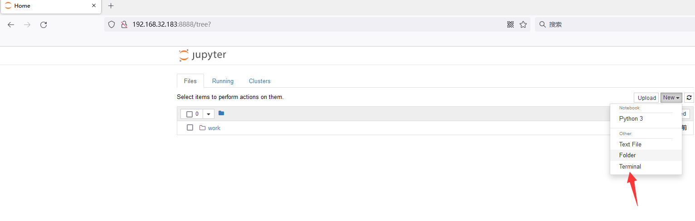
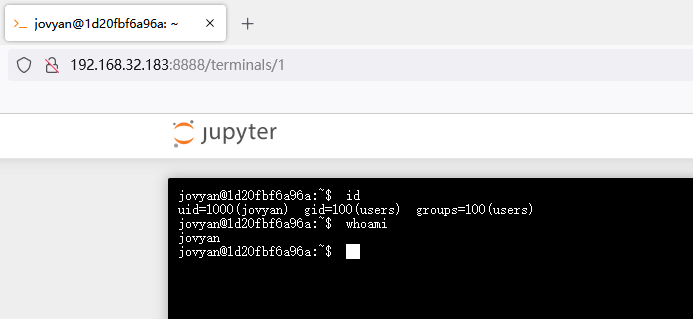

# Jupyter Notebook 未授权访问漏洞

## 漏洞描述

Jupyter Notebook（此前被称为 IPython notebook）是一个交互式笔记本，支持运行 40 多种编程语言。

如果管理员未为 Jupyter Notebook 配置密码，将导致未授权访问漏洞，游客可在其中创建一个 console 并执行任意 Python 代码和命令。

## 环境搭建

```
version: '2'
services:
 web:
   image: vulhub/jupyter-notebook:5.2.2
   command: start-notebook.sh --NotebookApp.token=''
   ports:
    - "8888:8888"
```

运行后，访问 `http://your-ip:8888` 将看到 Jupyter Notebook 的 Web 管理界面，并没有要求填写密码。

## 漏洞复现

选择 new -> terminal 即可创建一个控制台：



直接执行任意命令：




