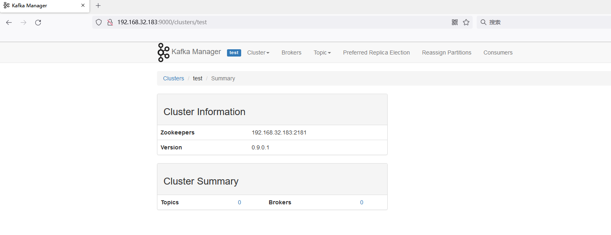

# Kafka Manager 未授权访问漏洞

## 漏洞描述

Kafka Manager是一款用于管理和监控Apache Kafka集群的工具。如果Kafka Manager未正确配置并对外开放，攻击者可能会未授权访问Kafka Manager，从而获取敏感信息，如Kafka集群的配置和使用情况。

此外，如果攻击者具有足够的权限，他们还可以操作Kafka集群，如创建主题、修改配置等，对系统造成威胁。

## 环境搭建

zookeeper

```
docker run -d  -p 2181:2181 -e TZ="Asia/Shanghai" wurstmeister/zookeeper:latest
```

kafka-manager

```
docker run -d -p 9000:9000 -e ZK_HOSTS=192.168.32.183:2181 sheepkiller/kafka-manager:latest
```

## 漏洞利用

访问9000端口，即可未授权访问Kafka管理界面


查看集群信息。

