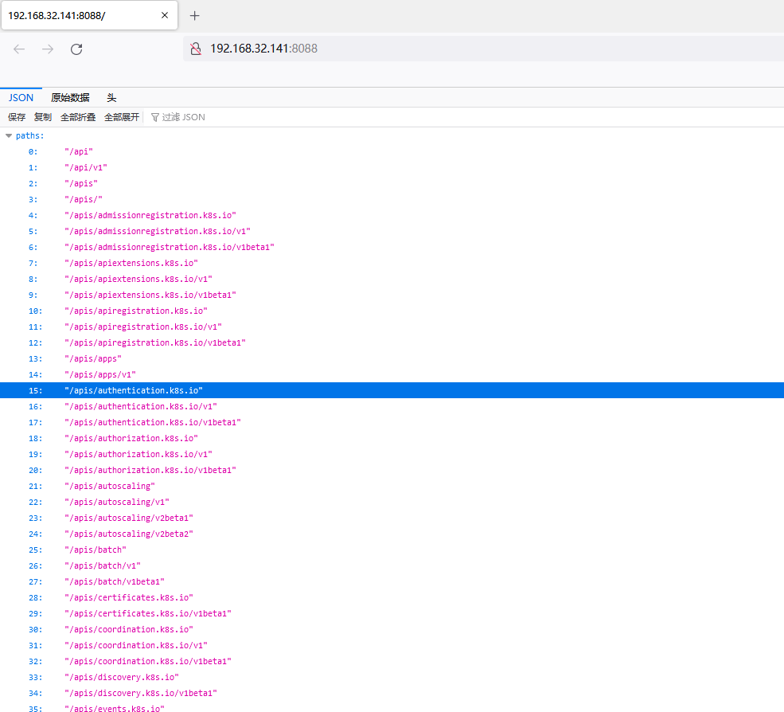
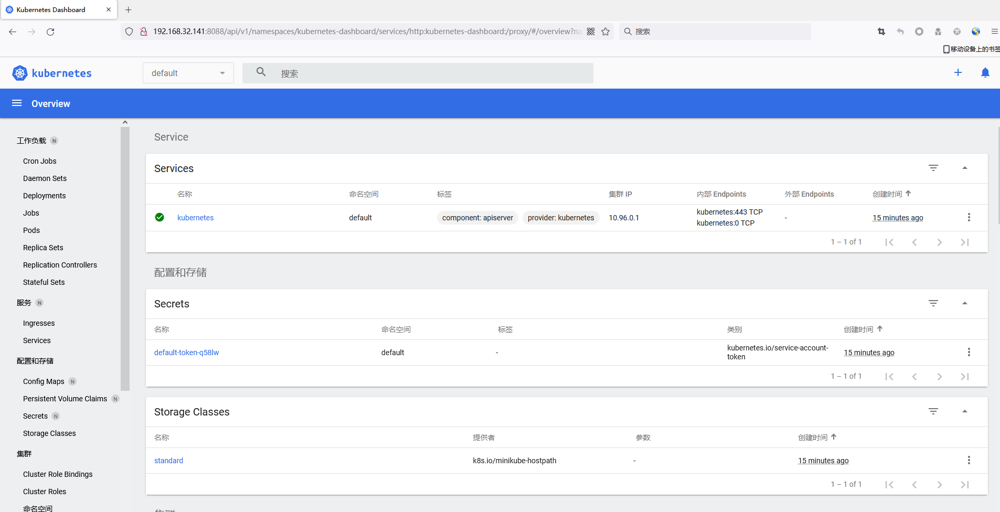

# Kubernetes Api Server 未授权访问

## 漏洞描述

Kubernetes 的服务在正常启动后会开启两个端口：Localhost Port （默认8080）、Secure Port （默认6443）。这两个端口都是提供 Api Server 服务的，一个可以直接通过 Web 访问，另一个可以通过 kubectl 客户端进行调用。如果运维人员没有合理的配置验证和权限，那么攻击者就可以通过这两个接口去获取容器的权限。

## 环境搭建

> ubuntu 18.04

下载

```
wget https://github.com/kubernetes/minikube/releases/download/v1.18.1/minikube-linux-amd64
mv minikube-linux-amd64 minikube
chmod 777 minikube

wget "https://storage.googleapis.com/kubernetes-release/release/v1.18.3/bin/linux/amd64/kubectl" -O "/usr/local/bin/kubectl"
chmod 755 /usr/local/bin/kubectl

```

启动K8S

```
sudo sysctl -w net/netfilter/nf_conntrack_max=131072
./minikube start --kubernetes-version=v1.18.3 --force --driver=docker  --extra-config=apiserver.anonymous-auth=true
```

启动仪表盘

```
root@l-virtual-machine:/opt# ./minikube dashboard
* Enabling dashboard ...
  - Using image kubernetesui/dashboard:v2.1.0
  - Using image kubernetesui/metrics-scraper:v1.0.4
* Verifying dashboard health ...
* Launching proxy ...
* Verifying proxy health ...
http://127.0.0.1:35293/api/v1/namespaces/kubernetes-dashboard/services/http:kubernetes-dashboard:/proxy/
```

把K8S API映射出去

```
root@l-virtual-machine:/opt# kubectl proxy  --port=8088 --address='0.0.0.0' --accept-hosts='^.*'
Starting to serve on [::]:8088
```



## 漏洞检测

仪表盘

```
http://192.168.32.141:8088/api/v1/namespaces/kubernetes-dashboard/services/http:kubernetes-dashboard:/proxy/#/overview?namespace=default
```




## 漏洞修复

* 进行授权认证；
* 使用Service Account令牌；
* 设置防火墙策略，限定IP访问服务；