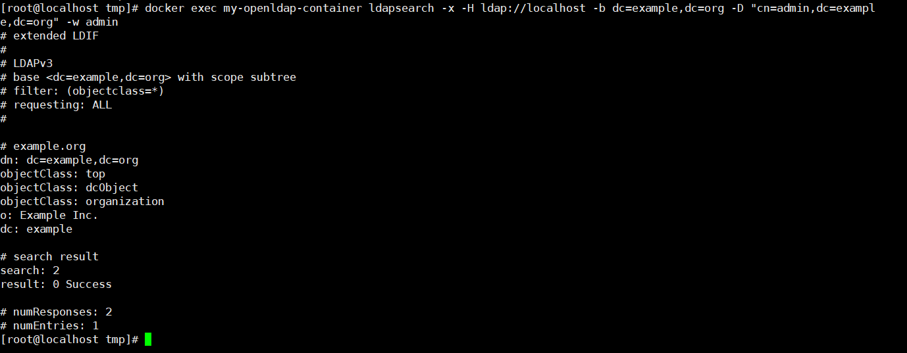

# LDAP未授权访问漏洞

## 介绍

LDAP的全称为Lightweight Directory Access Protocol(轻量级目录访问协议), 基于X.500标准, 支持 TCP/IP。

LDAP目录为数据库，通过LDAP服务器(相当于DBMS)处理查询和更新, 以树状的层次结构来存储数据,相对关系型数据库, LDAP主要是优化数据读取的性能,适用于比较少改变、跨平台的信息。

**LDAP属性**

| 属性        | 全名               | 描述                                                         |
| ----------- | ------------------ | ------------------------------------------------------------ |
| dn          | distinguished name | 唯一标识名，类似于绝对路径，每个对象都有唯一标识名。 例如：uid=tester,ou=People,dc=example,dc=com |
| rdn         | relative           | 相对标识名，类似于相对路径。 例如：uid=tester                |
| uid         | user id            | 通常指用户登录名。 例如：uid=tester                          |
| sn          | sur name           | 通常指一个人的姓氏。 例如：sn: Su                            |
| giveName    |                    | 通常指一个人的名字。 例如：giveName: Aldwin                  |
| I           |                    | 通常指一个地方的地名。 例如：I: Beijing                      |
| objectClass |                    | objectClass是特殊属性，包含数据存储的方式以及相关属性信息。  |
| dc          | domain component   | 通常指定一个域名。 例如：dc=example,dc=com                   |
| ou          | organization unit  | 通常指定一个组织单元的名称。 例如：ou=people,dc=example,dc=com |
| cn          | common name        | 通常指一个对象的名称。如果是人，需要使用全名。               |
| c           | country            | 一个二位的国家代码。 例如：CN、US、HK、JP等。                |


## 环境搭建

```
docker run -p 389:389 -p 636:636 --name my-openldap-container --detach osixia/openldap:1.5.0
```

## 漏洞复现

```
docker exec my-openldap-container ldapsearch -x -H ldap://localhost -b dc=example,dc=org -D "cn=admin,dc=example,dc=org" -w admin
```

