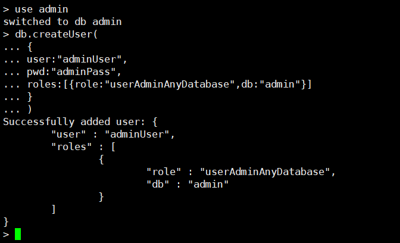

# MongoDB未授权访问漏洞

## 漏洞描述

启动MongoDB服务时不添加任何参数时,默认是没有权限验证的,登录的用户可以通过默认端口无需密码对数据库任意操作（增删改高危动作）而且可以远程访问数据库。

## 环境搭建

docker下载mongo镜像

```
docker run  -it  -p  27017:27017 mongo
```

## 漏洞复现

### cli执行

```
┌──(root💀kali)-[~]
└─# mongo 192.168.32.131
MongoDB shell version v5.3.1
connecting to: mongodb://192.168.32.131:27017/test?compressors=disabled&gssapiServiceName=mongodb
Implicit session: session { "id" : UUID("c7ddf3c3-2fbc-4b5a-b9a4-91dfce9703a2") }
MongoDB server version: 5.0.8
WARNING: shell and server versions do not match

> show dbs
admin   0.000GB
config  0.000GB
local   0.000GB

```

### msf执行

```
msf6 > use auxiliary/scanner/mongodb/mongodb_login
msf6 auxiliary(scanner/mongodb/mongodb_login) > set rhosts 192.168.32.131
rhosts => 192.168.32.131
msf6 auxiliary(scanner/mongodb/mongodb_login) > run

[*] 192.168.32.131:27017 - Scanning IP: 192.168.32.131
[+] 192.168.32.131:27017 - Mongo server 192.168.32.131 doesn't use authentication
[*] 192.168.32.131:27017 - Scanned 1 of 1 hosts (100% complete)
[*] Auxiliary module execution completed

```

## 修复建议

**(1).新建管理账户开启MongoDB授权**
新建终端[参数默认可以不加，若有自定义参数，才要加上，下同]
`mongod --port 27017 --dbpath /data/db1`

另起一个终端，运行下列命令

```
  use admin

  db.createUser(
    {
      user: "adminUser",
      pwd: "adminPass",
      roles: [ { role: "userAdminAnyDatabase", db: "admin" } ]
    }
  )
```



管理员创建成功，现在拥有了用户管理员 用户名:`adminUser` 密码:`adminPass`

**(2).本地访问**

```
bind 127.0.0.1
```

**(3).修改默认端口**
修改默认的mongoDB端口(默认为: TCP 27017)为其他端口

**(4).禁用HTTP和REST端口**
MongoDB自身带有一个HTTP服务和并支持REST接口。在2.6以后这些接口默认是关闭的。mongoDB默认会使用默认端口监听web服务，一般不需要通过web方式进行远程管理，建议禁用。修改配置文件或在启动的时候选择–nohttpinterface 参数`nohttpinterface = false`
**(5).开启日志审计功能**
审计功能可以用来记录用户对数据库的所有相关操作。这些记录可以让系统管理员在需要的时候分析数据库在什么时段发生了什么事情
**(6).开启auth认证**

```
/etc/mongodb.conf　　
auth = true
```