# SpringBoot Actuator未授权访问漏洞

## 简介

Spring Boot Actuator是Spring Boot项目中的一个模块，它提供了一组用于监控和管理Spring Boot应用程序的端点。这些端点可以用来检索应用程序的运行状态、查看应用程序的统计数据、查看应用程序中的配置信息等。

此外，还可以使用Actuator执行一些安全操作，如关闭应用程序。使用Actuator可以更好的监控、管理和维护Spring Boot应用程序。

其中以下是它端点：

| Http |      路径       |                             描述                             |
| :--: | :-------------: | :----------------------------------------------------------: |
| get  |   /autoconfig   | 提供了一份自动配置报告，记录哪些自动配置条件通过了，哪些没通过 |
| get  |  /configprops   |           描述配置属性（包含默认值）如何注入 Bean            |
| get  |     /beans      |       描述应用程序上下文里全部的 Bean，以及它们的关系        |
| get  |      /dump      |                      获取线程活动的快照                      |
| get  |      /env       |                       获取全部环境属性                       |
| get  |   /env/{name}   |                 根据名称获取特定的环境属性值                 |
| get  |     /health     | 报告应用程序的健康指标，这些值由 HealthIndicator 的实现类提供 |
| get  |      /info      |    获取应用程序的定制信息，这些信息由 info 打头的属性提供    |
| get  |    /mappings    | 描述全部的 URI 路径，以及它们和控制器（包含 Actuator 端点）的映射关系 |
| get  |    /metrics     |    报告各种应用程序度量信息，比如内存用量和 HTTP 请求计数    |
| get  | /metrics/{name} |                 报告指定名称的应用程序度量值                 |
| post |    /shutdown    | 关闭应用程序，要求 endpoints.shutdown.enabled 设置为 true（默认为 false） |
| get  |     /trace      |      提供基本的 HTTP 请求跟踪信息（时间戳、HTTP 头等）       |
| get  |    /heapdump    |                  获取正在运行的JVM的堆转储                   |


## 环境搭建

> SpringBoot Actuator未授权访问漏洞分为1.x版本和2.x版本。

### srpingboot 2.x

下载demo代码

```
git clone https://github.com/callicoder/spring-boot-actuator-demo.git
```

maven将项目代码构建成jar包。

```
mvn package
```

启动Spring Boot应用程序

```
java -jar target/actuator-demo-0.0.1-SNAPSHOT.jar
```

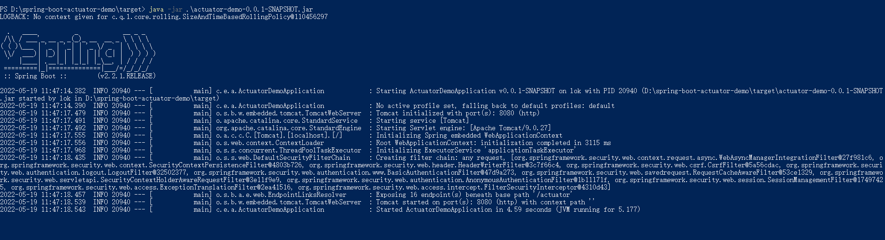

浏览器访问： [http://localhost:8080](http://localhost:8080/).


### srpingboot 1.x

使用IDEA**新建一个maven项目**。修改`pom.xml`，声明了一个父级依赖关系，表示该项目依赖于Spring Boot的`spring-boot-starter-parent`项目，版本为1.4.6.RELEASE。

```
    <parent>
        <groupId>org.springframework.boot</groupId>
        <artifactId>spring-boot-starter-parent</artifactId>
        <version>1.4.6.RELEASE</version>
    </parent>

    <!-- Add typical dependencies for a web application -->
    <dependencies>

        <dependency>
            <groupId>org.springframework.boot</groupId>
            <artifactId>spring-boot-starter-web</artifactId>
        </dependency>

        <dependency>
            <groupId>org.springframework.boot</groupId>
            <artifactId>spring-boot-starter-actuator</artifactId>
        </dependency>
    </dependencies>

    <build>
        <plugins>
            <plugin>
                <groupId>org.springframework.boot</groupId>
                <artifactId>spring-boot-maven-plugin</artifactId>
            </plugin>
        </plugins>
    </build>
```

新增测试文件：`\src\main\java\Example.java`

```
import org.springframework.boot.*;
import org.springframework.boot.autoconfigure.*;
import org.springframework.stereotype.*;
import org.springframework.web.bind.annotation.*;

@RestController
@EnableAutoConfiguration
public class Example {

    @RequestMapping("/")
    String home() {
        return "Hello World!";
    }

    public static void main(String[] args) throws Exception {
        SpringApplication.run(Example.class, args);
    }

}
```

修改`application.properties`

```
endpoints.beans.enabled=true
spring.redis.password=123456
```


## 漏洞复现

### srpingboot 2.x

访问`/info`接口，泄露springboot项目信息。

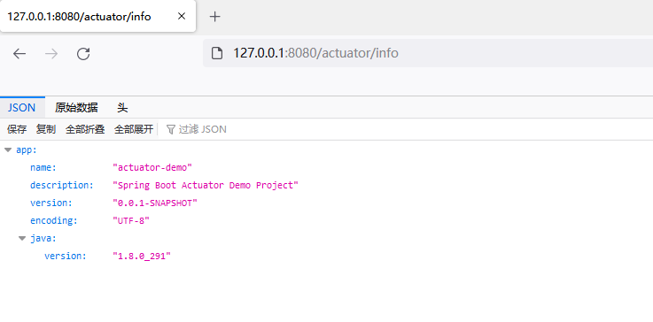

访问`/env`接口，泄露springboot环境变量信息。

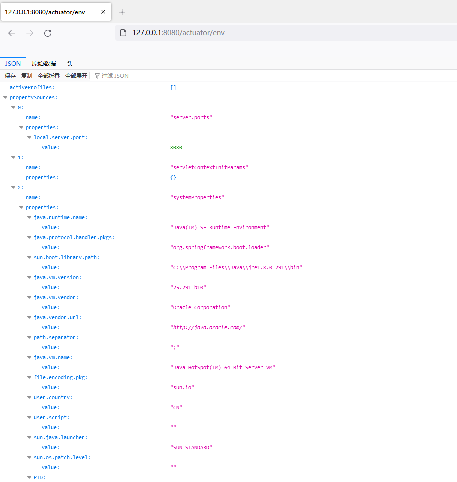


### springboot 1.x

访问`/metrics`接口，显示应用的信息。

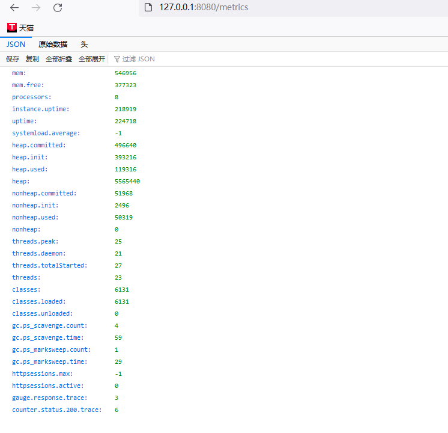

访问`/trace`接口，显示访问数据包具体信息。

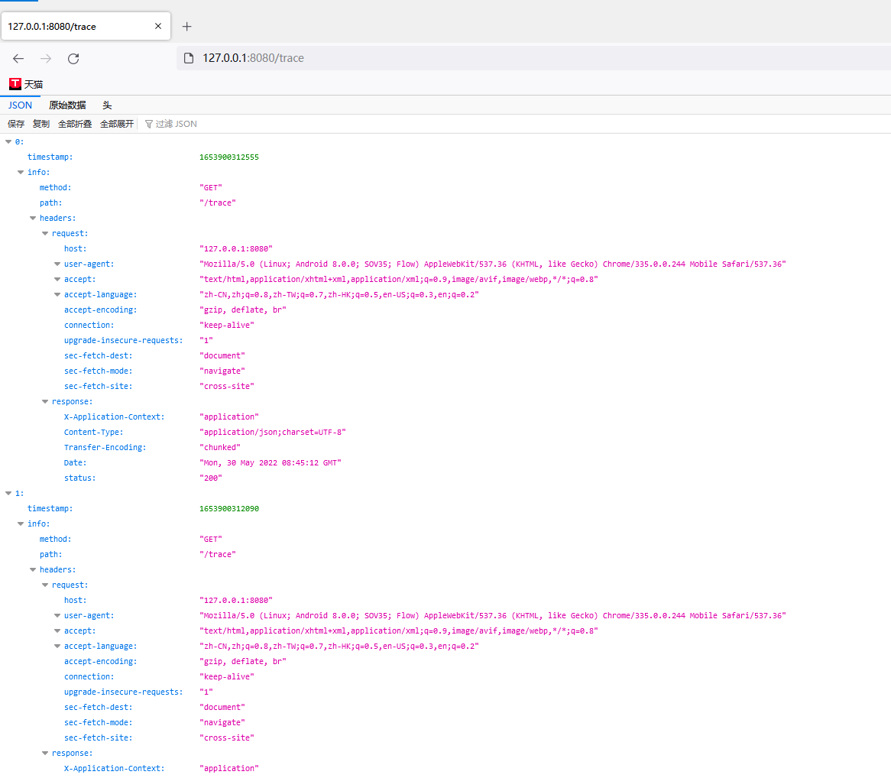


## heapdump泄露读取

Spring Boot Actuator的堆转储功能如果没有适当的配置，可能是一个安全漏洞。它允许通过URL获取正在运行的JVM的堆转储，其中可能包含敏感信息。

访问`/heapdump`接口下载heapdump文件。

### jvisualvm分析

JVisualVM是由Oracle提供的Java可视化和监控工具。它包含在Oracle JDK分发版中，可用于监视和配置Java应用程序，诊断性能问题，并检查内存使用和堆转储。

JVisualVM提供了各种功能，包括：

- 监控JVM性能、内存使用和线程
- 配置Java应用程序的CPU和内存使用情况
- 堆转储分析和内存泄漏检测
- JMX控制台，用于检查和管理MBeans

打开`jvisualvm.exe`

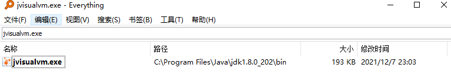

加载heapdump文件

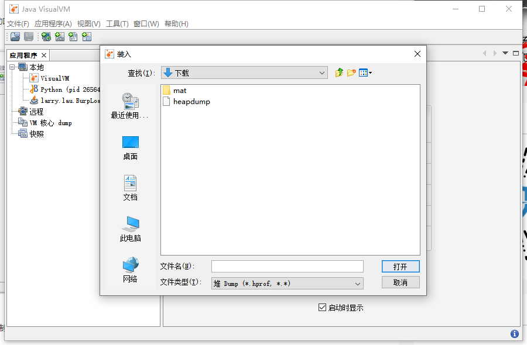

在工具菜单栏点击插件，安装OQL插件

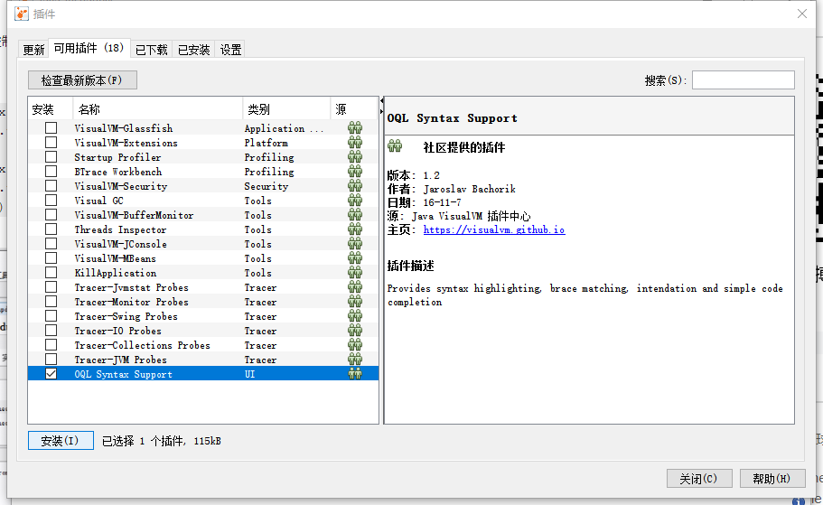

构建OQL语句进行关键字查询，从而获取明文密码。

Spring boot 1.x版本查询语句：

```
select s.value.toString() from java.util.Hashtable$Entry s where /password/.test(s.key.toString())
```

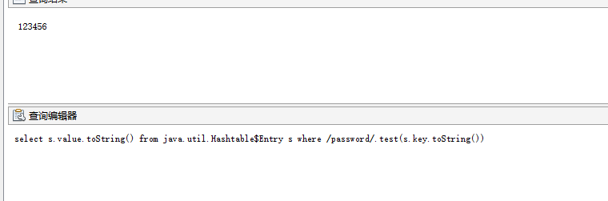

Spring boot 2.x版本查询语句：

```
select s.value.toString() from java.util.LinkedHashMap$Entry s where /password/.test(s.key.toString())
```

### jhat

JHat是Java堆分析工具。它可以用于分析Java堆转储文件，以找出内存泄漏和其他内存问题。并且提供了一个网页界面，允许用户浏览堆转储中的对象，检查引用关系，检查内存使用情况等。

使用jhat命令分析heapdump文件，会启动7000端口web页面。

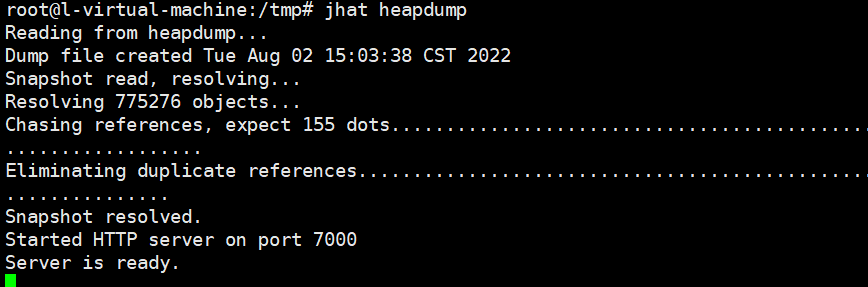

访问7000端口，**需要人工搜索关键字**。

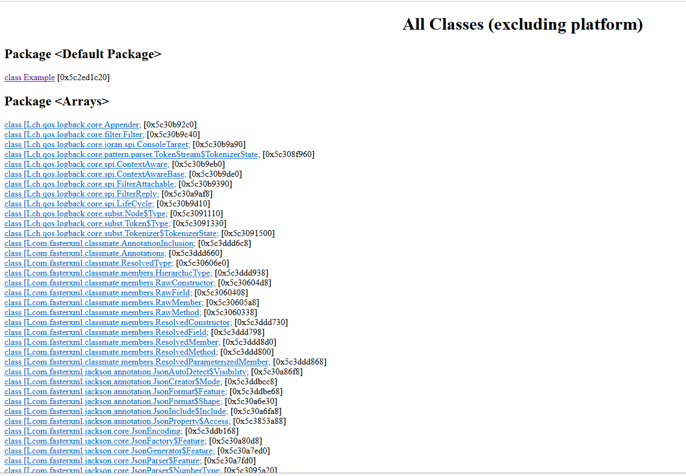

### **heapdump_tool** 

本质上是基于jhat，通过通过jhat解析heapdump文件，从而实现heapdump敏感信息搜索。

> 下载链接：https://toolaffix.oss-cn-beijing.aliyuncs.com/heapdump_tool.jar

```
java -jar heapdump_tool.jar  heapdump
```

选择1，获取全部内容

然后输入关键字

> 查询方式：
>
> 1. 关键词    例如 password 
> 2. 字符长度   len=10    获取长度为10的所有key或者value值
> 3. 按顺序获取  num=1-100 获取顺序1-100的字符
>    获取url,file,ip
>    geturl   获取所有字符串中的url
>    getfile  获取所有字符串中的文件路径文件名
>    getip    获取所有字符串中的ip
>    默认不输出查询结果非key-value格式的数据，需要获取所有值，输入all=true，all=false取消显示所有值。

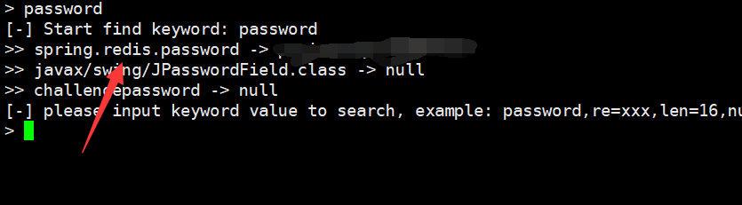


### mat

Heap Dump也叫堆转储文件，是一个Java进程在某个时间点上的内存快照。
可以使用Eclipse MemoryAnalyzer 工具对泄露的heapdump文件进行分析，查询加载到内存中的明文密码信息。
独立版下载地址：http://www.eclipse.org/mat/downloads.php

> 最新版用Java 11，可以下载历史版本

spring boot 1.x 版本 heapdump 查询结果，最终结果存储在 `java.util.Hashtable$Entry `实例的键值对中

```
select * from org.springframework.web.context.support.StandardServletEnvironment
select * from java.util.Hashtable$Entry x WHERE (toString(x.key).contains("password"))
```

spring boot 2.x 版本 heapdump 查询结果，最终结果存储在 `java.util.LinkedHashMap$Entry` 实例的键值对中：

```
select * from java.util.LinkedHashMap$Entry x WHERE (toString(x.key).contains("password"))
```

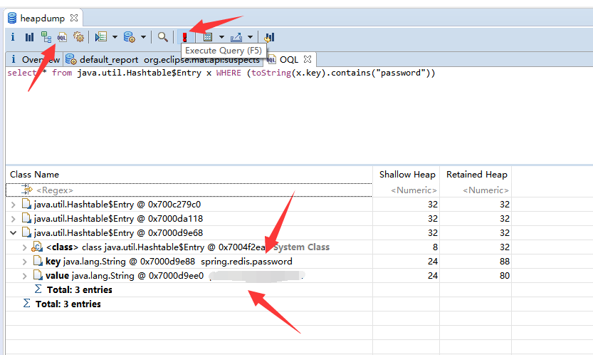

## 修复建议

### springboot 2.x修复方法

##### 禁用接口

`application.properties`配置文件内改成：`management.endpoint.beans.enabled=false`

```
management.endpoint.beans.enabled=false
```

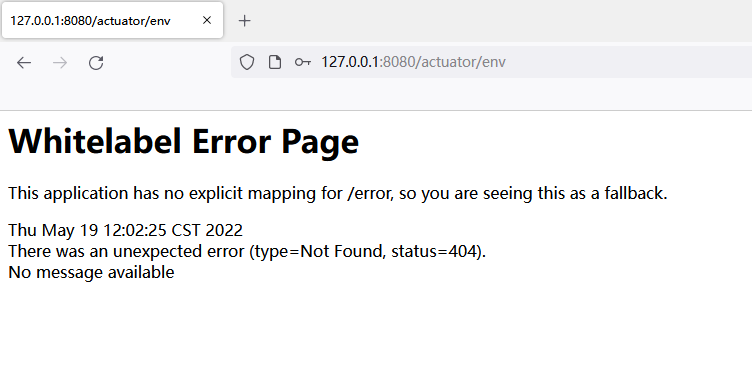

##### actuator接口进行鉴权

`application.properties`

```
# Spring Security default user name and password
spring.security.user.name=actuator
spring.security.user.password=actuator
spring.security.user.roles=ACTUATOR_ADMIN
```

如果需要访问actuator接口，则可以自定义代码，引用security进行鉴权访问。

`\src\main\java\com\example\actuatordemo\config\ActuatorSecurityConfig.java`

```
package com.example.actuatordemo.config;

import org.springframework.boot.actuate.autoconfigure.security.servlet.EndpointRequest;
import org.springframework.boot.actuate.context.ShutdownEndpoint;
import org.springframework.boot.autoconfigure.security.servlet.PathRequest;
import org.springframework.context.annotation.Configuration;
import org.springframework.security.config.annotation.web.builders.HttpSecurity;
import org.springframework.security.config.annotation.web.configuration.WebSecurityConfigurerAdapter;

@Configuration
public class ActuatorSecurityConfig extends WebSecurityConfigurerAdapter {

    /*
        This spring security configuration does the following

        1. Restrict access to the Shutdown endpoint to the ACTUATOR_ADMIN role.
        2. Allow access to all other actuator endpoints.
        3. Allow access to static resources.
        4. Allow access to the home page (/).
        5. All other requests need to be authenticated.
        5. Enable http basic authentication to make the configuration complete.
           You are free to use any other form of authentication.
     */

    @Override
    protected void configure(HttpSecurity http) throws Exception {
        http
                .authorizeRequests()
                //注释掉可以对actuator路径进行鉴权
//                    .requestMatchers(EndpointRequest.to(ShutdownEndpoint.class))
//                        .hasRole("ACTUATOR_ADMIN")
//                    .requestMatchers(EndpointRequest.toAnyEndpoint())
//                        .permitAll()
                    .requestMatchers(PathRequest.toStaticResources().atCommonLocations())
                        .permitAll()
                    .antMatchers("/", "/slowApi")
                        .permitAll()
                    .antMatchers("/**")
                        .authenticated()
                .and()
                .httpBasic();
    }
}
```

> 此Spring Security配置执行以下操作：
>
> 1. 对Shutdown端点的访问受限制，仅限于ACTUATOR_ADMIN角色。
> 2. 允许对所有其他actuator端点的访问。
> 3. 允许对静态资源的访问。
> 4. 允许访问主页（/）。
> 5. 所有其他请求都需要进行身份验证。
> 6. 启用http基本身份验证以完成配置。您可以自由使用其他形式的身份验证。

`\src\main\java\com\example\actuatordemo\controller\SampleController.java`

```
package com.example.actuatordemo.controller;

import org.springframework.web.bind.annotation.GetMapping;
import org.springframework.web.bind.annotation.RequestParam;
import org.springframework.web.bind.annotation.RestController;

import java.util.Random;
import java.util.concurrent.TimeUnit;

@RestController
public class SampleController {

    @GetMapping("/")
    public String sayHello(@RequestParam(value = "name", defaultValue = "Guest") String name) {
        return "Hello " + name + "!!";
    }

    @GetMapping("/slowApi")
    public String timeConsumingAPI(@RequestParam(value = "delay", defaultValue = "0") Integer delay) throws InterruptedException {
        if(delay == 0) {
            Random random = new Random();
            delay = random.nextInt(10);
        }

        TimeUnit.SECONDS.sleep(delay);
        return "Result";
    }

}
```

> 此控制器执行以下操作：
>
> 1. 定义了一个"/ "路径，返回带有请求参数名称的问候语。
> 2. 定义了一个"/slowApi"路径，可以模拟耗时的API请求，可以通过请求参数"delay"指定延迟，如果未指定，则随机生成延迟。

`\src\main\java\com\example\actuatordemo\health\CustomHealthIndicator.java`

```
package com.example.actuatordemo.health;

import org.springframework.boot.actuate.health.AbstractHealthIndicator;
import org.springframework.boot.actuate.health.Health;
import org.springframework.stereotype.Component;

@Component
public class CustomHealthIndicator extends AbstractHealthIndicator {

    @Override
    protected void doHealthCheck(Health.Builder builder) throws Exception {
        // Use the builder to build the health status details that should be reported.
        // If you throw an exception, the status will be DOWN with the exception message.

        builder.up()
                .withDetail("app", "Alive and Kicking")
                .withDetail("error", "Nothing! I'm good.");
    }
}
```

> 这是一个健康指标组件，继承自AbstractHealthIndicator。
>
> doHealthCheck方法构建健康状态的详细信息，如果抛出异常，状态将是DOWN，并带有异常信息。
>
> 该示例报告应用程序的健康状态是"Alive and Kicking"，错误是"Nothing! I'm good."

启动服务访问actuator就可以看到需要输入密码

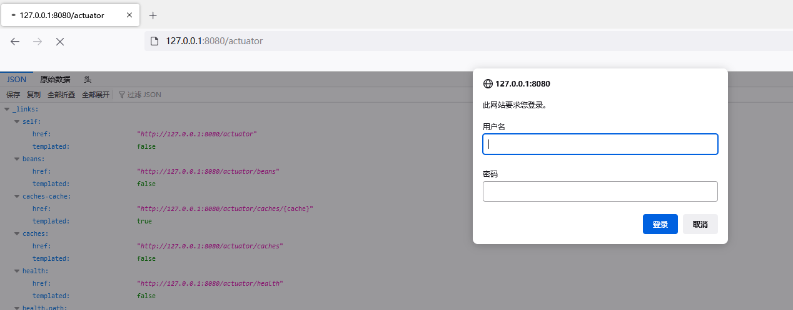

### springboot 1.x修复方案

##### 禁用接口

```
#关闭全部接口
endpoints.enabled = false

###只开启某些接口
#endpoints.beans.enabled = true
#endpoints.env.enabled = true
#endpoints.trace.enabled = true
#endpoints.metrics.enabled = true
```

##### 鉴权

另外也可以引入`spring-boot-starter-security`依赖

```
　　　　　<dependency>
            <groupId>org.springframework.boot</groupId>
            <artifactId>spring-boot-starter-security</artifactId>
        </dependency>
```

在`application.properties`中指定actuator的端口以及开启security功能，配置访问权限验证，这时再访问actuator功能时就会弹出登录窗口，需要输入账号密码验证后才允许访问。

```
management.security.enabled=true
security.user.name=admin
security.user.password=admin
```