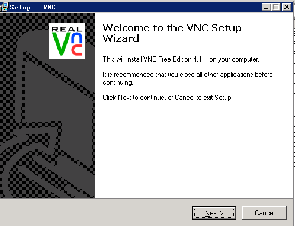
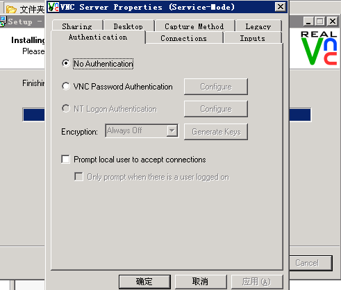
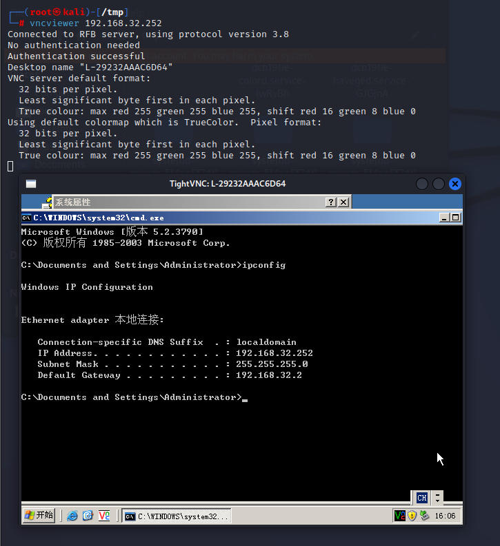

#  VNC Server 未授权访问漏洞

> CVE-2006-2369

## 漏洞描述

RealVNC VNC Server是英国RealVNC公司的一个远程访问软件的 VNC 服务器。

RealVNC VNC Server 存在授权问题漏洞，该漏洞源于采用的RFB(远程帧缓冲区)协议允许客户端与服务端协商合适的认证方法，协议的实现上存在设计错误，远程攻击者可以绕过认证无需口令实现对服务器的访问。

## 影响范围

RealVNC <= 4.1.1

### 环境搭建

> win2003系统

下载地址:https://www.filesoul.com/software/RealVNC/4-1-1/download/

进行安装(一直下一步即可)





## 漏洞利用

```
vncviewer 192.168.32.252
```



### 防御手段

- 配置 VNC 客户端登录口令认证并配置符合密码强度要求的密码。

- 以最小普通权限身份运行操作系统。

