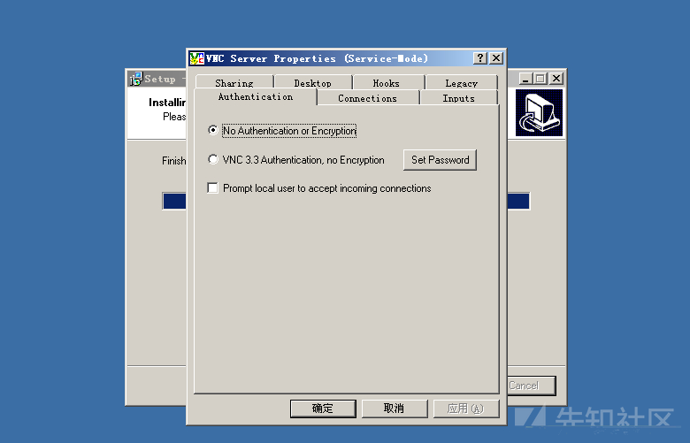
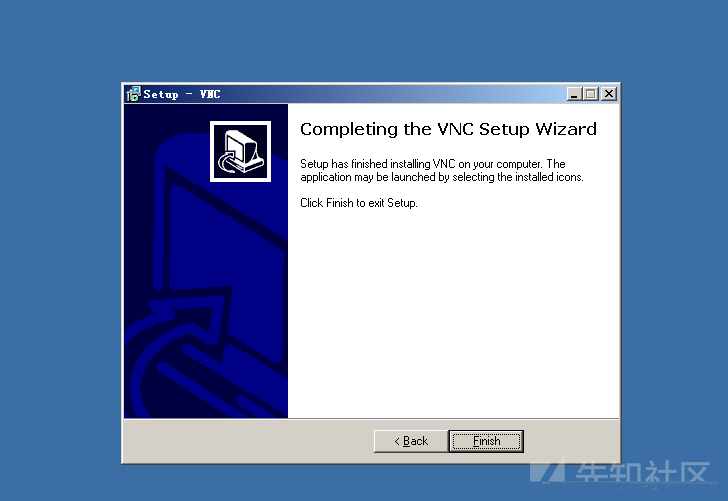
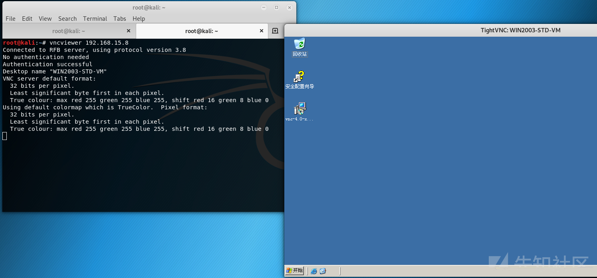

#  VNC 未授权访问漏洞

## 漏洞描述

VNC（Virtual Network Computing）是一种远程桌面技术，允许用户在远程计算机上查看和控制图形界面。如果VNC未正确配置或没有实施适当的授权机制，攻击者可以通过未授权访问获取远程计算机的控制权，对其执行任意操作。

### 环境搭建

下载地址:https://archive.realvnc.com/download/open/4.0/

进行安装(一直下一步即可)





## 漏洞利用

```
vncviewer 192.168.15.8
```



### 防御手段

- 配置 VNC 客户端登录口令认证并配置符合密码强度要求的密码。

- 以最小普通权限身份运行操作系统。

