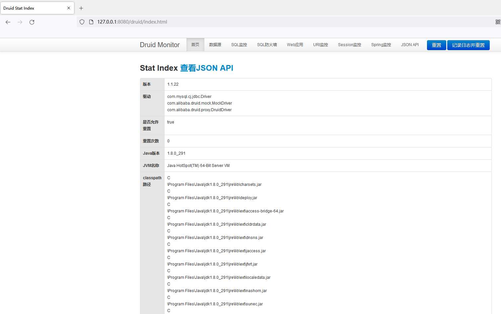
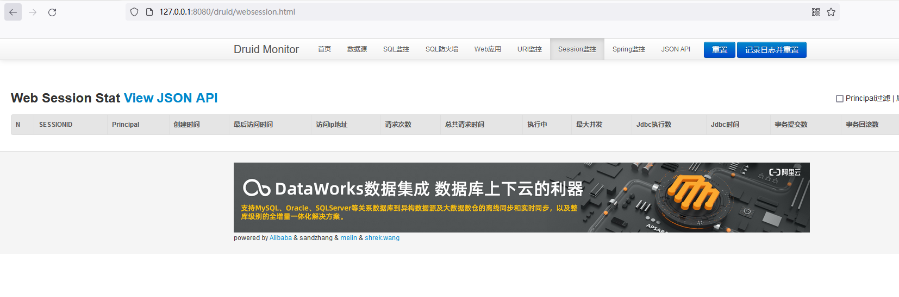
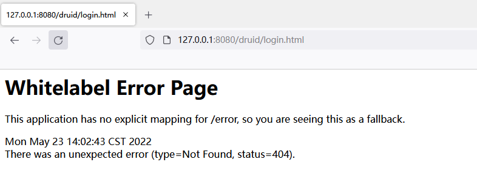
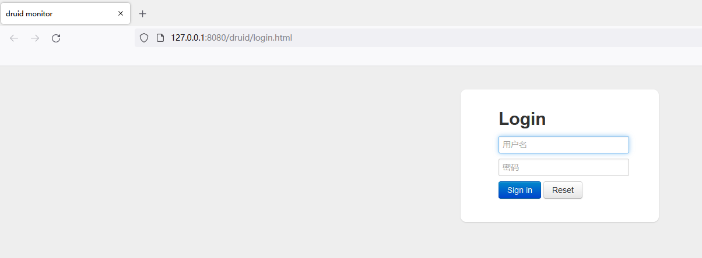
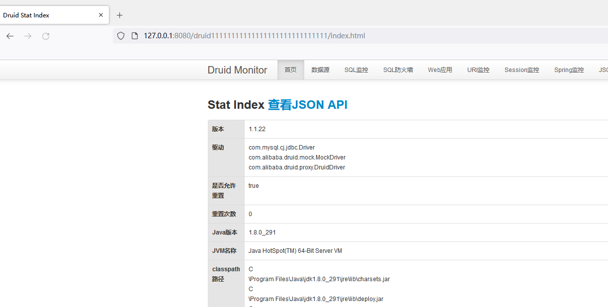

# druid 监控页未授权访问漏洞

## 漏洞简介

Druid是阿里巴巴数据库出品的，为监控而生的数据库连接池，并且Druid提供的监控功能，监控SQL的执行时间、监控Web URI的请求、Session监控，首先Druid是不存在什么漏洞的。但当开发者配置不当时就可能造成未授权访问.

## 环境搭建

pom.xml配置

```
<?xml version="1.0" encoding="UTF-8"?>
<project xmlns="http://maven.apache.org/POM/4.0.0" xmlns:xsi="http://www.w3.org/2001/XMLSchema-instance"
         xsi:schemaLocation="http://maven.apache.org/POM/4.0.0 https://maven.apache.org/xsd/maven-4.0.0.xsd">
    <modelVersion>4.0.0</modelVersion>
    <parent>
        <groupId>org.springframework.boot</groupId>
        <artifactId>spring-boot-starter-parent</artifactId>
        <version>2.6.3</version>
        <relativePath/> <!-- lookup parent from repository -->
    </parent>
    <groupId>com.example</groupId>
    <artifactId>demo</artifactId>
    <version>0.0.1-SNAPSHOT</version>
    <name>demo</name>
    <description>Demo project for Spring Boot</description>
    <properties>
        <java.version>1.8</java.version>
    </properties>
    <dependencies>
        <dependency>
            <groupId>org.springframework.boot</groupId>
            <artifactId>spring-boot-starter-jdbc</artifactId>
        </dependency>
        <dependency>
            <groupId>org.springframework.boot</groupId>
            <artifactId>spring-boot-starter-web</artifactId>
        </dependency>
        <dependency>
            <groupId>org.mybatis.spring.boot</groupId>
            <artifactId>mybatis-spring-boot-starter</artifactId>
            <version>2.2.2</version>
        </dependency>

        <dependency>
            <groupId>mysql</groupId>
            <artifactId>mysql-connector-java</artifactId>
            <scope>runtime</scope>
        </dependency>
        <dependency>
            <groupId>org.springframework.boot</groupId>
            <artifactId>spring-boot-starter-test</artifactId>
            <scope>test</scope>
        </dependency>
        <dependency>
            <groupId>com.alibaba</groupId>
            <artifactId>druid-spring-boot-starter</artifactId>
            <version>1.1.1</version>
        </dependency>
    </dependencies>

    <build>
        <plugins>
            <plugin>
                <groupId>org.springframework.boot</groupId>
                <artifactId>spring-boot-maven-plugin</artifactId>
            </plugin>
            <plugin>
                <groupId>org.apache.maven.plugins</groupId>
                <artifactId>maven-resources-plugin</artifactId>
                <version>3.1.0</version>
            </plugin>
        </plugins>
    </build>

</project>

```

`application.properties`配置

```
#数据库连接
spring.datasource.type=com.alibaba.druid.pool.DruidDataSource
spring.datasource.url=jdbc:mysql://127.0.0.1:3306/t1?serverTimezone=Asia/Shanghai
spring.datasource.username=sec
spring.datasource.password=sec123

##启用StatFilter
spring.datasource.druid.web-stat-filter.enabled=true

#启用内置的监控页面
spring.datasource.druid.stat-view-servlet.enabled=true
```


## 漏洞复现

直接访问`druid/index.html`。



可以通过session功能进行**伪造用户进行登录**



## 修复方法

### 禁用durid

`application.properties`配置

```
spring.datasource.druid.stat-view-servlet.enabled=false
spring.datasource.druid.web-stat-filter.enabled=false
```



### 设置鉴权

```
#设置登录用户名
spring.datasource.druid.stat-view-servlet.login-username=admin
#设置登录密码
spring.datasource.druid.stat-view-servlet.login-password=123
```



### 修改路径

```
##内置监控页面的地址
spring.datasource.druid.stat-view-servlet.url-pattern=/druid11111111111111111111111111111/*
```

