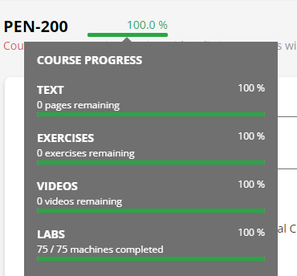

# 经验分享

## 简介

OSCP (Offensive Security Certified Professional) 是 Offensive Security 公司提供的一种专业的网络渗透测试证书。它是一项实践性强、高度挑战性的证书，需要考生通过一个 24 小时的实际渗透测试考试来获得。考试中，考生需要在给定的时间内完成对不同系统的渗透测试，并在线提交渗透报告。

通过 OSCP 证书的考生需要具备较高的网络安全知识和实践经验，能够独立进行网络渗透测试并生成详细的渗透报告。该证书可以作为网络安全专业人员的资格证明，并可以为考生在职业发展中提供帮助。

## 考试结构

- 考试有三台独立考试靶机和一套域环境(三台机器)
- 三台独立机器，每台20分；域环境40分，需获取完整攻击链路才有40分。
- 奖励积分10分。
- 考试合格分数**70分**。

## 收费标准

目前官方收费有三个套餐：

- 1599美元（涨价了，元旦前1499美元），包括课程、90天实验室和一次考试机会。
- 2499美元（元旦前打折1999美元），包括课程、一年实验室时间，两次考试机会、一年PG实验室、KLCP考试机会和OSWP考试机会。
- 5499美元（适合土豪肝帝），包括一年实验时间，offensive官方所有证书的无限制考试尝试，不过有考试冷静期。

## 个人经历

### 准备预热

对于准备OSCP，基本围绕几个平台的靶场：

- [vulnhub](https://www.vulnhub.com/)，里面有些是官方考试退役的机器，可以免费下载到本地练习。
- [HTB](https://www.hackthebox.com/)，这里面机器很不错，而且价格也不是很贵，一个月14美元。
- [tryhackme](https://tryhackme.com/)，关注Windows AD、Linux Windows提权机器，买一个月基本就可以打完。
- [PG](https://portal.offensive-security.com/labs/practice)，官方练习靶场，难度打完中级就可以，19美元一个月。

> 有人总结了这些靶场平台里面类似于OSCP考试模式的靶场，请参考：https://docs.google.com/spreadsheets/u/1/d/1dwSMIAPIam0PuRBkCiDI88pU3yzrqqHkDtBngUHNCw8/htmlview

对于前三个平台靶机，我直接上网找这台机器walkthrough，直接一一复现，如果没啥时间备考，可以直接看walkthrough文章去**理解考试类型有哪些，用到什么工具，攻击链路是怎样**。这块内容花费了我**三个月**的时间。

对于PG靶机，我是自己先打，实在不知道，可以看官方walkthrough（一天一台机器额度）。这块内容花费了我**一个多月**的时间。打到后面，我越来越发现很多内容都在vulnhub和htb里面出现过。

于是我总结一些枚举技巧：

- 查看源代码是否有隐藏内容。
- 查看response的headers是否有CMS返回。
- 查看`/var/www/html`中的config.php文件。
- 查看是否有MySQL连接，连接进去查看信息。
- FTP、SMB的目录与web目录一致，上传webshell。
- 反弹shell端口设置21，22，80，443等常用端口，以防被拦截。
- SSH爆破用户名和密码一样。
- 查看源代码有没有**虚拟域名**。
- 注意CMS版本可能不对，如果搜索没有漏洞，尝试使用低版本的EXP。
- 注意用户ID的组是否有问题。
- 软链接绕过文件或者目录限制。
- 查看靶场的127.0.0.1的端口服务。
- 看看WEB页面是否有用户名，如果有，尝试注册看看能不能覆盖。
- docker逃逸看看有没有漏洞或者有没有密码。
- 遇见`cgi-bin`目录，继续爆破cgi文件格式。
- 如果linpeas没有发现东西，使用pspy监控是否有定时计划。

### 购买OSCP

购买前一定要去**申请护照**，官方需要拍摄护照以及人脸识别，客服人工审核才可以访问资源。认证完成后，你可以访问课程材料和实验室，其中这块涉及到**10分奖励积分**内容需要完成，这是重中之重。

> **主题练习 + 30 台实验机**
>
> - 为了获得十 (10) 个奖励积分，您必须在 PEN-200 课程的每个主题中提交至少**80% 的主题练习正确解决方案，并在 Offsec 平台中提交**30 个正确的 proof.txt 哈希。
> - 对哪些实验室机器适用于 30 个正确的 proof.txt 哈希没有限制。这意味着可以包含**Sandbox**、**Alpha**、**Beta**和**Alice 。**
> - 您可以在 OffSec 平台的课程进度/练习模式下查看已完成的主题练习百分比。
>
> - 您可以通过将光标悬停在练习进度条上来查看每个主题的主题练习的完成百分比。

对于这块内容，如果不会，可以**提供有偿技术指导**。

### 考试

如果想要周六日考试，建议**提前一个月预约**，不然只剩下工作日的晚上和凌晨，而且要注意考试时间所处于那个时区。

需要准备摄像头，考试前会发送邮件给你需要安装浏览器插件用于监控人员监控你的屏幕。

考试时间是24小时，如果考试中途想要休息吃饭，在监控页面跟监控人员打字说明你要做什么就可以。

考完试后，需要写[报告](https://help.offensive-security.com/hc/en-us/articles/360046787731-PEN-200-Reporting-Requirements)，所以在考试过程中，需要记录好操作步骤、截图、flag(需包含IP地址)。

> 具体内容，可以参考：https://help.offensive-security.com/hc/en-us/articles/360040165632-OSCP-Exam-Guide

## 总结

- 一定要做好**信息收集**。
- 不想将事情想的过于复杂。
- 对于机器利用都有exp。

