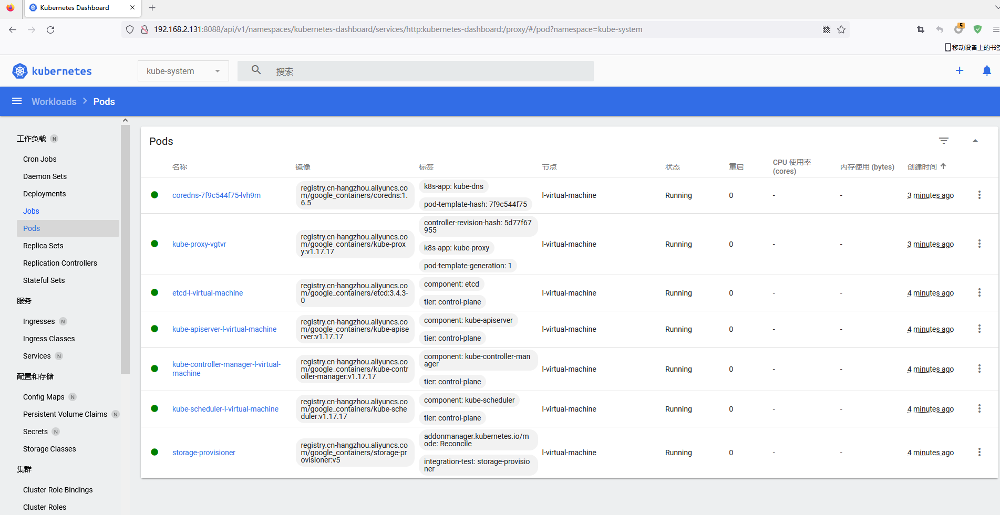
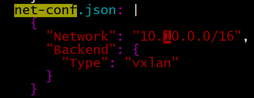
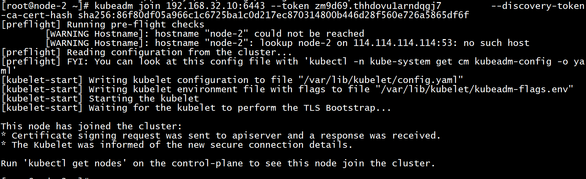
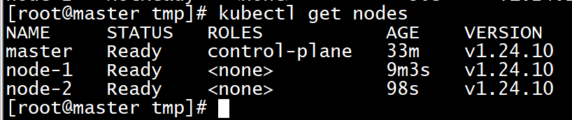

## minikube

> 使用Ubuntu 20.04

### 安装docker

```
apt install -y docker.io
```

### 安装cri-dockerd

```
wget https://storage.googleapis.com/golang/getgo/installer_linux
chmod +x ./installer_linux
./installer_linux
source ~/.bash_profile
```

```
git clone https://github.com/Mirantis/cri-dockerd.git
cd cri-dockerd
mkdir bin
go build -o bin/cri-dockerd
mkdir -p /usr/local/bin
install -o root -g root -m 0755 bin/cri-dockerd /usr/local/bin/cri-dockerd
cp -a packaging/systemd/* /etc/systemd/system
sed -i -e 's,/usr/bin/cri-dockerd,/usr/local/bin/cri-dockerd,' /etc/systemd/system/cri-docker.service
systemctl daemon-reload
systemctl enable cri-docker.service
systemctl enable --now cri-docker.socket
```

修改`/etc/systemd/system/cri-docker.socket`服务，将`docker`变成`root`。

```
SocketGroup=root
```

创建软连接

```
ln -s /usr/local/bin/cri-dockerd /usr/bin/cri-dockerd
```

然后重启服务服务

```
systemctl daemon-reload
systemctl restart cri-docker.socket
```

查看这两个服务是否正常

```
systemctl status cri-docker.service
systemctl status cri-docker.socket
```

安装crictl

```
wget https://github.com/kubernetes-sigs/cri-tools/releases/download/v1.26.0/crictl-v1.26.0-linux-amd64.tar.gz
sudo tar zxvf crictl-v1.26.0-linux-amd64.tar.gz -C /usr/local/bin
rm -f zxvf crictl-v1.26.0-linux-amd64.tar.gz
ln -s /usr/local/bin/crictl /usr/bin/crictl
```


### 安装kubectl

```
curl -LO https://storage.googleapis.com/kubernetes-release/release/`curl -s https://storage.googleapis.com/kubernetes-release/release/stable.txt`/bin/linux/amd64/kubectl
chmod +x ./kubectl
sudo mv ./kubectl /usr/local/bin/kubectl
kubectl version --client
```

### 安装Minikube 

```
apt install conntrack -y
```

```
curl -Lo minikube https://storage.googleapis.com/minikube/releases/latest/minikube-linux-amd64  && chmod +x minikube
sudo mkdir -p /usr/local/bin/
sudo install minikube /usr/local/bin/
```

### 运行

查看可支持的版本

```
minikube config defaults kubernetes-version
```

启动集群

```
minikube  start --image-mirror-country=cn  --driver=none  --kubernetes-version=1.23.15 
```

查看pods

```
kubectl get pods --all-namespaces
```

启动metrics

```
minikube addons enable metrics-server
```

启动仪表盘

```
minikube dashboard
```

配置对外端口

```
kubectl proxy  --port=8088 --address='0.0.0.0' --accept-hosts='^.*'
```

访问URL

```
http://192.168.2.131:8088/api/v1/namespaces/kubernetes-dashboard/services/http:kubernetes-dashboard:/proxy
```



## kubernetes集群安装

### 架构

三台使用Ubuntu 20.04。

|  机器  |    IP地址     |
| :----: | :-----------: |
| master | 192.168.32.10 |
| node-1 | 192.168.32.20 |
| node-2 | 192.168.32.30 |

### 安装cri-dockerd

> 三台都要装

> 注意： Docker 引擎不实现CRI ，这是容器运行时与 Kubernetes 一起工作的要求。因此， 必须安装额外的服务cri-dockerd 。cri-dockerd 是一个基于遗留内置 Docker 引擎支持的项目，该支持已在 1.24 版中从 kubelet 中删除。

```sh
$ yum install -y docker
```

安装go语言

```
wget https://storage.googleapis.com/golang/getgo/installer_linux
chmod +x ./installer_linux
./installer_linux
source ~/.bash_profile
```

安装cri-docker

```
git clone https://github.com/Mirantis/cri-dockerd.git
cd cri-dockerd
mkdir bin
go build -o bin/cri-dockerd
mkdir -p /usr/local/bin
install -o root -g root -m 0755 bin/cri-dockerd /usr/local/bin/cri-dockerd
cp -a packaging/systemd/* /etc/systemd/system
sed -i -e 's,/usr/bin/cri-dockerd,/usr/local/bin/cri-dockerd,' /etc/systemd/system/cri-docker.service
```

修改`/etc/systemd/system/cri-docker.socket `中`SocketGroup`组为`root`

```
SocketGroup=root
```

重新读取配置文件，设置开机启动以及立刻运行服务。

```
systemctl daemon-reload
systemctl enable cri-docker.service
systemctl enable --now cri-docker.socket
```


### 安装 kubeadm、kubelet 和 kubectl

您将在所有机器上安装这些软件包：

- `kubeadm`：引导集群的命令。
- `kubelet`：在集群中的所有机器上运行并执行诸如启动 pod 和容器之类的组件。
- `kubectl`：用于与您的集群对话的命令行实用程序。

切换到国内源

```
cat << EOF > /etc/yum.repos.d/kubernetes.repo
[kubernetes]
name=Kubernetes
baseurl=http://mirrors.aliyun.com/kubernetes/yum/repos/kubernetes-el7-x86_64
enabled=1
gpgcheck =0
repo_gpgcheck=0
gpgkey=http://mirrors.aliyun.com/kubernetes/yum/doc/yum-key.gpg
http://mirrors.aliyun.com/kubernetes/yum/doc/rpm-package-key. gpg
EOF
```

将 SELinux 设置为 permissive 模式（相当于将其禁用）

```
sudo setenforce 0
sudo sed -i 's/^SELINUX=enforcing$/SELINUX=permissive/' /etc/selinux/config
```

> 通过运行命令 `setenforce 0` 和 `sed ...` 将 SELinux 设置为 permissive 模式可以有效地将其禁用。 这是允许容器访问主机文件系统所必需的，而这些操作是为了例如 Pod 网络工作正常。

关闭swap分区

```
swapoff -a
```

关闭防火墙

```
systemctl disable firewalld
systemctl stop firewalld
```

查看支持的版本

```
yum list kubeadm --showduplicates 
```


```
yum install -y kubelet-1.24.10-0 kubeadm-1.24.10-0 kubectl-1.24.10-0

systemctl enable --now kubelet
```


### 部署集群

`kubeadm init` 是一个用于初始化 Kubernetes 集群的命令。当你运行 `kubeadm init` 时，它会在你运行该命令的节点上创建一个新的集群。

你可以使用 `--cri-socket` 参数来指定要使用的容器运行时接口 (CRI) 的套接字。CRI 是 Kubernetes 与容器运行时（例如 Docker 或 containerd）进行通信的接口。

你也可以使用 `--control-plane-endpoint` 参数来指定集群的控制平面端点的 IP 地址和端口。控制平面是集群的中枢，负责管理集群的状态并在节点上调度工作负载。

master节点初始化

```
kubeadm init --pod-network-cidr=10.10.0.0/16 --service-cidr=10.20.0.0/16  --apiserver-advertise-address=192.168.32.10
```

复制凭据

```
mkdir -p $HOME/.kube
sudo cp -i /etc/kubernetes/admin.conf $HOME/.kube/config
sudo chown $(id -u):$(id -g) $HOME/.kube/config
```

> 重置
>
> ```
> kubeadm reset
> ```

这时候`coredns`是还没有启动

```
[root@master tmp]# kubectl get pods --all-namespaces
NAMESPACE     NAME                             READY   STATUS    RESTARTS   AGE
kube-system   coredns-787d4945fb-8wx44         0/1     Pending   0          2m39s
kube-system   coredns-787d4945fb-gx8sn         0/1     Pending   0          2m39s
kube-system   etcd-master                      1/1     Running   0          2m43s
kube-system   kube-apiserver-master            1/1     Running   0          2m43s
kube-system   kube-controller-manager-master   1/1     Running   0          2m43s
kube-system   kube-proxy-7697h                 1/1     Running   0          2m39s
kube-system   kube-scheduler-master            1/1     Running   0          2m43s
```

下载配置文件

```
wget https://raw.githubusercontent.com/flannel-io/flannel/master/Documentation/kube-flannel.yml
```

修改`kube-flannel.ym`l中的Network的值，要与初始化时的参数`--pod-network-cidr`的值一致



运行flannel

```
kubectl apply -f kube-flannel.yml
```


默认情况下，出于安全原因，您的集群不会在控制平面节点上调度 Pod。如果您希望能够在控制平面节点上调度 Pod，例如对于单机 Kubernetes 集群，请运行：

```bash
kubectl taint nodes --all node-role.kubernetes.io/control-plane-
```


两个node节点加入到master节点

```
kubeadm join 192.168.32.10:6443 --token zm9d69.thhdovu1arndqgj7 \
        --discovery-token-ca-cert-hash sha256:86f80df05a966c1c6725ba1c0d217ec870314800b446d28f560e726a5865df6f 
```

> 如果出现`[ERROR FileContent--proc-sys-net-bridge-bridge-nf-call-iptables]: /proc/sys/net/bridge/bridge-nf-call-iptables contents are not set to 1`
>
> ```
> echo 1 > /proc/sys/net/bridge/bridge-nf-call-iptables
> ```



查看节点状态



> 由于集群节点通常是按顺序初始化的，CoreDNS Pod 很可能都运行在第一个控制面节点上。 为了提供更高的可用性，请在加入至少一个新节点后 使用 `kubectl -n kube-system rollout restart deployment coredns` 命令，重新平衡这些 CoreDNS Pod。


